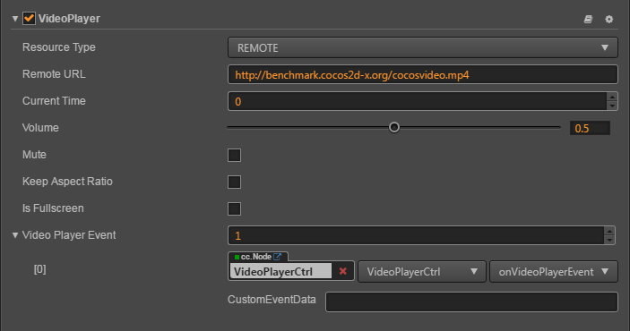

# VideoPlayer Component Reference

VideoPlayer is a component for playing videos, you could use this component for playing local video and remove videos.

Play local video：


Play remote video：



Click `add component` at the bottom of **Properties** panel and select `VideoPlayer` from `add UI component` popup.
Then you could add VideoPlayer component to the node.

For more info about VideoPlayer API reference [VideoPlayer API](../api/classes/VideoPlayer.html)。

## VideoPlayer Attribute

| Attribute | Function Explanation
|-------- | ----------- |
| Resource Type| The resource type of videoplayer, REMOTE for remote url and LOCAL for local file path.
| Clip | Displayed when Resource Type is LOCAL，feed it with a local video path.
| Remote URL | Displayed when Resource Type is REMOTE, feed it with a remote video URL.
| Current Time | The current time when video start to play.
| Keep Aspect Ratio | Whether keep the aspect ration of the original video.
| Is Fullscreen| Whether play video in fullscreen mode.
| Video Player Event| the video player's callback, it will be triggered when certain event occurs. Please refer to the `VideoPlayer Event` section for more details.

## VideoPlayer Event

### VideoPlayerEvent Event
| Attribute |   Function Explanation
| -------------- | ----------- |
|Target| Node with the script component.
|Component| Script component name.
|Handler| Specify a callback，when the video player is about to playing or paused, it will be called. There is a parameter in the callback which indicate the state of played videos. For more information, please refer to `Parameter of VideoPlayerEvent`.

### Parameter of VideoPlayerEvent

| Name           | Function Explanation          |
| -------------- | -----------                   |
| PLAYING        | Video is playing.             |
| PAUSED         | Video is paused.              |
| STOPPED        | Video is stopped.             |
| COMPLETED      | Video is completed.           |
| META_LOADED    | Video's meta data is loaded.  |
| CLICKED        | Video is clicked by the user. |
| READY_TO_PLAY  | Video is ready to play.       |


Note: On iOS platform, due to the platform limitations, the CLICKED event can't be fired when VideoPlayer is in fullscreen mode.
If you want to let the Video played in fullscreen and also fire the CLICKED event properly, you should use a Widget component
to hack the VideoPlayer's size. For more information, please refer to the Example-cases samples bundled with Creator.

## Detailed Explanation
Currently this component is only available on Web(Both PC and Mobile), iOS and Android.
You can't use it on Mac or Windows which means if you preview VideoPlayer on these platforms, there is nothing to show.

The supported video types are determined by the supported OS, in order to make it works across all the supported platforms, we suggest to use mp4 format.

### Add a callback via script

#### Method one

This method uses the same API that editor uses to add an event callback on Button component. You need to construct a `cc.Component.EventHandler` object first, and then set the corresponding target, component, handler and customEventData parameters.

```js
var videoPlayerEventHandler = new cc.Component.EventHandler();
videoPlayerEventHandler.target = this.node; //这个 node 节点是你的事件处理代码组件所属的节点
videoPlayerEventHandler.component = "cc.MyComponent"
videoPlayerEventHandler.handler = "callback";
videoPlayerEventHandler.customEventData = "foobar";

videoPlayer.videoPlayerEvent.push(videoPlayerEventHandler);

// here is your component file
cc.Class({
    name: 'cc.MyComponent'
    extends: cc.Component,

    properties: {
    },

	//the order of parameters should not change
    callback: function(videoplayer, eventType, customEventData) {
        //videoplayer is a VideoPlayer component instance
        //eventType is typed as cc.VideoPlayer.EventType 
        //customEventData is "foobar"
    }
});
```

#### Method two

Add event callback with `videoplayer.node.on('ready-to-play', ...)`

```js
// Suppose we add event handling callbacks in the onLoad method of a component and perform event handling in the callback function:

cc.Class({
    extends: cc.Component,

	
    properties: {
       videoplayer: cc.VideoPlayer
    },
    
    onLoad: function () {
       this.videoplayer.node.on('ready-to-play', this.callback, this);
    },
    
    callback: function (event) {
       //event is EventCustom, you can use event.detail to get VideoPlayer component
       var videoplayer = event.detail;
       //do whatever you want with videoplayer
       //you can't pass customEventData in this way
    }
});
```

Likewise, you can also register 'meta-loaded', 'clicked' , 'playing' events, and the parameters of the callback function for these events are consistent with the 'read-to-play' parameters.

<hr>

Continue reading [WebView Component](webview.md).