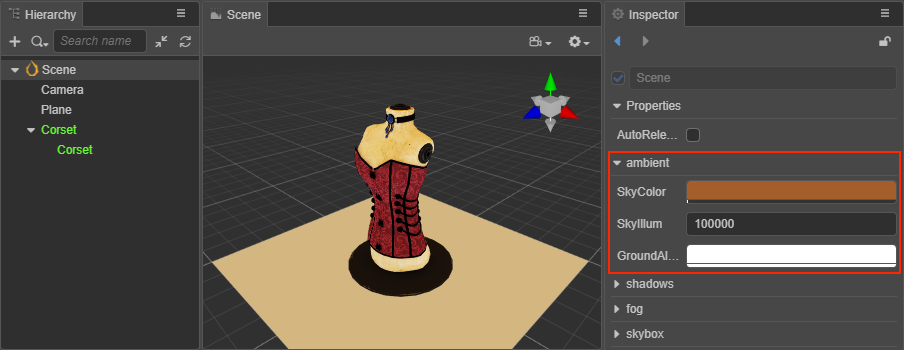
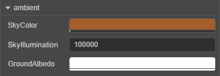

# Ambient Lights

In life, intricate lights and uneven surfaces of objects reflect each other, making the whole environment illuminated, as if by a layer of light evenly enveloped, this light is generally called Ambient Light. By adjusting the ambient light, is the most direct way to adjust the overall illumination of the environment, but also an effective way to express the atmosphere of the environment.

Select **Scene** in the **Hierarchy** panel and set the properties in the **ambient** component of the **Inspector** panel.

> **Note**: since the ambient light is directionless, it cannot produce shadows.

## Ambient lights properties

| Property | Explanation |
| :--- | :--- |
| **SkyColor** | Set the sky color |
| **SkyIllumination** | Adjust the sky brightness |
| **GroundAlbedo** | Set the ground reflected light |

Ambient light can be used with a Skybox, see the [Skybox](skybox.md) documentation for details.
