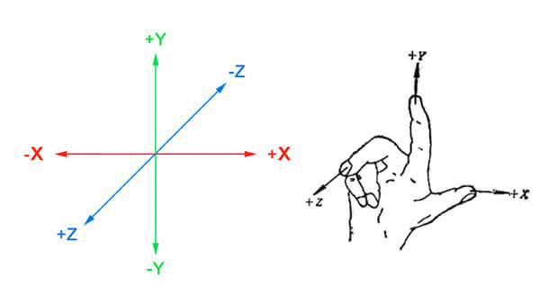
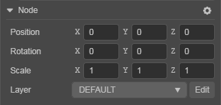
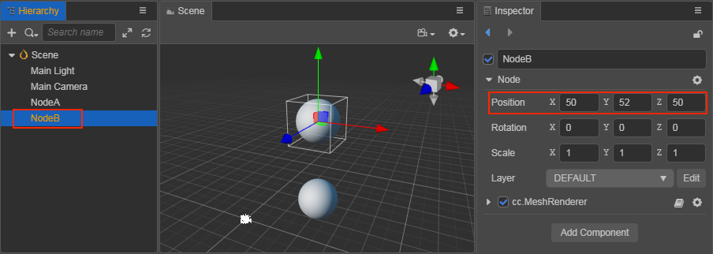
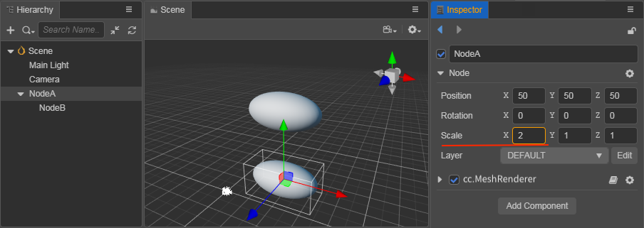

# Coordinate Systems and Node Transformation Properties

In the documents, [Scene Panel](../../editor/scene/index.md), and [Nodes and Components](node-component.md), the ability to change the display behavior of nodes by using the **transformation tool Gizmo** and editing the properties of nodes in the **Inspector** panel was introduced. This document will take a deeper look at the coordinate system of the scene space in which the node is located and how the **Position**, **Rotation**, and **Scale** transformation properties of the node work.

## Coordinate Systems

Position properties for nodes can be set, but where will a node with a specific position property be rendered on the screen when the game is running? Just as longitude and latitude specify coordinates for a location on a planet it is necessary to understand the coordinate system of Cocos Creator 3.0 to understand the meaning of node positions.

### World Coordinate

The world coordinate system, also called absolute coordinate system, represents a unified coordinate system in the scene space in Cocos Creator game development, and "world" is used to represent our game scene.

The world coordinate system of Creator 3.0 uses a Cartesian right-handed coordinate system with default **x** to the right, **y** to the top, **z** to the outside, and the **-z** axis for the front.

### Local Coordinate

The local coordinate system, also called the relative coordinate system, is the coordinate system associated with the node. Each node has a separate coordinate system, and when the node moves or changes direction, the coordinate system associated with that node will move or change direction with it.

Creator has a hierarchy of parent-child relationships between **Nodes**, and the position of a node set by modifying its `Position` property is the node's **local coordinate system** with respect to its parent, not the world coordinate system.

Finally when drawing the whole scene, Creator will map the local coordinates of these nodes to world coordinate system coordinates.  
Suppose there are three nodes in the scene: NodeA, NodeB, and NodeC. The structure of the nodes is shown in the following figure.

When the scene contains nodes at different levels, the position of each node under the world coordinate system is determined according to the following steps:

1. Process each node starting from the root level, NodeA in the above figure is a root level node. The first step is to determine the position of the origin of NodeA's local coordinate system (i.e. `Position`) in the world coordinate system based on NodeA's **Position** property.
2. Next, process all the direct children of NodeA, which is NodeB in the above figure (as well as other nodes of the same level as NodeB). Based on NodeB's `Position` property, determine NodeB's position in the world coordinate system in NodeA's local coordinate system.
3. Each node uses the parent's coordinate system and its own position property to determine its position in the world coordinate system.

## Transformation Properties

Nodes include three main transformation properties, **Position**, **Rotation** and **Scale**, which are described below in turn.

### Position

**Position** consists of the `X`, `Y` and `Z` properties, which specify the coordinates of the node on the X-axis, Y-axis and Z-axis of the current coordinate system, respectively, and default to `(0, 0, 0)`.

In the above figure, the world coordinates of NodeA are `(50, 50, 50)` and the local coordinates of child NodeB are `(0, 2, 0)`. If NodeB is moved to the root of the scene, the world coordinates of NodeB become `(50, 52, 50)`.

The `Position` of the child NodeB is based on the `Position` of the parent NodeA as the origin of the coordinate system.

If the parent NodeA changes its `Position`, the child NodeB will also change its position (world coordinate system), but the `Position` property of the child NodeB will not change, because the child NodeB does not change in the local coordinate system with the parent NodeA's `Position` as the origin.

In the **Scene** panel, use the [Move Transform Tool](../../editor/toolbar/index.md) to change the node position.

### Rotation

**Rotation** consists of the `X`, `Y` and `Z` properties, which default to `(0, 0, 0)`, and is another important property that affects the node's local coordinate system. When the `X` property is changed, it means that the node will be rotated counterclockwise/clockwise around the x-axis, and so on, and the same applies when the `Y` or `Z` property is changed.

- When the property value is **positive**, the node rotates **counterclockwise**.
- When the property value is **negative**, the node rotates **clockwise**.

The node hierarchy shown above is the same as the previous figure, except that the **Rotation** property of NodeA on the z-axis is set to **60** degrees, notice that in addition to NodeA itself being **counterclockwise** rotated by 60 degrees on the z-axis, its child NodeB is also **centered** on the z-axis. NodeB is also rotated **counterclockwise** on NodeA's z-axis. This also means that the rotation property affects the child nodes.

> **Note**: the [rotation](https://docs.cocos.com/creator/3.4/api/en/#/docs/3.4/en/scene-graph/Class/Node?id=rotation) property on a node is a quaternion that represents the angle of rotation about any axis. The property corresponding to `Rotation` in the **Inspector** is the property [EulerAngles](https://docs.cocos.com/creator/3.4/api/en/#/docs/3.4/en/scene-graph/Class/Node?id=eulerangles). These two properties can be used separately according to your needs. When using the API, make sure to pay attention to the difference between them and the editor panel property names.

In the **Scene** panel, use the [Rotate Transform Tool](../../editor/toolbar/index.md) to set the rotation of the node.

### Scale

The **Scale** property also consists of the `X`, `Y` and `Z` properties, which represent the scaling of the node on the x-axis, y-axis and z-axis, respectively, and defaults to `(1, 1, 1)`.

The node hierarchy shown above is the same as when `Position` was introduced. Setting the scale property of NodeA to `(2, 1, 1)` means that NodeA is scaled to **2** times its original size in the x-axis direction, while the y-axis and z-axis remain unchanged. You can see that the child node NodeB is also scaled to twice its original size in the x-axis direction, so the scaling property affects all child nodes.

The `Scale` property set on a child node are superimposed on its parent node's scaling, and the child nodes of the child node **multiply** all the `Scale` properties at each level to obtain the scaling multiplier displayed in the world coordinate system. This is actually the same as the **position** and **rotation** properties, except that the **position** and **rotation** properties are **additive**, while the **scaling** property is **multiplicative**, which has a more pronounced effect.

The **Scale** property does not affect the **Position** and **Rotation** of the current node, but it does affect the **Position** of the child nodes.

In the **Scene** panel, use the [Scale Transform Tool](../../editor/toolbar/index.md) to modify the node scaling.
