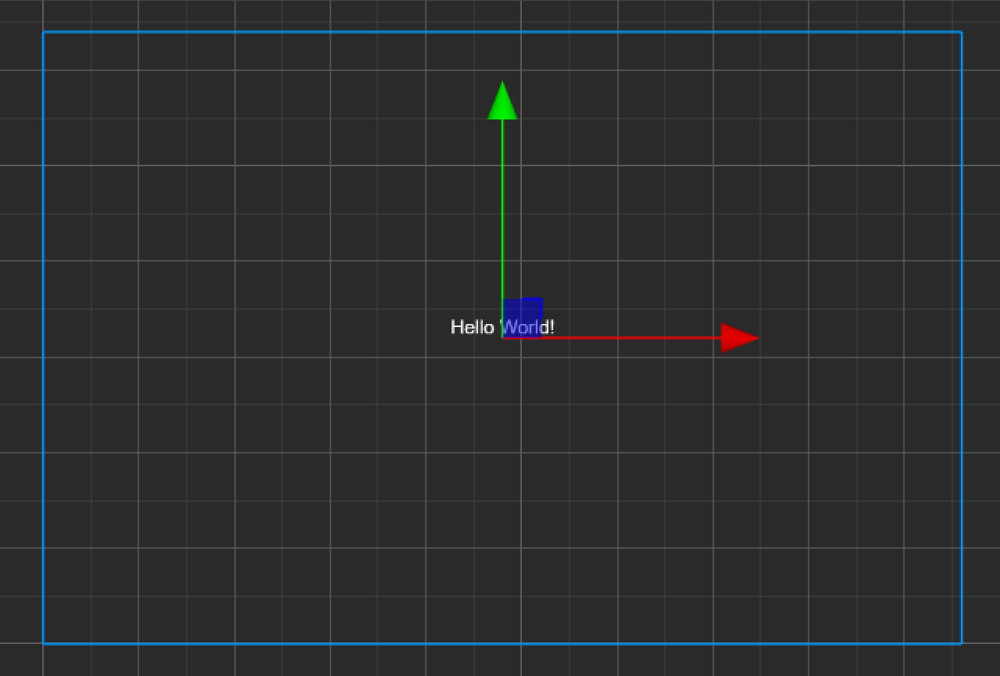

# Coordinate System

## World coordinate system

__Cocos Creator's__ world coordinate system uses a __Cartesian right-handed__ coordinate system with the origin occuring at the __lower left corner__, __x__ to the __right__, __y__ to the __top__, and __z__ to the __outside__.

## Screen coordinate system

The __origin__ of the __screen coordinate system__ is the __bottom left__ corner of the screen, with __x__ to the __right__ and __y__ to the __top__.

