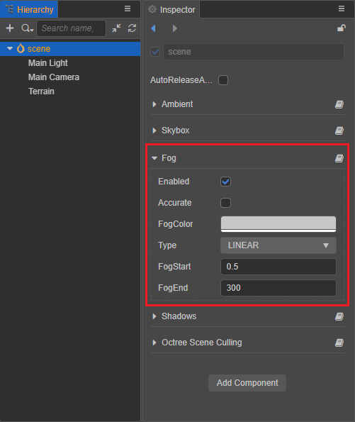
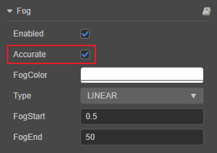
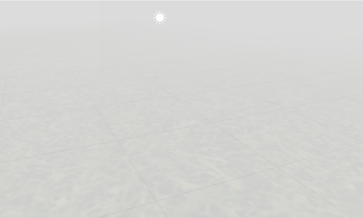
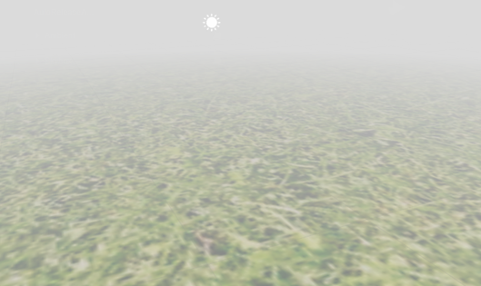
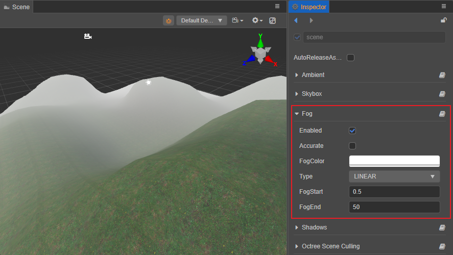
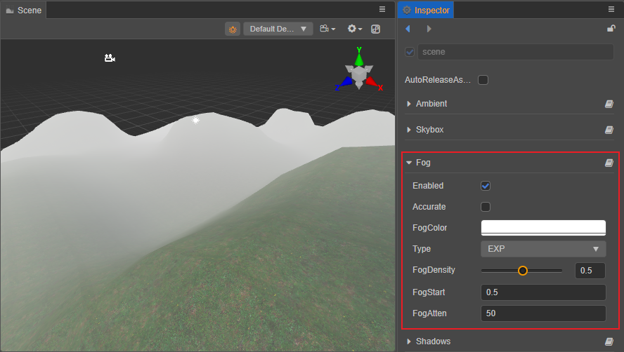
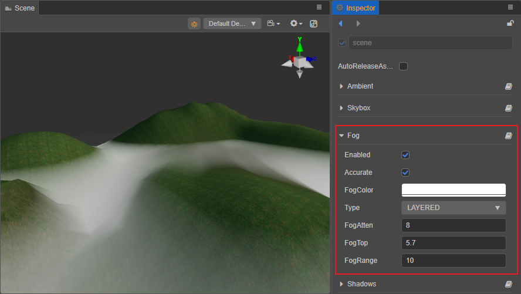

# Global Fog

Global fog is used to simulate fog effects in outdoor environments in games. In addition to fog effects in the game, it can also be used to hide the model outside the camera's far clipping plane to improve the rendering performance.

The global fog currently includes four types: Linear Fog, Exponential Fog, Exponential Squared Fog, and Layer Fog, please refer to the **Global Fog Types** section below for more details.

## Enable Global Fog

Check **Scene** in the **Hierarchy** panel, then check the **Enabled** property in the **Fog** component of the **Inspector** panel to enable global fog.



## Accurate Fog Computing

Before v3.4, Creator used vertex fog by default, which caused unusual fog transitions on objects with a few vertices and a large volume. So starting with v3.4, Creator added the **Accurate** option to enable pixel fog to solve this problem.



The effect when the **Accurate** option is unchecked, that is, the pixel fog is not enabled, is as follows:



The effect when the **Accurate** option is checked, that is, the pixel fog is enable, is as follows:



### Version Upgrade - `Effect` Migration

When the old project was upgraded to v3.4, all the Effect code that calls to `CC_APPLY_FOG` needed to be modified to add a second parameter, `worldPos`. e.g.:

- The original code is as follows:

    ```ts
    CC_APPLY_FOG(finalColor);
    ```

- After upgrading to v3.4, the original code needs to be changed to the following:

    ```ts
    CC_APPLY_FOG(finalColor, v_position.xyz);
    ```

## Types of Global Fog

The types of global fog include Linear Fog, Exponential Fog, Exponential Squared Fog, and Layer Fog. The type depends on the calculation result of **Camera** and **Model Vertex**, which is called **Fog Blend Factor**. The fog blend factor determines how the fog color and the model color are blended, resulting in a different global fog effect.

### Linear Fog



| Property | Description |
| :--- | :--- |
| **Enabled**  | Whether to enable the global fog. |
| **Accurate** | Whether to enable accurate fog computing. |
| **FogColor** | The color of the global fog. |
| **Type**     | The type of the global fog. |
| **FogStart** | The starting position of the fog effect. |
| **FogEnd**   | The end position of the fog effect. |

The fog blend factor of Linear Fog is calculated by the formula:

**f = (FogEnd - Cam_dis) / (FogEnd - FogStart)**

- When `Cam_dis = FogEnd`, i.e., the distance between the camera and the model vertex is equal to `FogEnd`, the blend factor is calculated as 0, and the object is fully fogged.

- When `Cam_dis = FogStart`, i.e. the distance between the camera and the model vertex is equal to `FogStart`, the blend factor is calculated as 1, and the object is not affected by fogging.

To increase the density of Linear Fog when the distance between the camera and the model vertex is fixed, there are two ways:

1. Fix the value of `FogStart` and decrease the value of `FogEnd`.
2. Decrease the value of `FogStart` and fix the value of `FogEnd`.

To adjust the fog effect to the right consistency, it is best to adjust both the `FogStart` and `FogEnd` properties appropriately.

### Exponential Fog and Exponential Squared Fog



The properties of Exponential Fog and Exponential Squared Fog are the same, and the Exponential Fog is used here as an example:

| Property | Description |
| :--- | :--- |
| **Enabled**    | Whether to enable the global fog. |
| **Accurate**   | Whether to enable accurate fog computing. |
| **FogColor**   | The color of the global fog. |
| **Type**       | The type of the global fog. |
| **FogDensity** | The fog density, the value range is 0 ~ 1, the larger the value the higher the density. |
| **FogStart**   | The starting position of the fog effect. |
| **FogAtten**   | Fog attenuation coefficient, the smaller the value the denser the fog. |

The fog blend factor for Exponential Fog is calculated as:

**f = e^(-max(0, distance-fogStart) * fogDensity)**

The fog blend factor for Exponential Squared Fog is calculated as:

**f = e^(-max(0, distance-fogStart) * fogDensity)²**

Developers can adjust the distribution of global fog in the near and far distance with `FogStart`, and the fog concentration at different locations with `FogDensity` and `FogAtten`.

### Layered Fog

Layered Fog is parallel to the horizontal plane and has a specific height. The height of the fog can be determined by setting the top of the Layered Fog at any position in the vertical direction of the scene world coordinate system.



| Property | Description |
| :--- | :--- |
| **Enabled**  | Whether to enable the global fog. |
| **Accurate** | Whether to enable accurate fog computing. |
| **FogColor** | The color of the global fog. |
| **Type**     | The fog type of the global fog. |
| **FogAtten** | Fog attenuation coefficient, the smaller the value the denser the fog. |
| **FogTop**   | The position of the model vertices in the vertical direction of the world coordinate system, below which all vertices will be affected by the fog effect. |
| **FogRange** | The range of the fog effect from the set **FogTop** downwards. |

The fog calculation of Layered Fog is a bit more complicated than the other three fog types, as it introduces the concept of `FogTop` and also requires distance calculation in the **X-Z** plane.

Layered Fog is more common in reality, with towering mountains and buildings. If it is used wisely, it is believed to have a good effect on scene presentation, but at the same time, the computation will be increased, developers can decide according to their needs.
