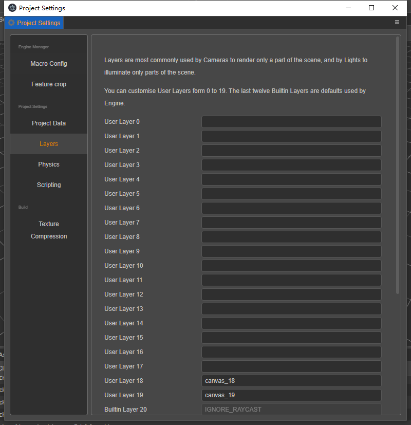

# layer

The layer property is an unsigned 32-bit integer, supporting up to 32 different types of layer, with bits 20 - 30 set as the system default, leaving bits 00 - 19 for user custom. The Visibility property of the camera, like the layer property of a node, is used to control its visibility. The Visibility property of the camera supports the overlay of multiple layer states, using bitwise operators like ` | `, ` & ` to determine whether the node's layer should be observed.

## System default hierarchical attributes

| Property              | Description                             | other           |
| :---                  | :---                                    | :---            |
| **NONE**              | Set all invisible                       | 0               |
| **IGNORE_RAYCAST**    | Setting to ignore ray detection         | 1 << 20         |
| **GIZMOS**            | Set gizmo information visible           | 1 << 21         |
| **EDITOR**            | Set editor visible                      | 1 << 22         |
| **UI_3D**             | Set the `3D UI` node to be visible      | 1 << 23         |
| **SCENE_GIZMO**       | Set scene gizmo visible                 | 1 << 24         |
| **UI_2D**             | Set `2D UI` nodes visible               | 1 << 25         |
| **PROFILER**          | Set the profiler node to be visible     | 1 << 28         |
| **DEFAULT**           | Set the default node to be visible      | 1 << 30         |
| **ALL**               | Set all nodes to be visible             | 0xffffffff      |

## User-defined hierarchy

