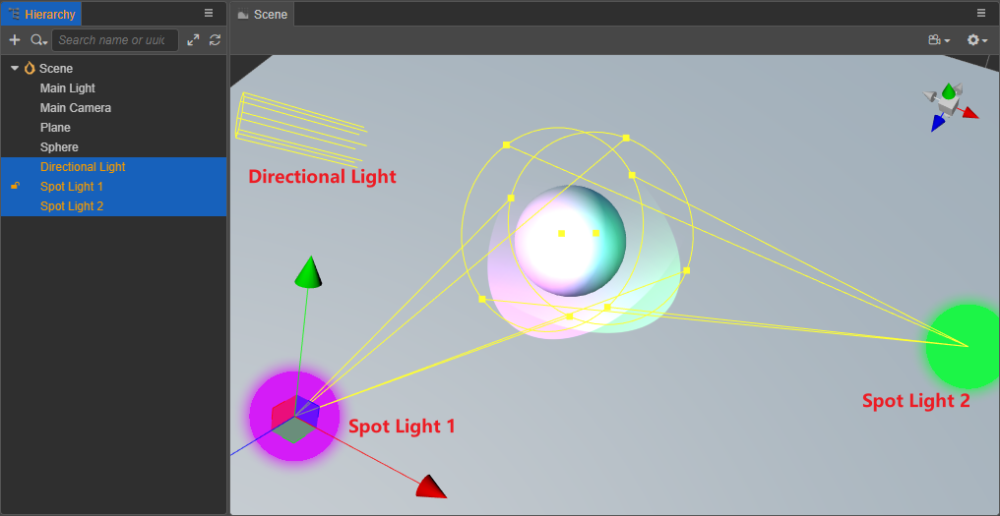
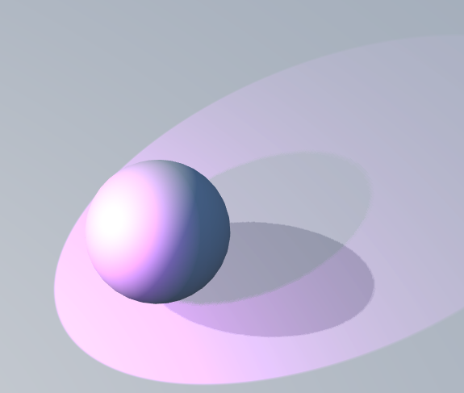

# Additive Per-Pixel Lights

Uber Shader is still the dominant solution on some performance-constrained platforms, but as hardware performance increases and the demand for higher picture quality increases, a fixed number of lights can no longer meet the needs of practical applications, so there is a solution that supports multiple lights -- **Multi-Pass Drawing**.

The following is an example of how to implement multiple lights based on multiple Pass with the default lighting material `default-material.mtl` in Cocos Creator.

First, create a new **Sphere** node in the **Hierarchy** panel, then continue to add a Directional Light and two Spotlights, setting them to surround the Sphere, as shown in the following image:

After the scene is built, select the browser preview above the editor and you can see the draw call in the bottom left corner of the web preview:

We can use a third party software such as RenderDoc to open the Frame Debug to see how these lights are rendered to the screen:

As shown in the image above, the first rendering is the lighting of **Directional Light**:

The second rendering is the lighting of **Spotlight 1**:

The third rendering is the lighting of **Spotlight 2**:

This type of rendering is the **Forward-Pipeline** that supports multiple lighting models, and **Forward** generally consists of two Passes:

- The first Pass is **BasePass**, which is used to render the lighting of Directional Light.

- The second pass is **LightPass**, which is used to render the lighting of the remaining lights.

Therefore, when an object is illuminated by more than one light at the same time, the Draw Call will also increase.
