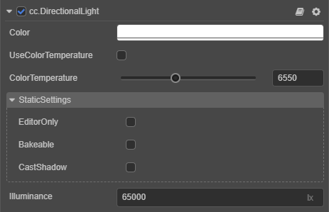

# Main Directional Light

There is only one main directional light in __Cocos Creator__. The main directional light can be understood as the dominant light in the scene, usually the sunlight in outdoor scenes. The main directional light also affects the shadow projection.

To use **Main Directional Light**, please refer to the [Main Directional Light API](../../../api/en/classes/component_light.directionallight.html).

## Main Directional Light Properties

| Property | Description |
| :------- | :--- |
| Color | Light color |
| Use Color Temperature | Whether to enable color temperature |
| Color Temperature | Color temperature |
| Illumiance | Illumination, unit **lux (lx)** of **nits** |
