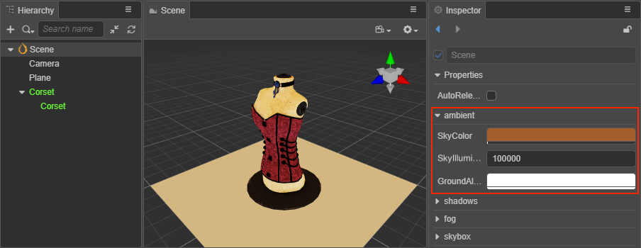
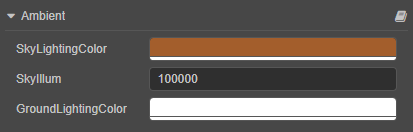

# Ambient Light

In life, intricate light and uneven object surfaces reflect off each other, making the entire environment illuminated as if by an even layer of light, this light is generally called ambient light, also known as diffuse ambient light.

Because the ambient light can evenly illuminate all objects in the scene, it is often used to solve the problem of the backlight surface of the model is completely black, generally need to be used with other types of lights together. For example, if there is only directional light in the scene, it will look very dark at the backlight of the model.

Check **Scene** in the **Hierarchy** panel, and then set the ambient light property in the **ambient** component of the **Inspector** panel.

> **Note**: since ambient light is undirected, it cannot produce shadows.

## Ambient Light Properties

| Property | Description |
| :--- | :--- |
| SkyColor | Sets the sky color. |
| SkyIllumination | Adjusts the sky brightness. |
| GroundAlbedo | Sets the color of the reflected light from the ground. |

The ambient light can be used together with the sky box, for details, please refer to the [Skybox](../../skybox.md) documentation.
