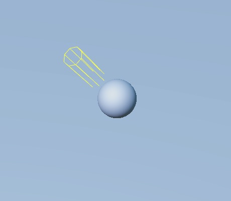
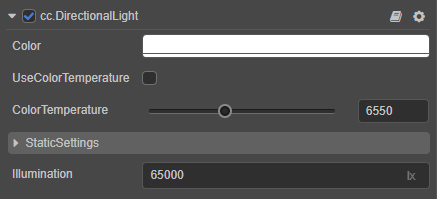
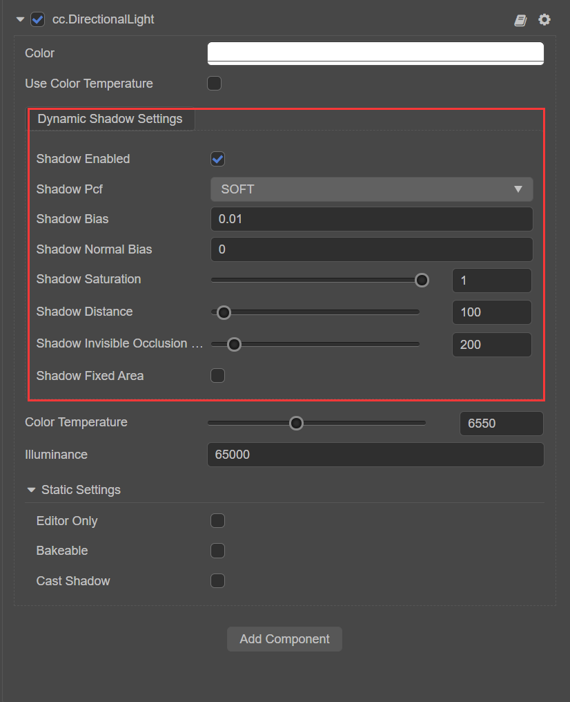
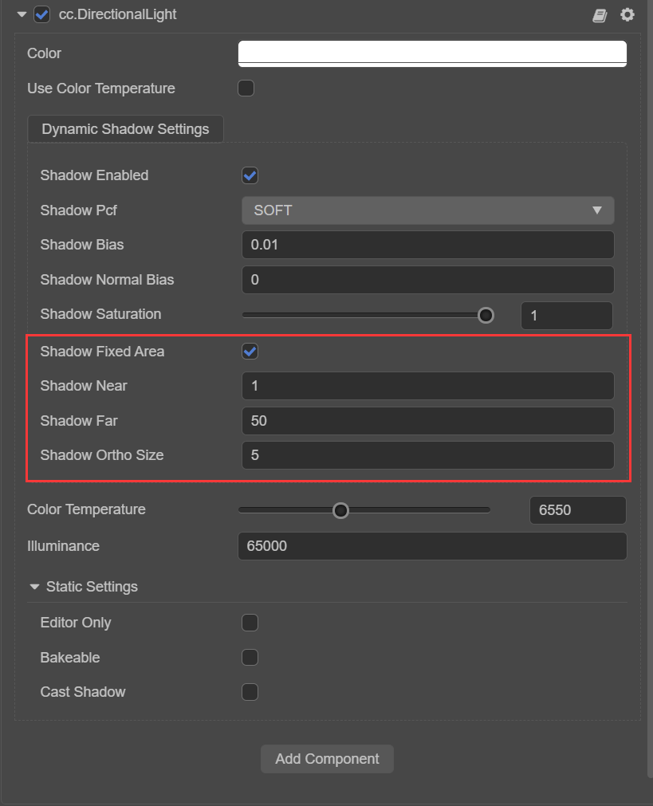

# Directional Lights

Directional Light is the most common type of light that simulates the light emitted by a source at infinity and is often used to simulate sunlight.

Because the distance between the light and the illuminated target is undefined (infinite distance), the lighting effect is not affected by the **position** and **orientation** of the light (as shown below, directional light produces the same lighting brightness in all planes). However, **rotation** affects the direction of directional light, which in turn affects the extent to which the model receives light and where the model produces shadows. This can be done with the [Rotate Gizmo](../../../../editor/toolbar/index.md#rotate-gizmo) in the upper left corner of the editor to adjust the direction of directional light.

Adding directional lights to the scene can be done as described in [Adding Lights](index.md#adding-lights).

> **Note**: Cocos Creator currently supports only one directional light. If adding more than one at the same time, the last one added will prevail.

A directional light node `Main Light` will be created automatically by default when creating a new scene.

For the interface of the directional light component, please refer to [DirectionalLight API](__APIDOC__/en/#/docs/3.4/en/component-light/Class/DirectionalLight).

> **Note**: Starting with v3.5, **Parallel Light Shadows** are separated from the Scene Settings panel and do not set shadow properties globally.

## Directional Light Properties

| Property | Description |
| :------ | :-- |
| Color | Sets the light color. |
| UseColorTemperature | Whether to enable the color temperature. |
| ColorTemperature | Adjusts the color temperature. |
| StaticSettings | Sets static lighting, please refer to the [Lightmapping](../lightmap.md) documentation for details. |
| Illumination | Illumination in **lux (lx)**. |

### Directional Light Shadow Properties

| Property | Explanation |
| :--- | :--- |
| ShadowEnabled        | Whether to enable the shadow effect. |
| ShadowPcf             | Set the anti-aliasing level of the shadow edge, currently including **HARD**, **SOFT**, **SOFT_2X**. Please refer to the section **PCF Soft Shadow** below for details.  |
| ShadowBias            | Set the shadow offset value to prevent z-fitting. |
| ShadowNormalBias      | Set the normal offset value. |
| ShadowSaturation      | Set the shadow saturation. It is recommended to set as **1**. If it is necessary to reduce the saturation of the directional light shadows, it is recommended to do it by increasing the ambient light instead of adjusting this value.  |
| ShadowInvisibleOcclusionRange | Set whether shadows from objects outside of the Camera's visible range are cast into the visible range, and if so, turns up the value. |
| ShadowDistance  | Set the range of shadow effects displayed within the visible range of the Camera, with the shadow quality inversely proportional to the size of this value.    |

#### FixedArea Mode

FixedArea mode is used to set whether to manually control the range of shadow effects displayed within the visible range of the Camera:

- If this option is unchecked (default), the engine uses the same crop process and camera calculations as CSM (Cascaded Shadow Maps), calculating the range of shadows generated based on the orientation and position of the Camera.
- If this option is checked, the range of shadow generation is controlled according to the `Near`, `Far`, and `OrthoSize` properties set manually. The shadows follow the position of the directional light nodes and are distributed around the directional light bounding box, rather than following the camera.

| Property | Explanation |
| :--- | :--- |
| ShadowFixedArea       | Set whether to manually set the following properties to control the range of shadow effects displayed within the visible range of the Camera, as described in the **FixedArea Mode** section below. |
| ShadowNear            | Set the near clipping plane of the main lights shadow camera. |
| ShadowFar             | Set the far clipping plane of the main lights shadow camera. |
| ShadowOrthoSize       | Set the ortho viewport size of the main lights shadow camera, with the shadow quality inversely proportional to the size of this value. |

#### PCF Soft Shadow

Percentage Closer Filtering (PCF) is a simple, common technique used to achieve shadow edge desampling, by smoothing shadow edges to eliminate jaggedness in shadow mapping. The principle is to sample around the current pixel (also called a fragment), then calculate the ratio of the sample closer to the lights compared to the fragment, use this ratio to scale the scattered light and specular light, and then color the fragment to blur the shadow edges.

Cocos Creator currently supports **hard sampler (HARD mode)**, **4x sampler (SOFT mode)**, **9x sampler (SOFT_2X mode)**. The larger the magnification, the larger the sampling area and the more softer the shadow edges.
