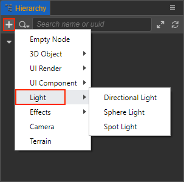
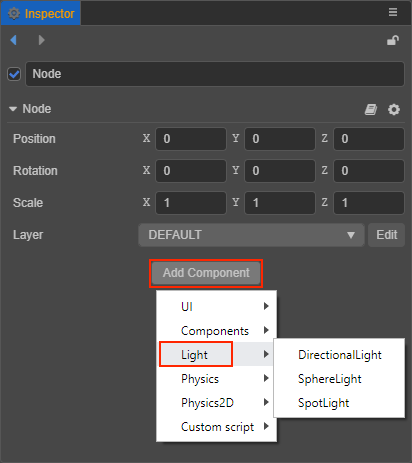

# Lights

The light determines the color, color temperature, intensity, direction, and shadow effect of the light to which the object is exposed. The types of lights currently supported by Creator include:

- [Directional Lights](dir-light.md)
- [Spherical Lights](sphere-light.md)
- [Spotlights](spot-light.md)
- [Ambient Light](ambient.md)

## Adding A Light

There are two ways to add a light.

1. Click the **+** button in the top left corner of the **Hierarchy** panel, select **Light**, and then select the light type as needed to create a node with the corresponding type of **Light Component** to the scene.

    

2. In the **Hierarchy** panel, select the node to which you want to add a light, then click the **Add Component** button under the **Inspector** panel and select **Light** to select the desired light component to the node.

    
