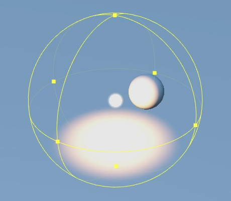
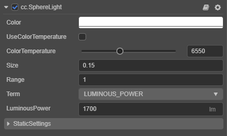

# Spherical Lights

Cocos Creator 3.x's spherical light is similar to v2.x's point light.

Spherical light spreads light evenly in all directions, similar to the light produced by a candle. The intensity of light on an object decreases as the distance from the light increases, and is zero when the distance exceeds the set light effect range.

In practical applications, it can be used to simulate lights such as torches, candles, and light bulbs to illuminate the surrounding environment within a certain distance.

The light location and color, as well as its illumination range can be clearly seen in the editor, as shown in the image below. The light range of the spherical light can be adjusted by modifying the `Range` property of the spherical light component in the **Inspector** panel.

Adding spherical lights to the scene can be done as described in [Adding Lights](index.md#adding-lights).

For the spherical light component interface, please refer to [SphereLight API](__APIDOC__/en/#/docs/3.5/en/component-light/Class/SphereLight).

## Sphere Light Properties

| Property | Description |
| :---- | :---- |
| Color | Sets the light color. |
| UseColorTemperature | Whether to enable the color temperature. |
| ColorTemperature |Adjusts the color temperature.|
| Size | Sets the light size. |
| Range | Sets the range of light effect. |
| Term | Sets the type of light intensity unit, including **LUMINOUS_POWER** and **LUMINANCE**.
| LuminousPower | Luminous flux in **lumens (lm)**. Effective when **Term** is set to **LUMINOUS_POWER**. |
| Luminance | Brightness in **Candela per square meter (cd/m2)**. Effective when **Term** is set to **LUMINANCE**. |
| StaticSettings | Static lighting settings, please refer to [Lightmapping](../lightmap.md). |

> **Note**: currently, the `Size` property of the spherical light does not take effect in actual operation, as well as the display of shadows is not supported for now, we will optimize it in subsequent versions, please pay attention to the update announcement.
