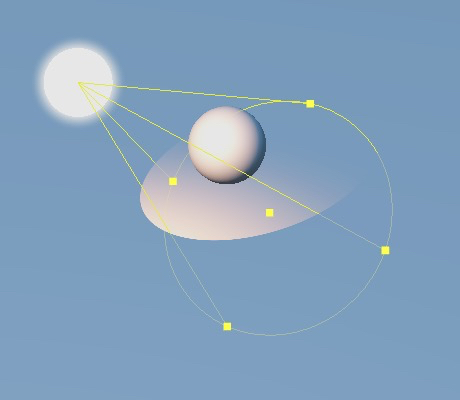
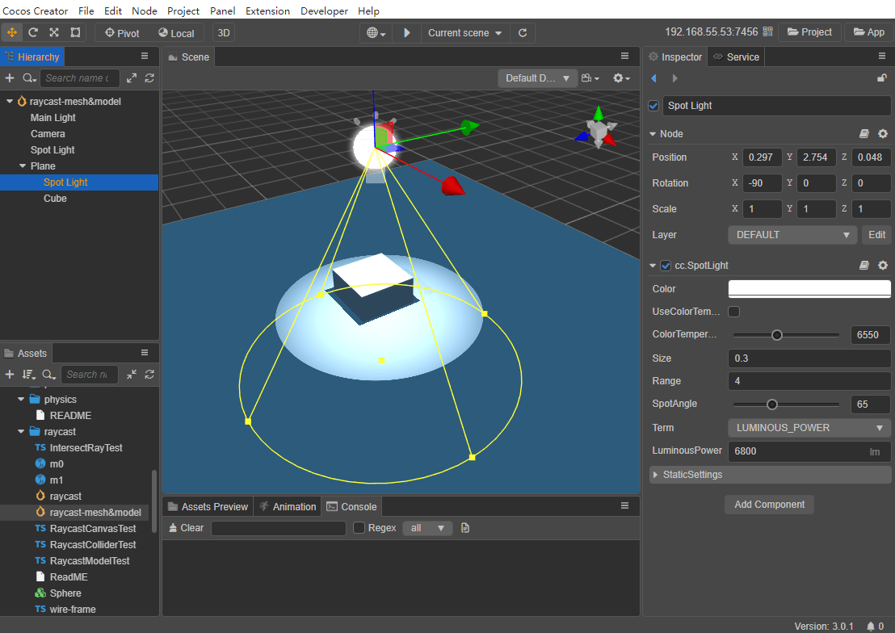

# Spotlights

A **Spotlight** is a cone-shaped beam of light emitted from a point in one direction, similar to the light produced by a flashlight or stage lighting. Compared to other lights, spotlights have an additional `SpotAngle` property, which is used to adjust the light range of the spotlight.

In the editor, you can clearly see the position, color and light range of the light as well as its spot angle, as shown in the following image. With the [Transform Gizmos](../../../../editor/toolbar/index.md) in the upper left corner of the editor, you can adjust the position and direction of the spotlight.

See [Adding A Light](index.md#adding-a-light) for how to add a spotlight to a scene.

For the Spotlight component interface, please refer to [SpotLight API](__APIDOC__/en/classes/component_light.spotlight.html).

## Spotlight Properties

| Property | Description |
| :------ | :--- |
| Color | Sets the color of the light. |
| UseColorTemperature | Enables or disables the color temperature. |
| ColorTemperature |Adjusts the color temperature. |
| Size | Sets the light size. |
| Range | Sets the range of light effect. |
| SpotAngle | Adjusts the spot angle to control the light range. |
| Term | Sets the light intensity unit type, including **LUMINOUS_POWER** and **LUMINANCE**.
| LuminousPower | Luminous flux in **lumens (lm)**.  Effective when **Term** is set to **LUMINOUS_POWER**. |
| Luminance | Brightness in **Candela per square meter (cd/m2)**. Effective when **Term** is set to **LUMINANCE**. |
| StaticSettings | Static lighting settings, please refer to the [Lightmapping](../lightmap.md) documentation. |
