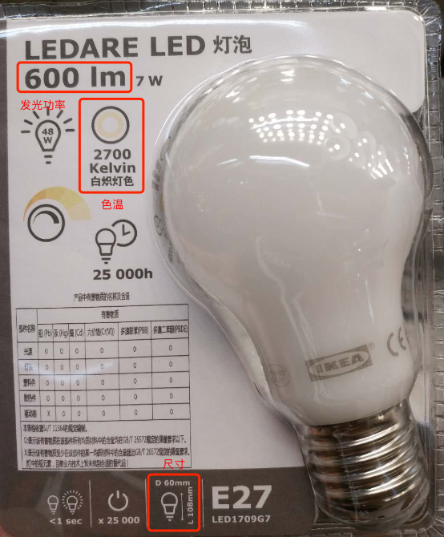
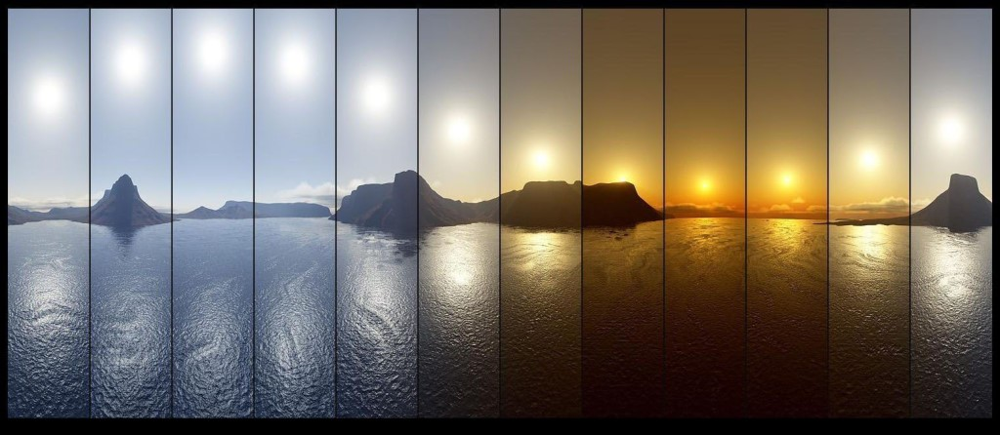
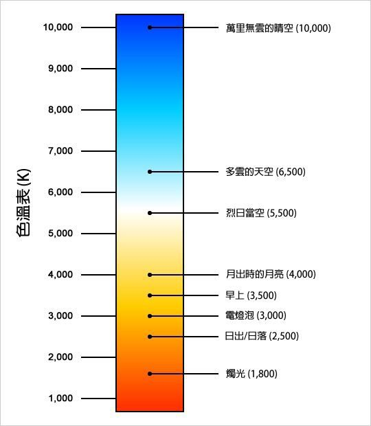

# Physically Based Lighting

## Light sources in the real world

Physically based lighting describes light sources in the real world. In real environments, the light sources we see have their own industrial parameters. Let’s first look at a light bulb.💡

From the product packaging, we can understand several important industrial parameters of this bulb:
- **luminous power**
- **color temperature**
- **size**

These three important parameters affect the performance of the light source in the real world. Let's focus on the physical meaning of these three parameters.

## Luminous power

**Luminous power** is what we usually call the light sources intensity. __Cocos Creator 3.0__ uses **photometric units** to measure light source intensity:

- **Luminous Power**

  Unit **Lumens (`lm`)**. 
  Describes the total amount of light emitted by the light source from all directions. Changing the size of the light source will not affect the lighting effect of the scene.

- **Luminance**

  Unit **Candela per square meter (`cd/m2` or `nits`)**. 
  Describes the intensity of the light source when light is measured from a point on the surface of the light source to a point on the receiving surface. Changing the size of the light source will affect the lighting effect of the scene.

- **Illuminance**

  Unit **lux (`lx`)** 
  Describes the total amount of light from a light source measured at the receiving surface. This value is affected by the distance the light travels.

In the real world, because the important physical parameters describing light sources are different, we usually use **luminous power** and **luminance** to describe light sources that illuminate areas commonly used in life.

## Color Temperature

**Color temperature** refers to the color of the absolute black body after it has been heated from absolute zero (-273°C).

**Color temperature** is an important attribute that affects the color of the light source. It is an optional attribute. When color temperature is enabled, the color temperature also contributes to the color of the light source.

In a real world environment, the ambient color temperature at different times of the day also changes dynamically:

Please refer to the following table:

## Light source size

Light sources in the real world have real physical dimensions. At the same time, the size of the light source also affects the intensity of the light source.

