# IBL Example

In Cocos Creator developers can combine image lighting based features. These features include.

- via [skybox](../../skybox.md) with baked reflection convolution to provide better ambient reflection effects
- Bake lighting information into the environment with [Lightmapping](../lightmap.md) to bake lighting information into the map to improve lighting performance
- Bake lighting information into maps to improve lighting performance via [light-probe](./light-probe.md)/[reflection-probe](./reflection-probe.md) to detect reflections between objects

This article will demonstrate how to bake image-based lighting into your scenes from an art asset worker's workflow.

## Preparation

Since both Light Probe and Reflection Probe are for physically based lighting models, please follow the PBR workflow when creating art resources.

Please prepare the material file in advance using the following shaders; or import the model exported from the DCC tool via [Importing Models Exported from DCC Tools](../../../../asset/model/dcc-export-mesh.md). Importing to **Resource Manager** will automatically recognize the materials in the model and convert its shaders to PBR shaders supported by the engine.

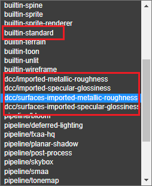 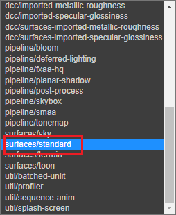

- builtin-standard: built-in standard PBR shader
- dcc/imported-metallic-roughness: shader for models exported based on the metallic-roughness workflow
- dcc/imported-specular-glossiness: shader for models exported based on the specular-glossiniess workflow
- surface/standard: built-in standard surface PBR shader
- dcc/surface-imported-metallic-roughness: built-in shader for models exported from the metallic-roughness workflow based on the standard surface
- dcc/surface-imported-specular-glossiness: built-in shader for models exported from the specular-glossiniess workflow for standard surfaces

It can also be manually adjusted to use the above standard shaders after the model has been imported into **Assets Manager**.

Developers can also review the following documentation to understand the entire PBR workflow.

- [Physically Based Lighting](../pbr-lighting.md)
- [Physically Based Rendering (PBR)](../../../../shader/effect-builtin-pbr.md)
- [Importing Models Exported from DCC Tools](../../../../asset/model/dcc-export-mesh.md).
- [FBX Smart Material Conversion](../../../../importer/materials/fbx-materials.md)

## Bake Lights

The [light-probe panel](light-probe-panel.md), and [lightmap](../lightmap.md) can be used for light baking to generate image-based lighting.

### Bakeing Process

As an example of a manually built scene.

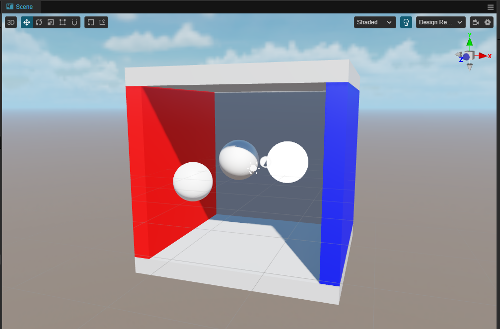

- Add [light-probe](light-probe.md)

    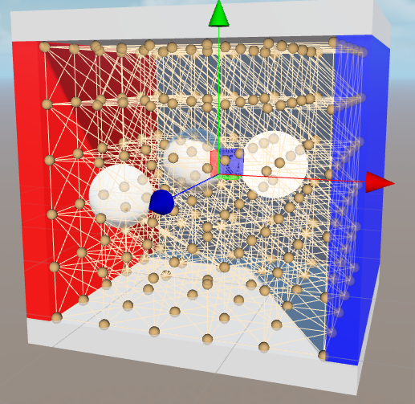

- Add [reflection probes](relfection-probe.md)

   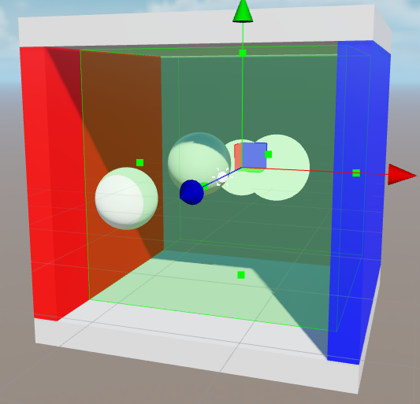

- Adjusting the properties of a node
    - For the nodes that need to use the baked results, adjust their properties as follows:

        

        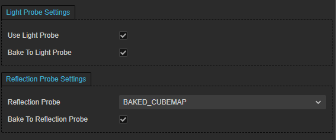

    - For the node to be baked
        - Ensure that the **Mobility** property within its **Inspector** is **Static**.

        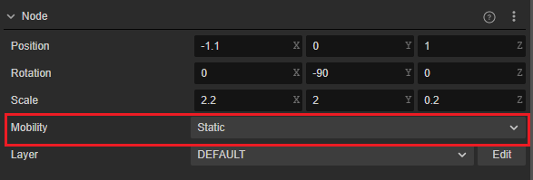

        - Check the **Bake To Light Probe** and **Bake To Reflection Probe** properties of its **MeshRenderer** property and select **Reflection Probe** wisely

        

- Open the **Reflection Probe** and **Light Probe** panels.

    - Click the **Bake** button on the above panel and wait for the baking process to finish.

        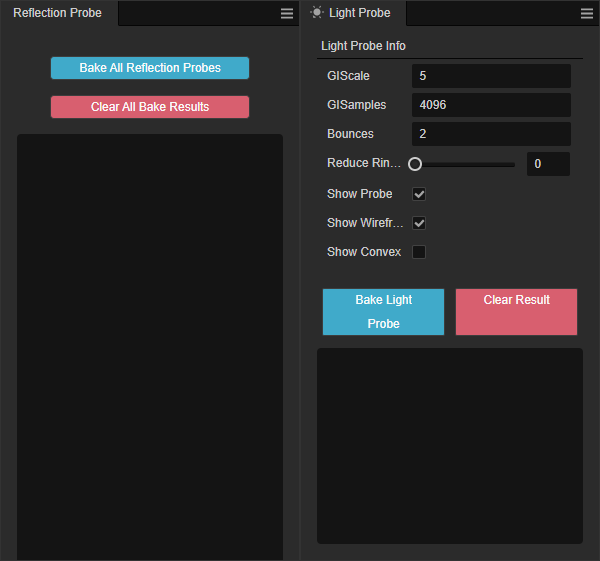

- Optionally, you can bake [lightmap] via the **Light Baking** panel (../lightmap.md):

    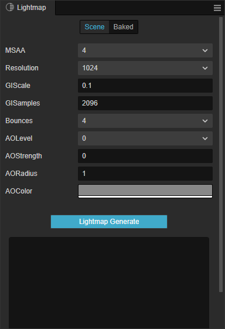

- Within **Hierarchy** **Scene Node**, find [Skybox](../../skybox.md) on its **Inspector** component and adjust the corresponding properties to get better results

  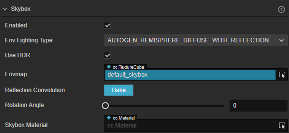

    - Adjust **Env Lighting Type** to **AUTOGEN_HEMISPHERE_DIFFUSE_WITH_REFLECTION**
    - Click the **Bake** button on the **Skybox** component to bake the reflection convolution map.

    This will give you a more realistic ambient reflection lighting effect

- Check the baking result:

    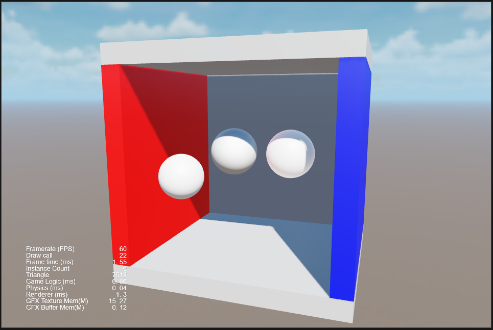
