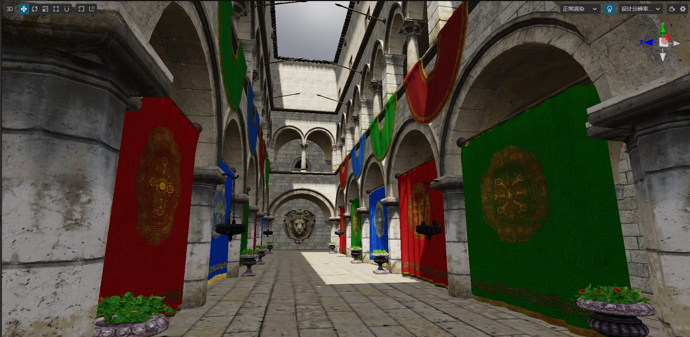

# Imaged Based Lighting

Since computing lighting in real time is too demanding for hardware, most of the games or 3D simulations use Image Based Lighting (IBL) for higher performance, which means that the lighting information is stored on the computer's storage media and the lighting is reconstructed by sampling the information in the graphics at runtime.

In the engine, image based lighting usually consists of the following functions.

## Light Mapping

With [Lightmapping](../lightmap.md) developers can record the lighting information of the scene on the mapping and use it at runtime. Thus, the use of real time within the scene can be avoided or reduced and rendering efficiency can be improved.

## Skybox

In [Skybox](../../skybox.md), **Bake Reflection Convolution Map** can be used to generate a pre-convolved reflection effect for the environment map to improve the quality of the ambient lighting.

## Light Probe

Starting from v3.7, Cocos Creator supports [light-probe](light-probe.md) and [reflection-probe](reflection-probe.md).

The light-probe is part of the global illumination. The probe is placed inside the scene to detect the light bouncing around the scene and store the offline results to improve the lighting effect and enhance the rendering quality.

## Reflection Probe

The [reflection-probe](reflection-probe.md) currently supports both real-time and baked cases. In the real-time case, developers can configure the reflection-probe to render the reflection effect of objects in real time. The baked case allows the

By combining [Skybox](../../skybox.md), [Lightmapping](../lightmap.md), [Light Probe](./light-probe.md) and [Reflection Probe](reflection-probe.md) to get more realistic and reliable lighting effects with performance.

## Contents

This chapter will contain the following.

- [Light Probe](light-probe.md)
    - [Light Probe Panel](light-probe-panel.md)
- [Reflection Probe](reflection-probe.md)
    - [Reflection Probe Panel](reflection-probe-panel.md)
- [Skybox](../../skybox.md)
- [lightmap](../lightmap.md)
- [Image Based lighting Example](example.md)
