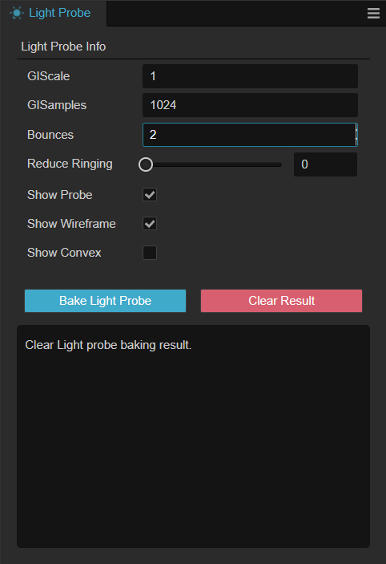
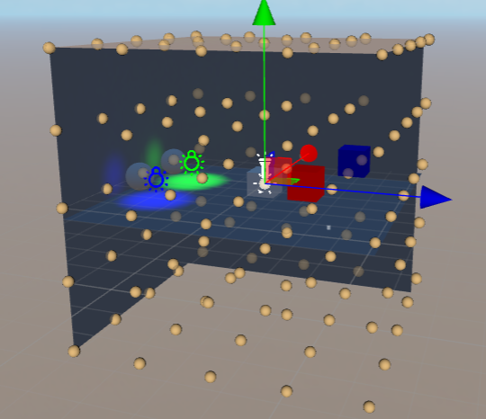
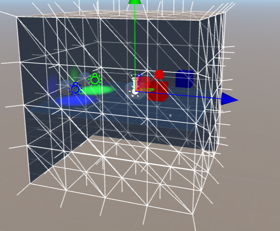
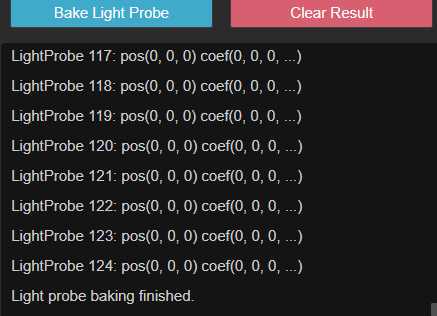

# Light Probe Panel

From the top menu of the editor, select **Projects** -> **Light Baking** -> **Light Probe** to open the Light Probe Baking Panel.

The **Light Baking Panel** will bake the [light-probe](light-probe.md) already laid out in the **Scene Editor**. After baking, the indirect light information of the static object will be recorded to the storage medium; all nodes configured with the **Movable** property will have access to more detailed and realistic indirect light effects.

## Properties

| Properties | Description |
| :-- | :-- |
| **GIScale** | GI([Global Illumination](https://en.wikipedia.org/wiki/Global_illumination))scale factor |
| **GISample** | GI sample factor |
| **Bounces** | Number of light bounces, in the range [1, 4]   The meaning of bounce is the process of the current light source hitting an object and bouncing back to the probe.   If the number of light bounces exceeds this property, it will not be recorded in the baking result |
| **Reduceing Ringing** | In some cases, the light from the light probe may penetrate from bright to dark areas thus forming a ring. Modifying this property may improve the situation, but may result in unrealistic lighting |
| **Show Probe** | Whether to show light probes   The node with the **LightProbeGroup** component needs to be selected in the **Hierarchy**    |
| **Show Wireframe** | Whether to display the connection between light probes   The node with the **LightProbeGroup** component needs to be selected in the **Hierarchy**    |
| **Show Convex** | Whether to display the convex wrapping frame and vertex normals   The node with the **LightProbeGroup** component needs to be selected in the **Hierarchy**   |
| **Bake Light Probe** | Bake light probes |
| **Clear Result** | Clear bake results |
| **Cancel** | Cancel the baking process, this button will only be enabled when **Bake Light Probe** is clicked |

## Sample

Click **Bake Light Probe** to bake the light probe, and click **Clear Result** to clear the baked result.

You can click **Cancel** to cancel the baking process.

The progress of baking can be viewed in the information panel below.

Developers can also use the **Show Probe**, **Show Wireframe**, and **Show Convex** options to see within the scene if the probe matches the expected results.

See the [IBL Example](example.md) to see the art workflow.
