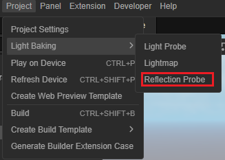
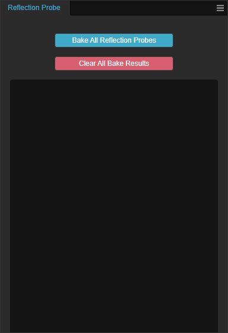
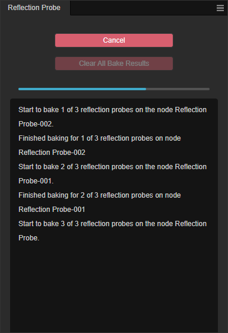

# Reflection Probe Panel

The Reflection Probe Baking panel can be opened via **Projects** -> **Light Baking** -> **Reflection Probe** on the main menu.

The Reflection Probe Baking panel bakes all nodes in the project that contain the [Reflection Probe](reflection-probe.md) component.

The baked results are placed in the project's **Resource Manager** under the name **reflectionProbe_**.

## Properties

| Properties | Description |
| :-- | :-- |
| **Bake All Reflection Probes** | Bake button, when clicked, will start baking all the reflection probes in the whole scene |
| **Clear All Bake Results** | Clear baked results, when clicked, will bake the results of reflection probes that already exist in the project |
| **Cancel** | Cancels the current baking process, which only takes effect when the bake button is pressed    |

## Art Workflow

Please refer to [reflection-probe](reflection-probe.md) or [IBL Example](example.md) for the art workflow.
