# Reflection Probe

Starting from v3.7, Cocos Creator supports reflection probes.

A reflection probe is a component that takes reflected light from a selected range and applies it to the current scene using baking or realtime to improve the scene lighting confidence.

You can create reflection probes within a scene by selecting **Light** -> **Reflection Probes** in the **Hierarchy** or on the top menu.

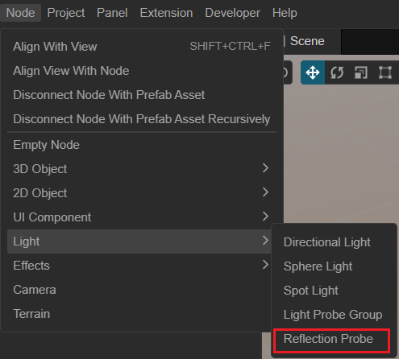

## Properties

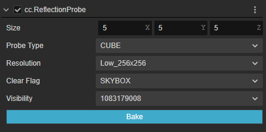

| Properties | Description |
| :-- | :-- |
| **Size** | The range of the reflection probe, which can be adjusted by manipulating Gizmo within the scene |
| **Probe Type** | Types of Reflection Probes   Options:  **CUBE**: Reflection probe with baking support   **PLANNAR**: Reflection probe with real-time reflection support   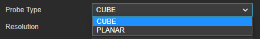|
| **Resolution** | Resolution of each face of the cube mapping after reflective probe baking   Options: **Low_256x256**/**Medium_512x512**/**Hight_768x768**   This option is only available when **Probe Type** is **CUBE**.   |
| **Background Color** | Background color, effective only when **Probe Type** is **PLANNAR** |
| **Clear Flag** | The clear flag of the camera specifies which part of the frame buffer is to be cleared each frame.   Contains SOLID_COLOR: clears the color, depth, and stencil buffers SKYBOX: enables the skybox and only clears the depth    |
| **Visibility** | Visibility mask declaring the set of node hierarchies visible in the current reflection probe   Selectable via drop-down menu   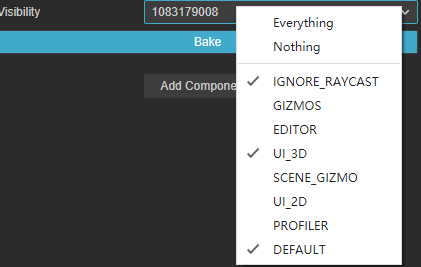|
| **Source Camera** | Specify the camera for real-time reflections   This property is only available when **Probe Type** is **PLANNAR** |
| **Bake** | Bake button, click it to bake the reflection probe

### Probe Type

There are two types of reflection probes for Cocos Creator.

- **CUBE**：Bake the reflection information in the area onto a CUBE Map.

    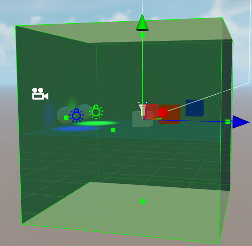

   With the reflection probe selected as **CUBE**, developers can select the size of the final baked map via the **RESOLUTION** drop-down menu below.

- **PLANNAR**：Real-time relection probe type.

    Commonly used to simulate the surface of water, mirrors, marble or wet floors, etc.

    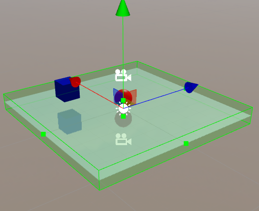

   When the type of the reflection probe is modified to **PLANNAR**, the developer needs to configure the **Source Camera** property to determine which camera to use as the camera for the reflection probe.

The **Size** property can be adjusted via Gizmo within the **Scene Editor** as a way to modify the range of the reflection probe.

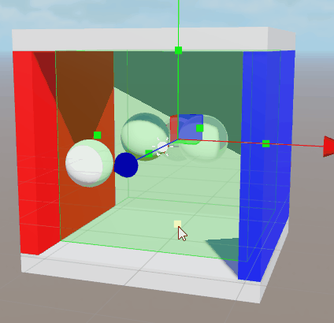

## Art workflow example

### Bake Reflection Probe Workflow

- Create **Reflection Probe** nodes within the scene

- Modify the **Mobility** property of the node that needs to bake the reflection to **Static**

    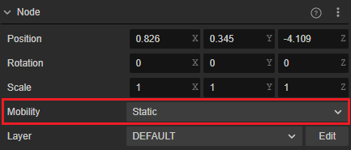

- Find **Reflection Probe Settings** by scrolling down on the **Inspector** of the node where the reflection needs to be baked, and adjust its corresponding property to.

    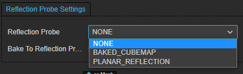

    - **Reflection Probe**: Select the type of reflection probe
    - **Bake To Reflection Probe**: Check whether to bake the reflection information of this mesh renderer to the reflection probe related map

    For detail, please refer to [MeshRenderer Component Reference](../../../../engine/renderable/model-component.md)

- Bake

    - Click the **Bake** button on the **Inspector** to bake the currently selected reflection probe.

        

    - Select **Projects** -> **Light** -> **Reflection Probe** on the main menu to open the [Reflection Probe Panel](reflection-probe-panel.md) and bake by clicking the bake button on the panel.

- Check baking results

    After baking is complete, **Asset Manager** creates mappings named starting with **reflectionProbe_** within the **Asset Manager**. Developers can see if these mappings meet expectations.

For more examples, please refer to [IBL Example](example.md).

### Real-time Reflection Probe Workflow

- Build the scene as shown in the figure.

    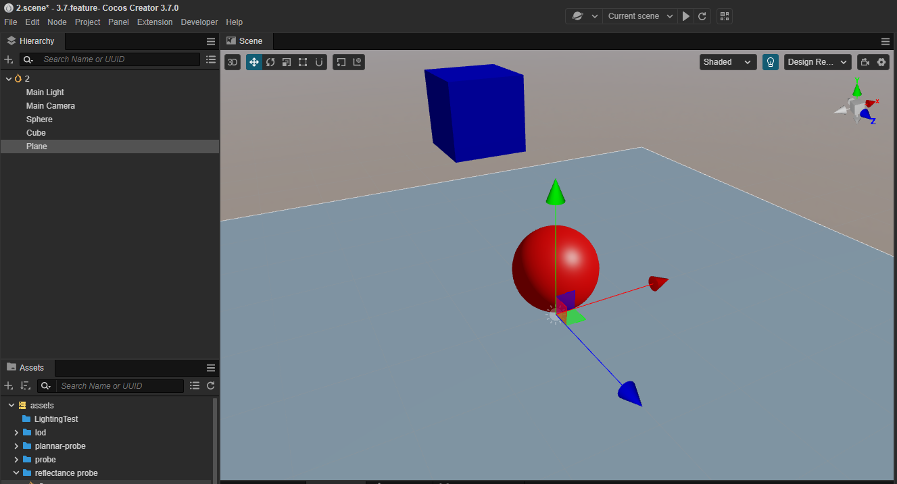

- Create a camera with the same parameters as the main camera, and use the Plane node in the scene above as the mirror, in mirror symmetry with the main camera.

    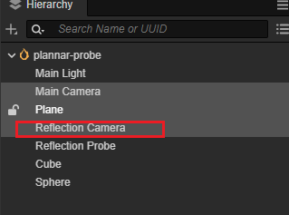

    Two cameras with mirror symmetry.

    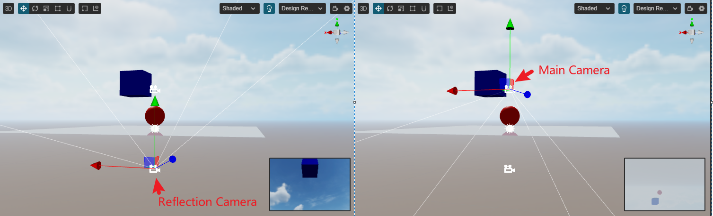

- Create **Reflection Probe** nodes in the scene:

    - Modify **Probe Type** to **PLANNAR**
    - Configure the **Source Camera** property to be the **Reflection Camera** node created in the above step

    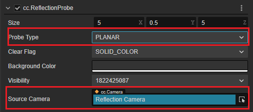

- Modify the **Reflection Probe** of the **MeshRenderer** property of the **Plane** node in the scene to **PLANNAR_REFLECTION**.

    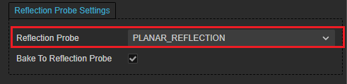

- At this point it can be observed that within the scene, the reflection of the plane changes.

    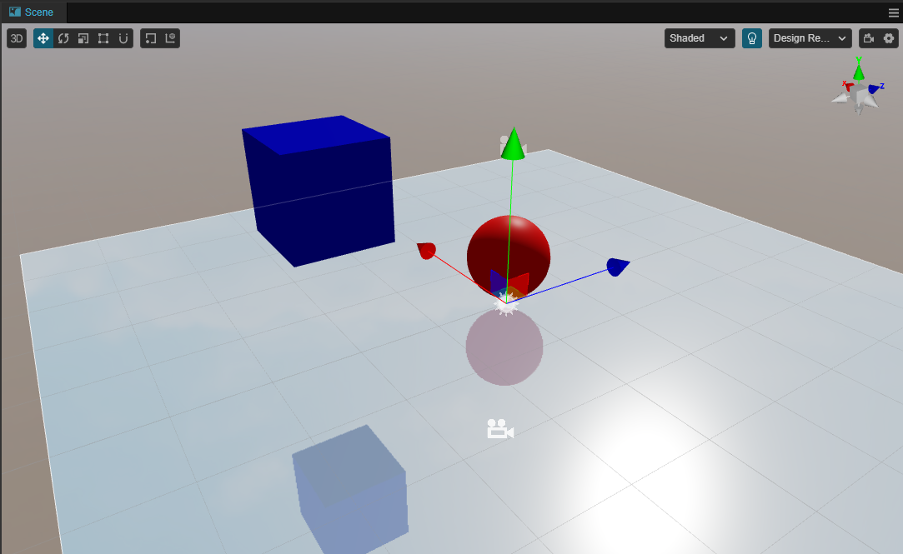
