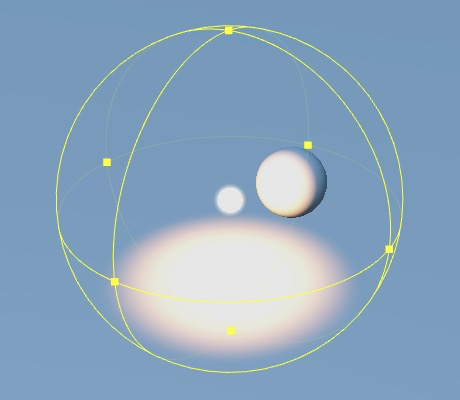

# Spherical Lighting

__Cocos Creator__ uses spherical light instead of **point lighting**, because physical light sources in the real world have light source size attributes.

To use `Spherical Lighting`, please refer to the [Spherical Lighting API](https://docs.cocos.com/creator3d/api/en/classes/component_light.spherelight.html).

## Spherical Lighting Properties

| Parameter | Description |
|:-------:|:---:|
| Color | Light source color |
| UseColorTemperature | Whether to enable color temperature |
| ColorTemperature | Color temperature |
| Size | Light source size |
| Range | Lighting impact range |
| Term | Selected unit for light intensity   Spherical light supports two unit system: **luminous power** and **luminance** |
| LuminousPower | Luminous power in **lumens (*lm*)**   When __Term__ is specified as __LUMINOUS_POWER__, lumen is used to indicate the light intensity |
| Luminance | Brightness, unit **Candela per square meter (*cd/m2</ sup>*)**  When __Term__ is specified as __LUMINANCE__, brightness is used to indicate light intensity |
