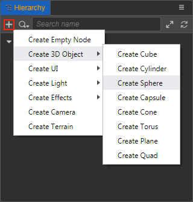
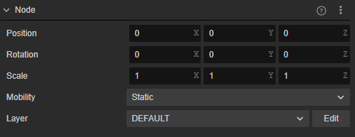
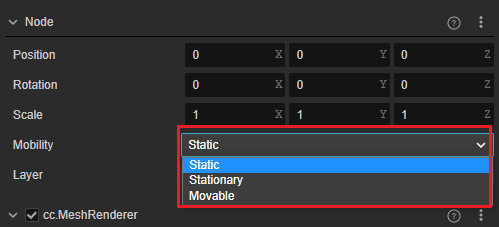
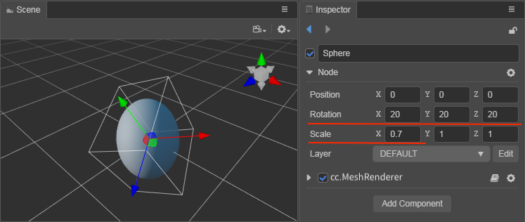
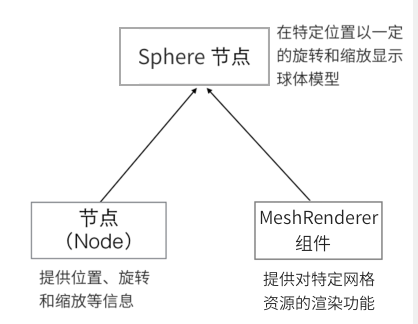
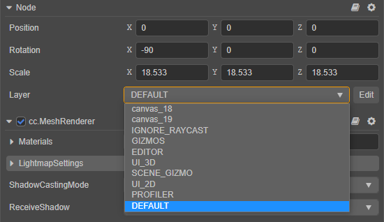

# Nodes and Components

The workflow of Cocos Creator is centered on component-based development, also known as an **Entity-Component System**, which simply means that the various elements of the game are built in a combinatorial rather than an inherited manner.

In Cocos Creator, a **Node** is an entity that hosts a component, and we mount **Component** with various functions on it to give it a variety of representations and functions. Let's see how to create nodes and add components to a scene.

## Nodes

Nodes are the basic building blocks of a scene. Nodes are organized in a tree-like relationship, and each node can have multiple children:

Nodes have the following properties:

- A node contains a set of base attributes (Position, Rotation, Scale), and nodes are organized together by a set of relative transformation relationships, as described in [coordinate systems and node transformation properties](./coord.md).
- The update order between nodes is cascading. The update of child nodes depends on the parent node, and child nodes follow the parent node transformations.
- Components can be added to a node to associate multiple components with the node.

### Create Nodes

The quickest way to get a node with a specific function is to use the **Create Node** button in the top left corner of the **Hierarchy** panel. Take the simplest example of creating a Sphere node by clicking on the **+**, creating a Node button in the upper left corner and then selecting **Create 3D Object -> Create Sphere**.

Notice the newly added Sphere node in the **Scene** and **Hierarchy** panel. The new node is named `Sphere` by default, indicating that it is a node whose functionality is primarily provided by the **Sphere** component. Try clicking the **Create Node** button again to select another node type and see that they will be named and behave differently. Also, note that creating a UI node automatically creates a Canvas node as the root node of the UI node, as described in the document [UI Structure Description](../../2d-object/ui-system/index.md).

For more information about the operations of single-select, multi-select, copy, delete, etc. of nodes in the **Hierarchy** panel, please refer to the [Hierarchy Panel](../../editor/hierarchy/index.md) documentation.

To create nodes dynamically in a script, refer to the [Create and Destroy Nodes](../../scripting/create-destroy.md) documentation.

## Node Properties

- **Mobility**：Mobility of nodes. Different mobility can lead to different properties and performance of nodes in terms of illumination

    

    For nodes containing light source components, Mobility behaves slightly differently, as described separately below.
    - For nodes holding light source components
        - Static: bakes direct and indirect light, and does not participate in the calculation at runtime after baking
        - Stationary: only indirect light is baked, and only direct light is calculated at runtime
        - Movable: does not bake, only calculates direct light at runtime
    - For nodes with MeshRenderer component
        - Static & Stationary Static objects: can use light mapping
        - Movable dynamic objects: can use light probes
    In general it is possible to add a light component to a node that holds a MeshRenderer component, but it is not recommended, consider separating multiple nodes to achieve such a requirement.

Translated with www.DeepL.com/Translator (free version)

- **Layer**：Sets the visibility capability of the node. Please refer to the following **Setting the visibility of nodes** for details.

## Components

What are components and how do they relate nodes?

Select the `Sphere` node, created above, and notice what the **Inspector** panel shows:

The part of the **Inspector** panel that starts with the `Node` title is the node's properties, which include information about the node's `Position`, `Rotation`, `Scale`, and other transformations. This is covered in detail in the [Coordinate Systems and Node Transformation Properties](coord.md) documentation.

Starting with the `cc.MeshRenderer` title is the property of the MeshRenderer component mounted on the Sphere. In Cocos Creator, the **MeshRenderer** component is used to render static 3D models, where the `Mesh` property is used to specify the mesh resources used for rendering. As the Sphere node was just created the default is `sphere.mesh`.

The `Materials` property is used to specify the [material](../../asset/material.md) used for rendering. You can try dragging any material from the **Assets** into the `Materials` property of the **Inspector** panel and you can see that the default material just became the specified material.

> **Note**: any resources set on the component, such as `sphere.mesh` in this case, will be loaded automatically at the same time as the scene loads. Types of resources that need to be set and automatically loaded can also be declared in custom components, refer to the [Getting and loading resources](../../scripting/load-assets.md) documentation.

In addition to adding components manually in the editor, they can also be added via scripts, for more details see the [Component creation and destruction](../../scripting/component.md) documentation.

### Effect of Node Properties on Components

Once the node and **MeshRenderer** component are combined, the rendering of the mesh resources can be controlled by modifying the node properties. The node can also be adjust according to the properties marked by the red line in the figure below, notice that the rotation and scaling of the model have changed.

**Before adjustment**:

**After adjustment**:

As previously mentioned, component-based structure is combined to achieve functional extensions. The combination of the node and **MeshRenderer** component is shown in the following figure:

## Add Additional Components

Multiple components can be added to a node to add more functionality to the node.

For example, select the node `Sphere` in the above example, then click the **Add Component** button at the bottom of the **Inspector** panel and select **Light -> DirectionalLight** to add a **Directional Light** component.

Next, set the properties of the **Directional Light** component, e.g.: adjust the `Color` property of the directional light to red, and notice that the color of the sphere model has changed, i.e. the **DirectionalLight** component that was added to the node has taken effect!

> **Notes**:
>
> 1. This is just a brief example of a more obvious effect. It is not recommended to add a **DirectionalLight** component to a sphere node.
> 2. That only one renderable component can be added to a node. Renderable components include: **MeshRenderer**, **Sprite**, **Label**, **Graphics**, **Mask**, **RichText**, **UIStaticBatch**, etc.

## Setting the visibility of nodes

The engine uses more generic nodes that match the camera to control the visibility of nodes. When the `Layer` property set in the node is included in the [Visibility property](../../editor/components/camera-component.md) of the camera, the node can be seen by the camera, and it supports mixed rendering of 3D and 2D components. This allows more flexibility in controlling the visibility of node components and diversifying the group display.

For details on the implementation of layers, please refer to the [layer](layer.md) documentation.

### Set the layer property of the node

The `Layer` property of a node is global and unique, but different nodes can set the same `Layer` property so that they are viewed by the same camera. Developers can use the `Layer` property built-in with the engine, or they can use a custom `Layer` property, which can be set by clicking the **Edit** button in the image below and going to the **Project Settings -> Layers** page. Please refer to the [Layer](layer.md) documentation for details.

Where `User Layer 0` - `User Layer 19` are layer properties provided for user-defined settings, the user only needs to fill in the custom layer name after the layer to enable this layer property and edit it on the node.
