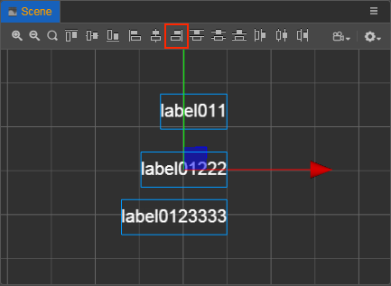

# Build a Scene Image Using the Scene Panel

This document will introduce the workflow and tips of using [Scene](../../editor/scene/index.md) panel to create and edit scene images.

## Use the "Create Node" Menu to Quickly Add Basic Node Types

When we start adding content to the scene, we typically start with the **Create Node** menu in the **Hierarchy** panel, which is the menu that pops up when you click the **+** button in the upper left corner, and select the base node type we need from several simple node categories and add it to the scene.

When adding nodes, the node selected in **Hierarchy** panel will become the parent of the newly created node. If you select a node that is collapsed and then add a new node through the menu, you need to expand the node you just selected to see the newly added node.

### Empty Node

Select **Create Empty Node** in the **Create Node** menu to create a node that does not contain any components. Empty nodes can be used as containers for organizing other nodes or for mounting logic and control components written by the developer. Also in the following we will describe how to create controls that meet your specific requirements by combining empty nodes and components.

### 3D Objects

Select **Create 3D Object** in the **Create Node** menu to create some of the more basic static model controls that come with the editor, which currently include cub, cylinder, sphere, capsule, cone, torus, plane, and quad. If you need to create other types of models, you can refer to the [MeshRenderer component](../../engine/renderable/model-component.md).

### UI Nodes

UI nodes can be created by selecting **Create UI** from the **Create Node** menu. UI nodes in Creator 3.0 require that any parent node must have at least one **UITransform** component. And every UI node itself will also have a **UITransform** component.

So the Canvas node is the **root node** of UI rendering, and all rendering-related UI nodes are placed under the Canvas, which has the following benefits:

- Canvas can provide multi-resolution adaptive scaling, and using Canvas as the root node can ensure that our scenes will look good on larger or smaller screens, see [Multi-resolution adaptation scheme](../..//ui-system/components/engine/multi-resolution.md).
- Canvas nodes are automatically centered according to the screen size, so UI nodes under Canvas will have the center of the screen as the origin of the coordinate system. In our experience, this simplifies the scene and UI setup (e.g.: having the button element's text appear right in the center of the button node by default), and makes it easier to script the UI node position control.

#### 2D Rendering Nodes

The **Create Node** menu allows you to create node types consisting of nodes and base rendering components like **ParticleSystem**, **Sprite**, **Label**, **Mask**, etc.

The base 2D rendering component here cannot be replaced by a combination of other components. Note that only one rendering component can be added to each node, and repeated additions will result in an error. However, complex interface controls can be implemented by combining different rendering nodes, such as the UI control node below.

#### UI Control Node

Common UI controls including Button, Widget, Layout, ScrollView, EditBox, etc. nodes can be created from the **UI** category in the **Create Node** menu.

UI nodes are mostly a combination of rendered nodes, for example, the **Button** node we created through the menu includes a button background node with a **Button** component + a **Sprite** component, and a label node with a **Label** component:

Creating nodes of the base type using the menu is the recommended way to quickly add content to the scene, and then we can edit the nodes created using the menu as needed to create the combinations we need.

For more on UI nodes, see [UI Structure Description](../../ui-system/components/engine/index.md).

### Attribution of Logical Nodes

In addition to nodes with specific rendering and other tasks, it is recommended to have some nodes in the root directory of the scene that are only responsible for mounting scripts and executing game logic, without any rendering and other related content. Usually we place these nodes at the root level of the scene, side by side with Canvas nodes, so that other developers can find the game logic and bind relevant data in the first place when collaborating.

## Tips to Improve the Efficiency of Scene Creation

The **Scene** panel includes both 3D and 2D views. The 3D view is used for 3D scene editing, and the 2D view is used mainly for editing 2D elements such as UI nodes. The scene view can be switched via the 3D/2D button in the toolbar at the top left of the editor.  
The following shortcuts work for both views.

- Select a node in the **Hierarchy** panel and double-click or press <kbd>F</kbd> to focus the node in the **Scene** panel.
- Pressing <kbd>Cmd/Ctrl + D</kbd> after selecting a node will copy and paste an identical node at the same location as the node, which can be used for efficiency when we need to make multiple similar nodes quickly.
- In **Scene**/**Hierarchy** panel, hold down the <kbd>Cmd/Ctrl</kbd> key and click on the node you want in order to select multiple nodes at the same time. The <kbd>Shift</kbd> key allows you to select nodes in succession, without selecting them one by one.

### Align/Evenly Distribute Nodes

When the **Scene** panel is in **2D** view, there is a row of buttons in the upper left corner that can be used to align or evenly distribute multiple nodes when they are selected. The specific rules are as follows:

Assuming that all three Label nodes are selected, the six alignment buttons from left to right will align these nodes in turn:

- Top-aligned to the nearest upper border (not the upper border of the topmost node)
- Vertically centered, aligned to the overall horizontal center line
- Bottom-aligned, aligned to the nearest lower boundary
- Left-aligned to its closest left border
- Horizontally centered, aligned to the overall vertical center line
- Right-aligned, aligned to the nearest right border

The 6 distribution buttons in the second half, from left to right, will align these nodes in turn:

- Top distribution, evenly distributed along the top boundary of the node
- Vertically centered distribution, evenly distributed along the horizontal midline of the node
- Bottom distribution, evenly distributed along the lower boundary of the node
- Left distribution, evenly distributed along the left border of the node
- Horizontally centered distribution, evenly distributed along the vertical center line of the node
- Right distribution, evenly distributed along the right boundary of the node

> **Note**: whether the left and right boundaries and the center line are determined at the beginning, or the reference when aligning/evenly distributing each node later, it is the center of the node bounding box or one of the boundaries rather than the position coordinates of the nodes.

For example, in the figure below, when we align the three Label nodes with different widths to the right, we get the alignment of the right boundaries of the three node bounding boxes, not the `x` coordinates of the three node positions becoming the same.

## Scene Display Effects

There is also support for setting the Skybox, Global Fog, and Shadows in the scene to better enrich the scene and render and display the scene environment. For details, please refer to:

- [Skybox](./skybox.md)
- [Global Fog](./fog.md)
- [Shadow](./shadow.md)
