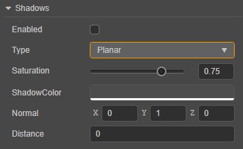
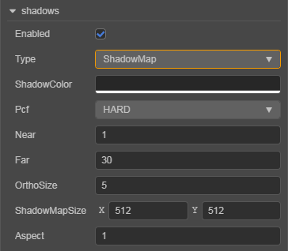

# Shadow

In the 3D world, light and shadow have always been extremely important components that enrich the entire environment. High quality shadows can make the game world look more realistic.

Cocos Creator 3.0 currently supports both **Planar** and **ShadowMap** shadow types.

## Enable Shadow Effect

To enable the shadow effect for an object, proceed as follows:

1. Check **Scene** in the **Hierarchy** panel, and then check the **Enabled** property in the **Shadows** component of the **Inspector** panel.

    

2. Select the 3D node that needs to display shadows in the **Hierarchy** panel, and then set the **ShadowCastingMode** property to **ON** in the **MeshRenderer** component of the **Inspector** panel.

    

    If the shadow type is **ShadowMap**, set the **ReceiveShadow** property on the **MeshRenderer** component to **ON**.

> **Note**: if the shadows are not displayed properly, adjust the direction of the directional light.

## Shadow Type

The shadow type can be set in the **Type** property of the **Shadows** component.

### Planar Shadow

The Planar shadow type is generally used for simpler scenes.

| Property | Description |
| :--- | :--- |
| **Enabled** | Whether to enable shadow effect |
| **Type** | Shadow type |
| **Saturation**  | Set the shadow saturation  |
| **ShadowColor** | Shadow color |
| **Normal** | The normal line perpendicular to the shadow, used to adjust the slope of the shadow |
| **Distance** | The distance of the shadow in the direction of the normal to the origin of the coordinate |

Adjust the direction of the directional light to adjust the position of the shadow.

> **Note**: planar shadows are only cast on planar surfaces, not on objects, which means that the **ReceiveShadow** property in the **MeshRenderer** component is invalid.

### ShadowMap

ShadowMap renders the scene with the lights as the viewpoint. From the position of the lights, the places in the scene that are not visible are where the shadows are created.

| Property | Explanation |
| :--- | :--- |
| **Enabled**         | Whether to enable the shadow effect. |
| **Type**            | Choose the shadow type. |
| **Saturation**      | Set the shadow saturation.  |
| **Pcf**             | Set the anti-aliasing level of the shadow edge, currently including **HARD**, **SOFT**, **SOFT_2X**. Please refer to the section **PCF Soft Shadow** below for details.  |
| **MaxReceived**     | The maximum number of lights supported for shadow generation, default is 4, can be adjusted as needed.  |
| **Bias**            | Set the shadow offset value to prevent z-fitting. |
| **NormalBias**      | Set the normal offset value. |
| **ShadowMapSize**   | Set the texture size of the shadow, Currently supports **Low_256x256**, **Medium_512x512**, **High_1024x1024**, **Ultra_2048x2048** four kinds of precision textures. |
| **InvisibleOcclusionRange** | Set whether shadows from objects outside of the Camera's visible range are cast into the visible range, and if so, turns up the value. |
| **ShadowDistance**  | Set the range of shadow effects displayed within the visible range of the Camera, with the shadow quality inversely proportional to the size of this value.    |
| **FixedArea**       | Set whether to manually set the following properties to control the range of shadow effects displayed within the visible range of the Camera, as described in the **FixedArea Mode** section below. |
| **Near**            | Set the near clipping plane of the main lights shadow camera. |
| **Far**             | Set the far clipping plane of the main lights shadow camera. |
| **OrthoSize**       | Set the ortho viewport size of the main lights shadow camera. |

> **Note**: starting with v3.3, the **Linear** and **Packing** options for Shadows in the **Inspector** panel have been removed, and Creator will automatically determine the hardware capabilities and choose the best way to render the shadows.

ShadowMap receives and displays shadow effects generated by other objects when **ReceiveShadow** on the object **MeshRenderer** component is enabled.

ShadowMap is generally used for scenes that require more realistic and complex light and shadow effects. The downside is that if the lights is not moved, then the previously generated Shadow Map can be reused, while once the lights is moved, then a new ShadowMap needs to be recalculated.

#### PCF Soft Shadow

Percentage Closer Filtering (PCF) is a simple, common technique used to achieve shadow edge desampling, by smoothing shadow edges to eliminate jaggedness in shadow mapping. The principle is to sample around the current pixel (also called a fragment), then calculate the ratio of the sample closer to the lights compared to the fragment, use this ratio to scale the scattered light and specular light, and then color the fragment to blur the shadow edges.

Cocos Creator currently supports **hard sampler (HARD mode)**, **4x sampler (SOFT mode)**, **9x sampler (SOFT_2X mode)**. The larger the magnification, the larger the sampling area and the more softer the shadow edges.

#### FixedArea Mode

FixedArea mode is used to set whether to manually control the range of shadow effects displayed within the visible range of the Camera:

- If this option is unchecked (default), the engine uses the same crop process and camera calculations as CSM (Cascaded Shadow Maps), calculating the range of shadows generated based on the orientation and position of the Camera.
- If this option is checked, the range of shadow generation is controlled according to the `Near`, `Far`, and `OrthoSize` properties set manually.

## Support dynamic batching to improve performance

For models with `instancing` enabled in the material, the planar shadow will automatically draw with `instancing` as well, see the [Dynamic Batching](../../engine/renderable/model-component.md#about-dynamic-batching) documentation for details.
