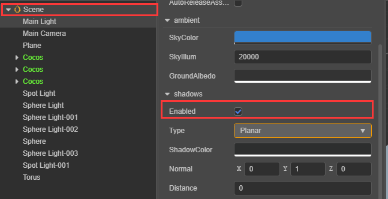
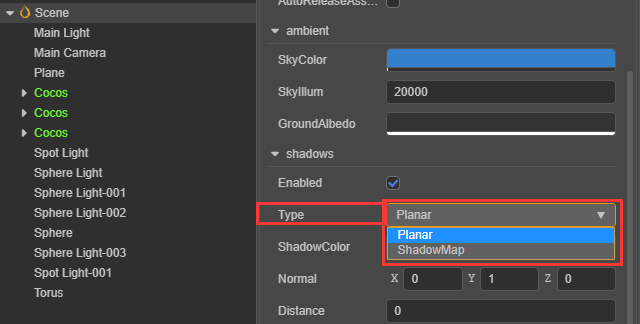
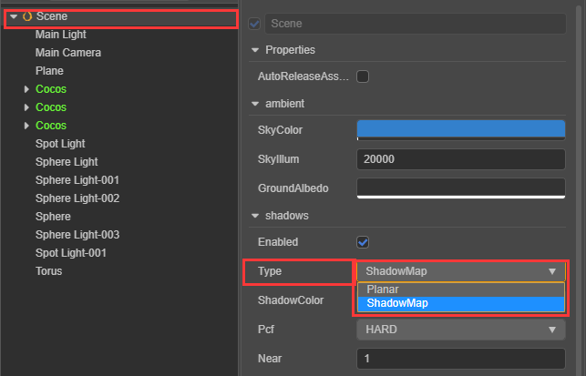
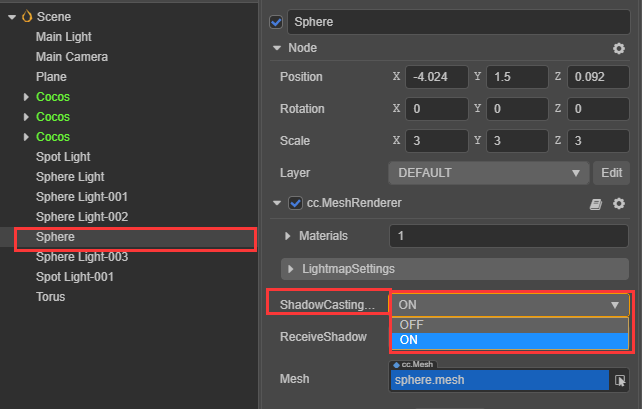
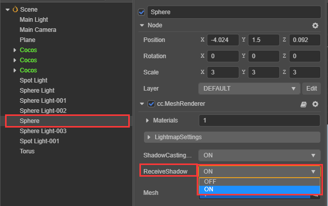
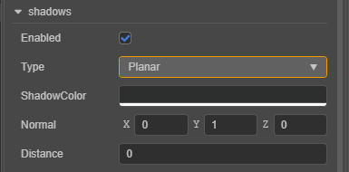
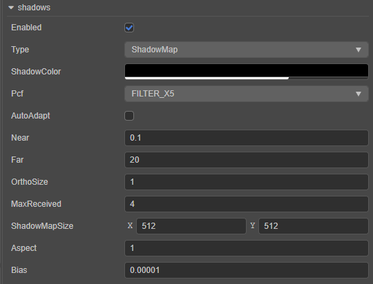

# Shadow

In the 3D world, *light* and *shadows* have always been extremely important components. They can enrich the entire environment, good-quality shadows can achieve the effect of false realization, and make the entire world have a three-dimensional feel to it.

Here is an example of a shadow from __Cocos Creator__:

## Turning on shadows

__Cocos Creator__ currently supports two shadow modes, __shadow Map__ and __planer Shadow__ for developers to use.

* It takes three steps to enable a __Planar Shadow__ in __Cocos Creator__:

  1. Select the Scene node on the level manager, you can see the following panel, check the *Enabled* property of *Shadows*.

  2. Choose *Type* as *Planar*

  3. Set *ShadowCastingMode* to *ON* in the model that needs to display shadows.

  > **Note**: __Planar Shadow__ will only be cast on the shadow surface. Adjusting the directional light angle can adjust the shadow projection.

* It takes four steps to enable a __Shadow Map__ in __Cocos Creator__:

  1. Select the Scene node on the level manager, you can see the following panel, check the *Enabled* property of *Shadows*.

  2. Choose *Type* as *ShadowMap*

  3. Set *ShadowCasting* to *ON* in the model that needs to display shadows.

  4. Set *ReceiveShadow* to *ON* in the model that needs to display shadows.

  > **Note**: __ReceiveShadow__ receive the shadow effect. __ShadowCasting__ produces a shadow effect.

## PlanarShadows panel

The following describes all the properties of the panel:

| Properties | Explanation |
| --- | --- |
| **Enabled**     | Whether to turn on the shadow effect |
| **Type**        | Choose shade type |
| **ShadowColor** | Color value of the resulting shadow |
| **Normal**      | Normals to vertical and shadow planes |
| **Distance**    | The distance of the shadow plane from the coordinate origin in the direction of the normal |

## ShadowMap panel

The following describes all the properties of the panel:

| Properties | Explanation |
| --- | --- |
| **Enabled**         | Whether to turn on the shadow effect |
| **Type**            | Choose shade type |
| **ShadowColor**     | Color value of the resulting shadow |
| **Pcf**             | Set the anti-aliasing level of the shadow edge |
| **Near**            | Set the near clipping plane of the main light source shadow camera |
| **Far**             | Set the far clipping plane of the main light source shadow camera |
| **OrthoSize**       | Set the ortho viewport size of the main light source shadow camera |
| **ShadowMapSize**   | Set the shadow map size |
| **Aspect**          | Set the ortho viewport aspect ratio of the main light source shadow camera |
