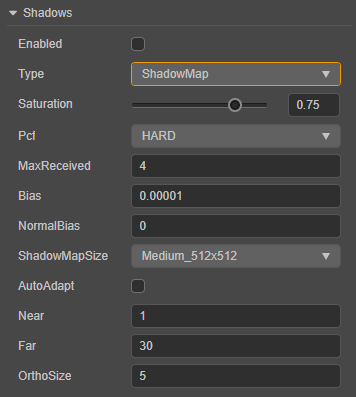

# Shadow

In the 3D world, light and shadow have always been extremely important components that enrich the entire environment. High quality shadows can make the game world look more realistic.

Creator 3.0 currently supports both **Planar** and **ShadowMap** shadow types.

## Enable Shadow Effect

To enable the shadow effect for an object, proceed as follows:

1. Check **Scene** in the **Hierarchy** panel, and then check the **Enabled** property in the **Shadows** component of the **Inspector** panel.

    

2. Select the 3D node that needs to display shadows in the **Hierarchy** panel, and then set the **ShadowCastingMode** property to **ON** in the **MeshRenderer** component of the **Inspector** panel.
    
    

    If the shadow type is **ShadowMap**, you also need to set the **ReceiveShadow** property on the **MeshRenderer** component to **ON**.

> **Note**: if the shadows are not displayed properly, you need to adjust the direction of the directional light.

## Shadow Type

The shadow type can be set in the **Type** property of the **Shadows** component.

### Planar Shadow

The Planar shadow type is generally used for simpler scenes.

| Property | Description |
| :--- | :--- |
| **Enabled** | Whether to enable shadow effect |
| **Type** | Shadow type |
| **ShadowColor** | Shadow color |
| **Normal** | The normal line perpendicular to the shadow, used to adjust the slope of the shadow |
| **Distance** | The distance of the shadow in the direction of the normal to the origin of the coordinate |

Adjust the direction of the directional light to adjust the position of the shadow.

> **Note**: planar shadows are only cast on planar surfaces, not on objects, which means that the **ReceiveShadow** property in the **MeshRenderer** component is invalid.

## ShadowMap

| Properties | Explanation |
| --- | --- |
| **Enabled**     | Whether to turn on the shadow effect |
| **Type**        | Choose shade type |
| **ShadowColor** | Color value of the resulting shadow |
| **Normal**      | Normals to vertical and shadow planes |
| **Distance**    | The distance of the shadow plane from the coordinate origin in the direction of the normal |

### PCF soft shadow support

Percentage Closer Filtering (PCF) is a simple, common technique used to achieve shadow edge desampling, by smoothing shadow edges to eliminate jaggedness in shadow mapping. The principle is to sample around the current pixel (also called a fragment), then calculate the ratio of the sample closer to the lights compared to the fragment, use this ratio to scale the scattered light and specular light, and then color the fragment to blur the shadow edges.

Cocos Creator currently supports 5x, 9x, and 25x sampling. The larger the magnification, the larger the sampling area and the more blurred the shadow edges.

### AutoAdapt adaptive shadow calculation technology

AutoAdapt adaptive shadow calculation will automatically calculate the range of shadows created under the viewport, as well as the distance of the shadow camera.

### GPU Instancing support

We can remove all these static objects such as vegetation from the scene, and save their position, zoom, uv offset and other related information. When rendering is needed, use the saved information to render through Instance, which can reduce The rendering time of large batches of the same objects that cannot be batched due to memory reasons. Generate a shadowMap for the statically batched model, and sample it where it is used.

The following describes all the properties of the panel:

ShadowMap receives and displays shadow effects generated by other objects when **ReceiveShadow** on the object **MeshRenderer** component is enabled.

| Properties | Explanation |
| --- | --- |
| **Enabled**         | Whether to turn on the shadow effect |
| **Type**            | Choose shade type |
| **ShadowColor**     | Color value of the resulting shadow |
| **Pcf**             | Set the anti-aliasing level of the shadow edge |
| **AutoAdapt**       | Enable automatic calculation of the range of shadow generation    |
| **Near**            | Set the near clipping plane of the main light source shadow camera |
| **Far**             | Set the far clipping plane of the main light source shadow camera |
| **OrthoSize**       | Set the ortho viewport size of the main light source shadow camera |
| **ShadowMapSize**   | Set the shadow map size |
| **Aspect**          | Set the ortho viewport aspect ratio of the main light source shadow camera |
| **Bias**            | Set shadow offset value    |
