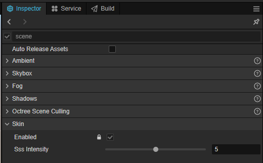

# Global skin material configuration panel

The intensity of the skin material is set globally. The skin material is turned on by default and cannot be turned off, which will not bring additional performance loss if no skin material is used in the scene.

| Attributes | Descriptions |
| :---| :--- |
| **Enabled**    | Whether to turn on skin material |
| **Sss Intensity**   | Global skin material intensity setting |
