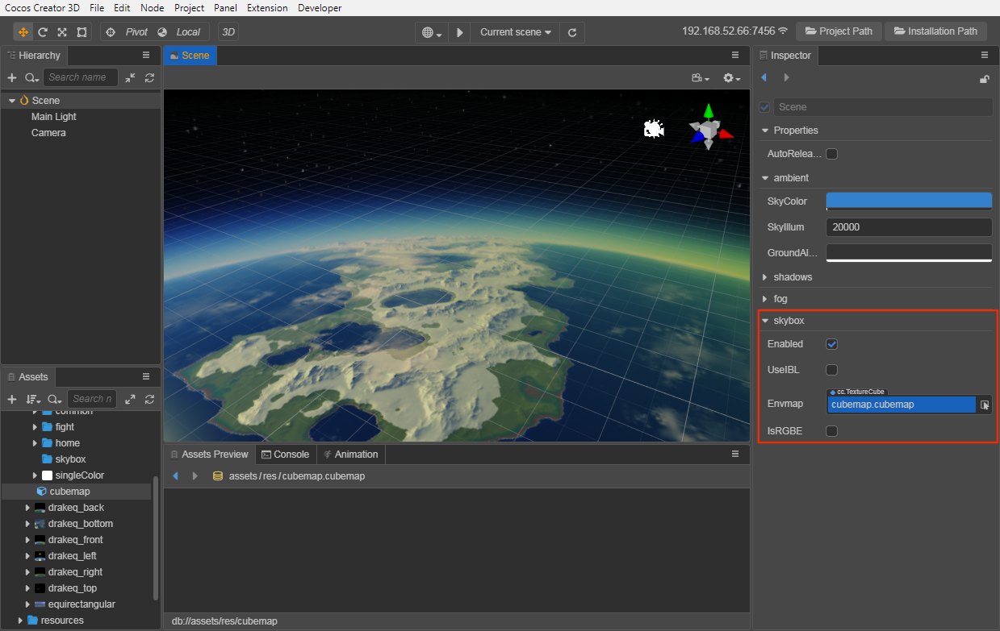

# Skybox

The skybox in a video game is a cube that wraps around the entire scene and can render and display the entire scene environment very well. The Skybox can also contribute very important IBL ambient lighting the in PBR-based workflow.

## Enable Skybox

Check **Scene** in the **Hierarchy** panel, then check the **Enabled** property in the **Skybox** component of the **Inspector** panel to enable the skybox.

 

The **Skybox** component properties are as follows:

| Property | Description |
| :---| :--- |
| **Enabled** | Whether to enable skybox |
| **UseIBL** | Whether to use ambient lighting |
| **Envmap** | Environment map, TextureCube type, see below for details on how to set it.  When this property is empty, the skybox uses and displays pixel mapping by default |

## Set the Environment Map of the Skybox

After enabling the skybox, you also need to set the skybox's environment map. The environment map asset of the skybox can be a single map of TextureCube type or a CubeMap which is a combination of six texture type maps. So the developer can set the environment map of the skybox in the following two ways:

### By Setting the Texture Assets of TextureCube Type

1. To import a texture asset, drag and drop it directly into the **Assets** panel.

2. Select the imported texture asset, set the **Type** property to **texture cube** in the **Inspector** panel on the right, then click the green checkbox in the upper right corner to save the settings.

    

3. Check **Scene** in the **Hierarchy** panel, then drag the set texture asset to the **Envmap** property box of the **Skybox** component in the **Inspector** panel.

    

Then the setup is done. The developer can see the set environment map of the skybox in the **Scene** panel. If the map is not displayed correctly, you need to check if the value of **SkyIllum parameter** is too low, or **modify the Clear Flag** of Camera.

#### SkyIllum Property

The SkyIllum property can be found in the **ambient** component of the **Inspector** panel by selecting the scene root node in the **Hierarchy** panel, with a default value of 20000.

If the SkyIllum property is set **too low**, the environment map of the skybox may not be displayed correctly in the **Scene** panel. General:

- When the SkyIllum property value is less than 300, the environment map of the Skybox will not be displayed properly.

- When the SkyIllum property is 5000, the effect is equivalent to the light intensity of a moonlit night.

#### Modify ClearFlags of Camera

If the environment map of the skybox is already displayed correctly in the **Scene** panel but still does not take effect after the project is run, you need to change the **ClearFlags** of the **Camera** component to **SKYBOX**:

### By Setting the CubeMap

To use a CubeMap as the environment map for the skybox, you need to create a CubeMap and drag it into the **Envmap** property box of the **Skybox** component. The operation steps are as follows:

1. Select all the six prepared texture assets in the **Assets** panel, and then set the **Type** property of these texture assets to **texture** in the **Inspector** panel, and click the green checkbox in the upper right corner.

   

2. Create a new CubeMap asset. Select the folder where you want to store CubeMap in the **Assets** panel, click the **+** button in the upper left corner, and then select **CubeMap**. Or you can right-click the folder where you want to store the CubeMap, and select **New -> CubeMap**.

   

3. Drag and drop the six images you just set as texture type into the corresponding property box of the CubeMap, and click the green tick button on the top right then you are done.

    

    > **Notes**:
    > 1. The property boxes in CubeMap that do not have a texture asset yet will be populated using the default asset.
    > 2. The six property boxes in CubeMap **do not use the same texture**, otherwise they will not be displayed properly for some platforms.

4. Finally, drag the finished CubeMap asset into the **Envmap** property box of the **Skybox** component, and you are done with the CubeMap application.

    
