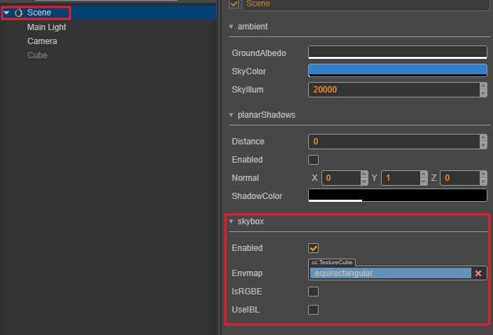
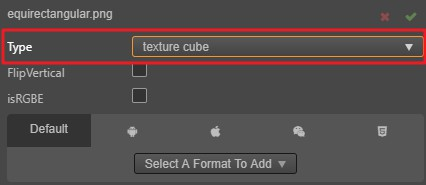
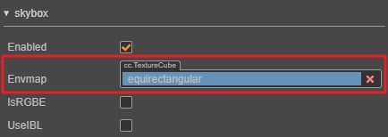
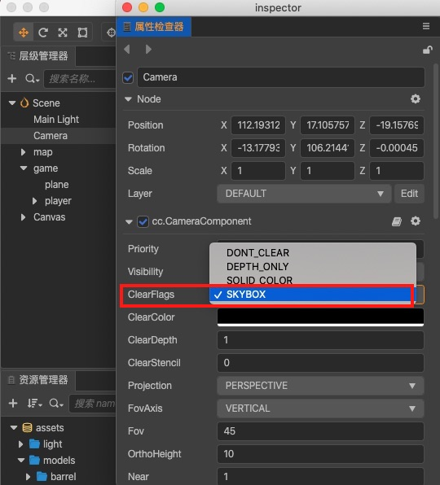
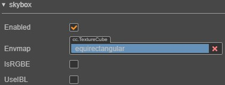
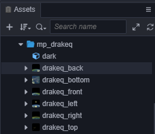
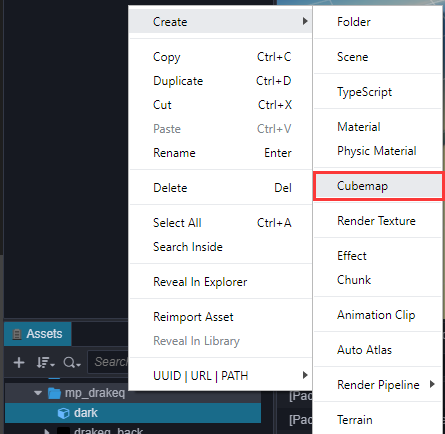
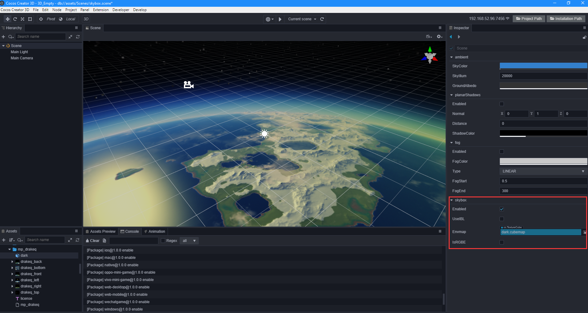

# Skybox

__Skybox__, in video games, is a cube that wraps the entire scene. The __Skybox__ can render the atmosphere of the entire environment and express the environment of the entire scene. The __Skybox__ is also a very important part in the __PBR-based workflow__.

The __Skybox__ in __Cocos Creator__, is shown below:

## Enabling Skybox

Enabling the __Skybox__ effect in __Cocos Creator__, takes just one step:

  - The __Skybox__ panel is on the Scene node's __Properties panel__. Check the *Enabled* property to enable the __Skybox__.
  

 > **Note**: when the **Envmap** property of __Skybox__ is empty, the default pixel map will be used and displayed.

## Modify the environment map of the Skybox

Modifying the environment map of the __Skybox__ in __Cocos Creator__ is done by setting a asset of type __TextureCube__. Importing from a asset into a __TextureCube__ and setting it into a __Skybox__ can be done in the following steps:

1. Import picture assets.
    > **Note**: this example is of a panorama. Creating a `CubeMap` is covered later in this documentation.

2. Select the imported panorama asset and set it to the __TextureCube__ type in the __Inspector panel__ on the right, as shown in this figure:

    

3. Drag the __TextureCube__ asset to the __Envmap property__ on the __Skybox's Inspector panel__.

    

After completing the above steps, you should be able to see the newly replaced environment map in the editor scene.

## Confirm setting the SkyIllum parameter
If the skybox doesn't show in the __Scene__ panel after completing the previous step, it is highly likely that the SkyIllum parameter setting is too low. Check the parameter of `ambient -> SkyIllum` in the __Inspector__ panel of the scene node. Generally speaking, if SkyIllum < 300, the skybox texture is not very visible. SkyIllum is 5000 is probably the light intensity of the moon at night. For a newly created __Cocos Creator__ project, the default SkyIllum is 20000.

## Modify the Clear Flag of Camera
After completing the above steps, although the skybox can be displayed correctly in the __Scene__ panel, it is still not visible when running. At this time, you need to modify the __Clear Flag__ of __Camera__ to `SKYBOX`, as shown below

## Skybox panel

The following describes all the properties of the __Skybox__ panel:

| Properties | Explanation |
| --- | --- |
| **enabled** | whether to enable Skybox |
| **envmap** | environment map, type is __TextureCube__ |
| **isRGBE** | whether the pixel format of the environment map is __RGBE__ |
| **useIBL** | whether to use ambient light |

## CubeMap

__CubeMap__ is a kind of environment map asset for a __Skybox__. It is composed of map assets of six faces on a cube. It can be used as a __TextureCube__ asset.

### Making and applying a CubeMap

To make a __CubeMap__ in __Cocos Creator__ and set it to a __Skybox__, follow these steps:

1. Import the six texture map assets prepared in advance, and set these texture assets to the __Texture__ type.

    
    

2. Create a new __CubeMap__ resource

    

3. Drag the imported texture assets into the corresponding input box, and click the green check button when you are finished.

    

4. Finally, drag the completed __CubeMap__ asset into the __Envmap__ property box of the __Skybox__.

    

> **Note**: 
> 1. Faces that are not mapped in __CubeMap__. It will be filled with a default texture.
> 2. The pictures associated with the TextureCube **should not be the same**. Otherwise, there will be a problem that some platforms will not display it.
