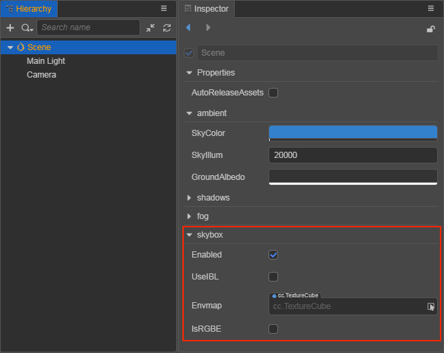
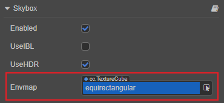
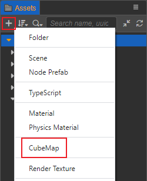
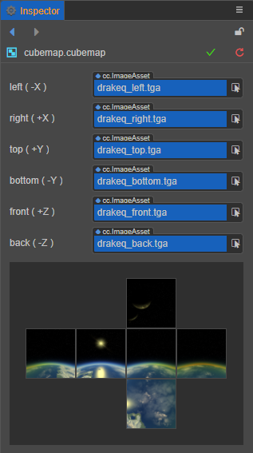
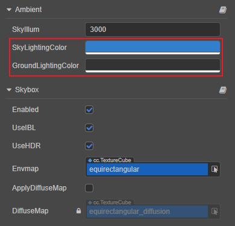
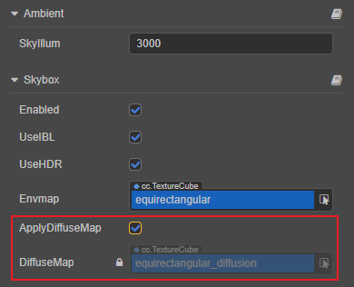
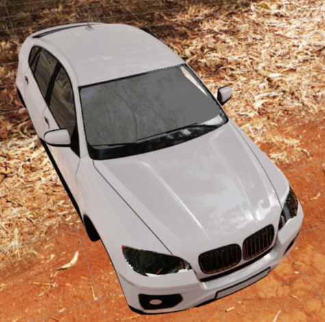
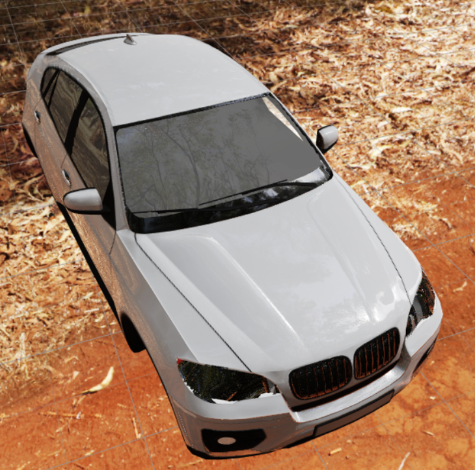
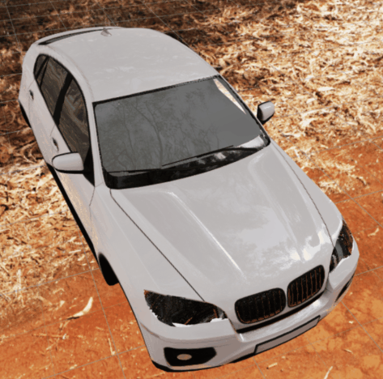
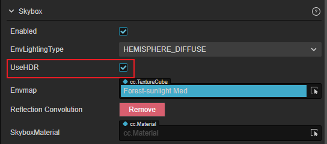

# Skybox

The skybox in a video game is a cube that wraps around the entire scene and can render and display the entire scene environment very well. The Skybox can also contribute very important IBL ambient lighting the in PBR-based workflow.

## Enabling Skybox

Check the scene root node in the **Hierarchy** panel, then check the **Enabled** property in the **Skybox** component of the **Inspector** panel to enable the skybox.

 

The **Skybox** component properties are as follows:

| Property | Description |
| :---| :--- |
| **Enabled** | Check this option to enable skybox. |
| **UseIBL** | Whether to use ambient lighting. Please refer to the **Using IBL** section below for more information. |
| **UseHDR** | If this option is checked, HDR (High Dynamic Range) will be turned on, if not checked, LDR (Low Dynamic Range) will be used. For details, please refer to the section **Switching HDR/LDR Mode** below. |
| **Envmap** | Environment map, TextureCube type, see below for details on how to set it.  When this property is empty, the skybox uses and displays pixel texture by default. |
| **ApplyDiffuseMap** | If this option is checked, the scene objects will use a more accurate diffuse map instead of the default hemispherical lighting. This option is only displayed when **UseIBL** is checked. Please refer to the **Diffuse Lighting** section below for details. |
| **DiffuseMap** | The convolution map for advanced diffuse lighting that is automatically generated when the **ApplyDiffuseMap** property is checked, and does not support manual editing. This option is only shown when **UseIBL** is checked. |

## Setting the Environment Map of the Skybox

After opening the Skybox, it is also necessary to set the Skybox environment map. Drag and drop the map asset into the **Envmap** property box of the Skybox component, or click the arrow button behind the **Envmap** property box to select the desired map asset. If not set, the Skybox will use and display pixel maps by default.

The skybox supports the following environment map assets:

1. a single texture of type TextureCube, which can be set in the Creator.

    - Cube Cross images

    - PNG or HDR format images

2. CubeMap in the form of image files

3. CubeMap created manually in Creator by combining six texture maps

### By Setting the Texture Assets of TextureCube Type

1. To import a texture asset, drag and drop it directly into the **Assets** panel.

2. Select the imported texture asset, set the **Type** property to **texture cube** in the **Inspector** panel on the right, then click the green checkbox in the upper right corner to save the settings.

    

3. Check **Scene** in the **Hierarchy** panel, then drag the set texture asset to the **Envmap** property box of the **Skybox** component in the **Inspector** panel.

    

Then the setup is done. The developer can directly see the set environment map of the skybox in the **Scene** panel. If the map is not displayed correctly, you need to check if the value of **SkyIllum parameter** is too low, or **modify the Clear Flag** of Camera.

#### SkyIllum Property

The SkyIllum property can be found in the **Ambient** component of the **Inspector** panel by selecting the scene root node in the **Hierarchy** panel, with a default value of 20000.

If the SkyIllum property is set **too low**, the environment map of the skybox may not be displayed correctly in the **Scene** panel. General:

- When the SkyIllum property value is less than 300, the environment map of the Skybox will not be displayed properly.

- When the SkyIllum property is 5000, the effect is equivalent to the light intensity of a moonlit night.

#### Modifying ClearFlags of Camera

If the environment map of the skybox is already displayed correctly in the **Scene** panel but still does not take effect after the project is run, you need to change the **ClearFlags** of the **Camera** component to **SKYBOX**:

### By Setting the CubeMap

A cube map can be generated manually in Creator from six normal maps by following the steps below:

1. Select all the six prepared texture assets in the **Assets** panel, and then set the **Type** property of these texture assets to **texture** in the **Inspector** panel, and click the green checkbox in the upper right corner.

   

2. Create a new CubeMap asset. Select the folder where you want to store CubeMap in the **Assets** panel, click the **+** button in the upper left corner, and then select **CubeMap**. Or you can right-click the folder where you want to store the CubeMap, and select **New -> CubeMap**.

   

3. Drag and drop the six images you just set as texture type into the corresponding property box of the CubeMap, and click the green tick button on the top right then you are done.

    

    > **Notes**:
    >
    > 1. The property boxes in CubeMap that do not have a texture asset yet will be populated using the default asset.
    > 2. The six property boxes in CubeMap **do not use the same texture**, otherwise they will not be displayed properly for some platforms.

## Using IBL

If the **UseIBL** property is checked, objects in the scene use specular reflections of the ambient lighting generated by the skybox, while allowing for more accurate diffuse lighting (convolution maps).

If the **UseIBL** property is disabled, objects in the scene will only use diffuse lighting in the hemispherical light mode.

### Diffuse Lighting

The Creator supports the following two types of ambient diffuse lighting, which can be toggled by checking or unchecking the **ApplyDiffuseMap** property, noting that this property is only displayed when **UseIBL** is checked.

1. **Hemispheric Light**: when the **ApplyDiffuseMap** property is unchecked, hemispheric light diffusion will be used. This method is controlled by the **SkyLightingColor** and **GroundLightingColor** properties in the **Ambient** component, and has higher rendering performance, but less detail and poor lighting directionality. **Manually adjustable, but may become inconsistent with the environment map**.

    

2. **Convolution Map**: when the **ApplyDiffuseMap** property is checked, the convolution map diffuse will be used. This method is advanced diffuse reflection, which can correctly express the diffuse lighting generated by environment map, with better lighting directionality and details. However, the convolution map in the **DiffuseMap** property is automatically generated for diffuse reflection and does not allow manual editing.

    

When using hemispherical light diffuse reflection, the effect is as follows:

When using diffuse reflection with convolution map, the effect is as follows. Compared with the above figure, it is obvious that the left backlighting surface is darker, highlighting the overall sense of hierarchy, and the contrast details between light and dark are also greatly improved.

The contrast can be seen more clearly in the following GIF image:

> **Notes**:
> 
> 1. When replacing the environment map in the **Envmap** property, the Creator will automatically calculate the corresponding ambient lighting information, as well as the diffuse lighting (only CubeMap in the form of image files is supported, not including manually created CubeMap).
> 2. If the **UseIBL** property is checked, but **ApplyDiffuseMap** is not checked, the hemispheric light diffuse reflection will be used, and the effect is the same as if **UseIBL** is not checked.

## Toggling HDR/LDR mode

The **UseHDR** option in the Skybox component is used to toggle the HDR/LDR mode, which is used when checked.

- HDR (High Dynamic Range): High dynamic range, with **photometric intensity of the light source** and **exposure parameters of the camera** to achieve a more realistic level of contrast between light and dark. If this mode is used, the intensity of all light sources (including parallel light, point light, spot light, etc.) **will become photometric physical units** and ambient light cube map should use **HDR format images** to provide a high dynamic range data source.

- LDR (Low Dynamic Range): Low dynamic range. If this mode is used, the **light source intensity becomes unitless** and no longer has any connection to photometry or camera exposure. This mode is suitable for scenarios where you want the original map color to be reflected without any color tinting. Ambient light cube map can be done using images in formats such as **PNG**.
