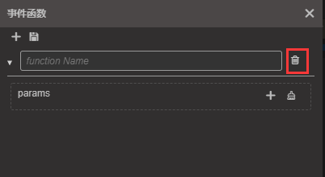

# Animation Events

In games, it is often necessary to execute some function at the end of an animation or at a specific moment in a certain frame. At this time, it can be achieved by adding __Animation Events__. After adding an event function on to a key frame, the animation system will match the corresponding function methods on the __animation root node__ and execute them when the animation reaches the key frame. 

Please refer to the [frame events](./../../engine/animation/animation-component.md#frameevents) documentation before continuing.

## Adding an event frame

First, move the time control line to the position where the event needs to be added, and then __click__ the  button in the toolbar area. The same golden icon , this is the event we added.

## Deleting an event frame

At the added time frame position, __right-click__ and select __Delete__. Deleting here will delete all time frame functions at that time position.

## Add an event frame function

__Click__ the `+` button on the upper left of the __Event Function Editor__ to add a new event frame function

## Delete time frame function

To delete a frame function at the corresponding time position separately, you can __click__ the __delete button__ next to the function name in the __Event Function Editor__.

## Editing a specified event trigger function

__Double-click__ the __event frame__ just added to open the __Event Editor__. In the editor, we can manually enter the name of the function that needs to be triggered. When the event is triggered, animation system will execute all corresponding method with the same name in each component of the __animation root node__.

If you need to add the incoming parameters, __click__ `+` or `-` next to __Params__. Currently, only __three__ types of parameters are supported: *Boolean*, *String*, and *Number*.

After the modification occurs, a __red asterisk__ will appear next to the title of the __Event Function Editor__. The modification of the event function needs to be manually saved. After the modification, __click__ the __save button__ above to save. If not saved, there will be a pop-up box prompting to save when closing the __Event Editor__.

