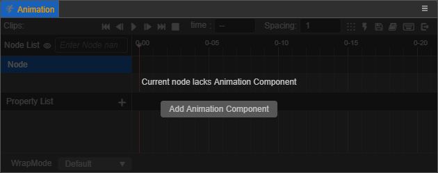

# About Animations

Before creating an __Animation__, you must first add an __Animation Component__ to the node, and mount the clip file for the component before editing. Before that, it is necessary to first understand the related concepts of an __Animation Clip__ and __Animation Component__.

## Animation Component

__Cocos Creator__ is a component structure, and __Animation__ is no exception. It is also a component on the node. Only after adding an __Animation Component__ to the node can the node be given the ability to participate in the animation. Therefore, after clicking on the relevant node, if the node does not have an __Animation Component__, the **Add Animation Component** button will be displayed on the interface of the __Animation Editor__, __click__ to __add__.

To use `Animation`, please refer to the [Animation API](https://docs.cocos.com/creator3d/api/en/classes/animation.animation-1.html).

## Clip Animation clip

An __Animation Clip__ is a piece of declaration data for an animation. If we mount it on an __Animation Component__, we can apply this animation data to a node. An __Animation Component__ can mount multiple __Animation Clips__. It is not possible to edit animations on nodes without clips. After clicking on the relevant nodes, if the node has only __Animation Components__, but no clip files, the __Animation Editor__ will display the **Create Clip File** button, __click__ to create and assign to the component. In the animation editing mode, you can also switch to edit different __Animation Clips__ through the clip option in the lower left corner of the __Animation Editor__.

## Animation editing mode

Animations are not allowed to be edited in __normal mode__. Only in __animation editing mode__ can animation files be edited. However, in __animation editing mode__, you cannot **add**, **delete**, or **rename** nodes.

There are two ways to open edit mode:

- __Select__ the node that contains the __Animation Component__ and contains more than one clip file, and then __click__ the **Enter animation editing mode** button in the __Animation__ panel.
- __Press__, **Ctrl/Cmd + E**

There are three ways to exit edit mode:

- __Click__ the __exit__ button in the upper right corner of the __Animation Editor__
- __Click__ the __close__ button in the upper left corner of the __Scene__ panel
- __Press__, **Ctrl/Cmd + E**

For more details, refer to the [Animation System Design](./../../engine/animation/index.md) and the [Script Control](./../../engine/animation/animation-componentofAnimation).md) documentation.
