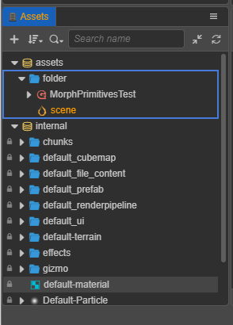
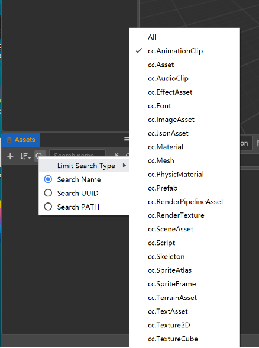
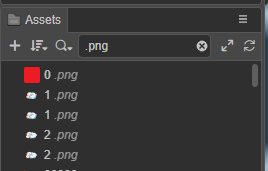
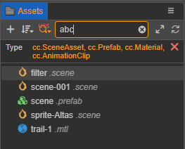
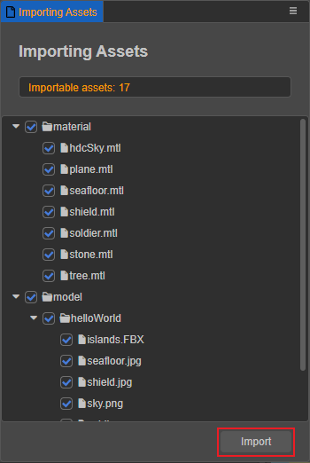

# Assets Panel

The **Assets** panel is an important work area for accessing and managing project assets. When starting a game, **Import Assets** is usually a mandatory step. Use the **HelloWorld** template project when creating a new project, and notice that the **Assets** panel already contains some basic asset types.

## Panel introduction

The **Assets** panel can be divided into two main sections: **Toolbar** and **Asset List**.

- The functions in **Toolbar** include **New Asset (+)**, **Sort by**, **Search Filter**, **Search Box**, **Collapse/Expand All** and **Refresh**. For details, please refer to the description below.

- The **Asset List** presents the contents of the project's asset folder in a tree structure, which by default includes the **assets** and **internal** base repositories (DBs for short).

    - **assets** is similar to the file manager in the operating system, only assets placed in the `assets` directory of the project folder will be displayed here. For a description of the project folder structure, please refer to the [Project Structure](../../getting-started/project-structure/index.md) documentation.
    - The **internal** contains the default built-in assets (read-only). Built-in assets can be copied, but cannot be added, deleted, or changed. It can be dragged and dropped into **assets** as an asset template, i.e. a new project asset is created.

- The panel currently supports shortcuts for manipulating assets, including:
    - **Copy**: Ctrl/Cmd + C
    - **Paste**: Ctrl/Cmd + V
    - **Duplicate**: Ctrl/Cmd + D, Ctrl + drag assets
    - **Delete**: Delete
    - **Up and down selection**: Up arrow, Down arrow
    - **Previous hierarchy**: Left arrow
    - **Next hierarchy**: Right arrow
    - **Multi-select**: Ctrl/Cmd + Click
    - **Multi-select continuously**: Shift + Click
    - **Select All**: Ctrl/Cmd + A
    - **Rename**: Enter/F2
    - **Cancel input**: Esc

### Creating assets

There are two ways to create an asset.
1. Click the **+** button at the top left of the **Assets** panel.
2. Right-click in the **Assets** panel and select **Create**.

> **Note**: when creating an asset, an **INPUT BOX** will first appear asking for the name of the new asset, which cannot be empty.

When creating an asset, select the folder where to place the asset in the tree asset list, then the new asset will be created in the currently selected folder directory. If a folder isn't selected, the new asset will be created in the current root directory (`assets`) by default.

For additional information about Assets, please refer to the [Asset](../../asset/index.md) documentation.

### Selecting assets

The following asset selection actions can be used in the asset list:

- Click to select a single asset. The selected asset will be highlighted in **yellow on blue**.
- Double-click to open an asset, e.g.: scene, script, image; double-click on a folder to collapse/expand it
- Hold Ctrl/Cmd and select an asset to select multiple assets at once
- Hold Shift and select an asset to select multiple assets in a row

For selected assets, you can move, delete, etc.

### Moving assets

After selecting an asset (multiple selections are possible), move the asset to another location by holding down the mouse and dragging it. When dragging the asset to be moved to the target folder, notice the folder where the mouse is hovering appears highlighted in yellow and has a blue box around it. Release the mouse at this point and the asset will be moved to the highlighted folder directory.

Asset movement also includes the following actions:

- Drag and drop assets from **Assets** panel to the **Scene** panel or **Hierarchy** panel to generate nodes, currently supporting dragging and dropping `cc.Prefab`, `cc.Mesh`, `cc.SpriteFrame` assets.
- Drag and drop files from the **system's file manager** to the **Assets** panel list to import assets.
- Drag and drop a node from the **Hierarchy** panel to a folder in the **Assets** panel to save the node as a `cc.Prefab` asset. Please review the [Prefab Assets](../../asset/prefab.md) documentation.

### Sorting assets

The **Sort by** in the toolbar includes **Sort by name** and **Sort by type**. The current sorting method is recorded and will be maintained the next time the editor is opened.

### Collapsing assets

Collapses are divided into single collapses or all collapses with subsets:

- The **Collapse/Expand All** button in the **Toolbar** works globally
- Click on the triangle icon of a parent asset (e.g.: folder) to expand or collapse its subsets. Use the shortcut key **Alt** and click on the triangle icon to expand or collapse all children of the asset

The current collapsed state of the asset will be recorded and will be maintained the next time the editor is opened.

### Searching assets

The search function can limit the search type and specify the search field, both of which can be used to achieve a type filtering effect. Depending on the selected type/field, all the corresponding assets will be displayed in the panel.

- **Limit search types**: multiple selections are possible. The type is the asset type `assetType`, not the suffix name or importer name.

- **Specify search fields**: the search name is not case sensitive and includes the following search types:

    1. **search Name or UUID**, support searching for asset file extensions, such as `.png`:

        

    2. **Search UUID**

    3. **Search URL**, starting with the `db://` protocol.

    4. **Find UUID usage**, used to find out which assets the UUID asset is used by. For example:

        

If you want to search only in a parent asset (e.g.: folder), right-click and select **Find in Folder** to narrow the search.

Selecting an asset in the search result list and double-clicking on it is equivalent to the operation in normal mode. After clearing the search content, it will redirect to the selected asset.

### Assets preview

Selecting an asset in the **Assets** panel displays a thumbnail image of the asset in the **Assets Preview** panel. Selecting the folder where the asset is located, displays thumbnails of all assets under the folder for easy viewing.

## Right-click menu for assets

After selecting a specific asset/folder, right-click on it to perform a series of actions on the asset in the pop-up menu:

- **Create**: the same function as the **Create** button in the **Assets** panel, it will add the asset to the currently selected folder, if the currently selected is an asset file, it will add the new asset to the same folder as the currently selected asset.
- **Copy**/**Cut**/**Paste**: copy/cut the selected asset (multiple options available) and paste it under that folder or another folder.
- **Duplicate**: duplicate the selected asset (can be multi-selected), and the duplicated asset will be in the same hierarchy as the selected asset.
- **Rename**: modify the asset name, please check the description below for details.
- **Delete**: delete the asset (can be multi-selected), or you can use the shortcut **Delete**. The asset will remain in the **Recycle Bin** of the system after deletion, and can be restored if necessary.
- **Select All**: selects all assets in the same hierarchy.
- **Search in Folder**: when using the search function, only search the assets in that folder.
- **Find UUID Usages**: find which assets the asset is referenced by by the asset's UUID.
- **Importing/Exporting Asset Package**: please refer to the introduction below for details.
- **Preview this scene in the browser**: only available for scene assets.
- **Reveal in Explorer (Windows) or Finder (Mac)**: opens the folder where this asset is located in the operating system's file manager window.
- **Reimport Asset**: updates the asset to the project's `./library` folder of the project, with multiple selections for bulk import.
- **Reveal in Library**: opens the asset in the `Library` folder of the project, please read the [Project Structure](../../getting-started/project-structure/index.md) documentation.
- **UUID/URL/PATH**: copies the UUID/URL/PATH of the asset and outputs it in the **Console** panel.

Also for specific asset types, double-clicking on an asset allows you to enter the edit state of that asset, such as scene assets and script assets.

### Rename asset

Select the asset to rename, then right-click and select **Rename** to change the asset name, or use the shortcut keys **Enter** or **F2**. Click elsewhere in the panel or press the shortcut **Esc** to cancel the renaming.

### Exporting asset package

Select the asset to be exported and right-click on it, then select **Export Asset Package**. The **Export Asset** panel will automatically list the currently selected asset with its dependencies. If you don't need to export related dependent assets, uncheck **Include Dependency** in the lower left corner of the **Export Assets** panel.

After determining the assets to be exported, click the **Export** button, a file storage dialog will pop up, the user needs to specify a folder location and file name, click **Save**, and a **filename.zip** file will be generated, containing all the exported assets.

> **Note**: the extension will automatically break the assets into a zip package, which is only available for use with the **Import Asset Package** extension.

### Importing asset package

Select and right-click on the folder you want to import assets from, or right-click on the **blank space** in the **Assets** panel, then select **Import Package** and select the zip package exported by **Export Package** in the pop-up file browse dialog. The assets in the zip package will be automatically parsed to the pop-up **Import Asset Package** panel.

During the import process, the user will be asked to confirm the imported assets again, so you can uncheck some assets to remove the ones you don't want to import.

> **Notes**:
> 1. Imported zip packages are only supported by Cocos Creator 3.0.0 and above using **Export Asset Package**.
> 2. Importing scripts with the same class name is not supported.

## Extending the Assets Panel

Currently supported extensions include **right-click menu** and **drop-in recognition**, please refer to the [Extending the Assets Panel](./extension.md) documentation.
