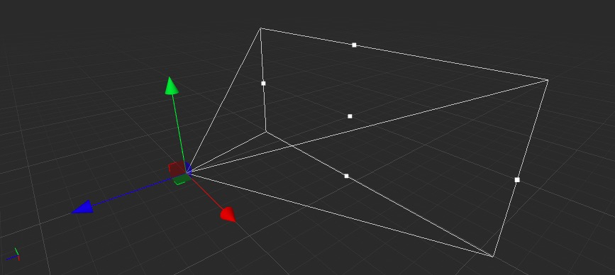
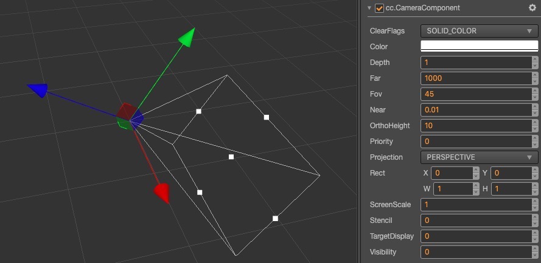
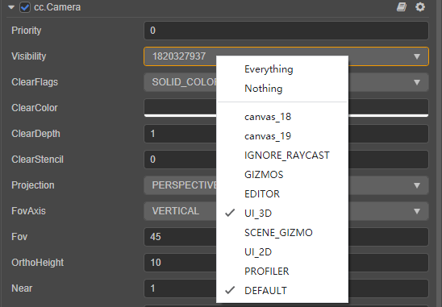

# Camera

The __Camera__ in a game is the main tool used to capture __Scenes__. The visible range of the __Camera__ is controlled by adjusting camera-related parameters. The __Camera__ is represented as follows in the __Cocos Creator__ editor:

The __Camera__'s visual range is composed of __6__ planes forming a **Frustum**, a **Near Plane**, and a **Far Plane** to control the visible distance and range of near and far distance, at the same time, they also constitute the size of the viewport.

To use `Camera`, please refer to the [Camera API](../../../api/en/classes/component_camera.camera.html).

## Camera components

The __Camera Component__ is an important functional component that we use to present a __Scene__.

| Parameter | Description |
|:-------:|:---:|
| *ClearFlags* | Camera clear logo. Contains:   **DONT_CLEAR**: not clear;   **DEPTH_ONLY**: only clear the depth;   **SLOD_COLOR**: clear the color, depth and template buffer|
| *Color* | Clear the specified color |
| *Depth* | Clear the specified depth |
| *Stencil* | Clear the specified template buffer |
| *Far* | Far cutting distance |
| *Near* | Near cutting distance |
| *Fov* | Angle of view |
| *OrthoHeight* | The height of the orthogonal __Camera__ |
| *Priority* | Priority. High-priority __Camera__s will be rendered first in the rendering process |
| *Projection* | Projection mode. Divided into **perspective projection (PERSPECTIVE)** and **orthogonal projection (ORTHO)** |
| *Rect* | Viewport size of __Camera__ |
| *Visibility* | The `Visibility` of the __Camera__. Used to control the `Visibility` of different models in the same __Camera__. |

## Camera group rendering

The __Camera__'s group rendering function works with the [Model Component](../../engine/renderable) through the __Visibility__ property of the [Camera Component](../../editor/components/camera-component.md). The user can set the __Visibility__ value through code to complete the group rendering. It should be noted that the __Visibility__ value is **bitwise comparison**, and the user can manipulate the **top 20 bits of Visibility** through **bit operations** to complete the grouping.

The __Camera__ and models provided by default are all __rendered without grouping__. You do not need to change this value if the game has no special requirements to do so.

### Set the Visibility property

The `Visibility` property is used to set which layers of nodes should be observed by the camera, and multiple Layers can be selected at the same time.

> **Note**: the rendering of 2d elements (such as Sprite) also follows the `Layer` and `Visibility` judgement, adjust the `Layer` and `Visibility` as required.

When you check multiple Layers in the `Visibility` property, the value of the `Visibility` property is calculated by performing a `|` operation on the property values of multiple Layers.

For example, in the following image, the `Visibility` property of the camera has both **UI_3D** and **DEFAULT** Layer checked, and by looking up [the value of the Layer property](../../concepts/scene/layer.md), we can see that the value of the **UI_3D** property is **1 << 23** and the value of the **DEFAULT** property is **1 << 30**, so the value of the `Visibility` property is **1 << 23 | 1 << 30  = 1820327937**.

### Visibility calculations for the camera

The `Visibility` property allows multiple Layers to be selected at the same time, while the `Layer` on the Node has its own value, so the `Visibility` property of the camera is an **232** bit integer. Each visible Layer occupies one bit, using bitwise operations, and supports up to 32 different Layer labels (one bit for each Layer value, that is, represented by **232**). When the camera is culling, the Layer's property value of each node will perform a `&` operation with the camera, and if the `Visibility` property of the camera contains this `Layer`, then the current node will be visible to the camera, and vice versa.
