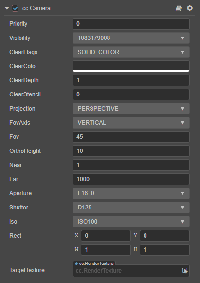
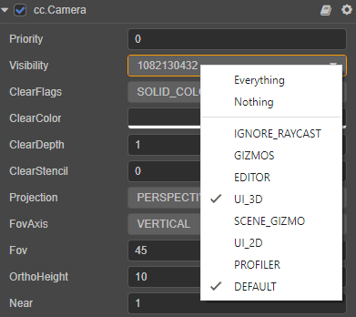

# Camera

The __Camera__ in a game is the main tool used to capture __Scenes__. The visible range of the __Camera__ is controlled by adjusting camera-related parameters. The __Camera__ is represented as follows in the __Cocos Creator__ editor:

The __Camera__'s visual range is composed of __6__ planes forming a __Frustum__, a __Near Plane__, and a __Far Plane__ to control the visible distance and range of near and far distance, at the same time, they also constitute the size of the viewport.

To use `Camera`, please refer to the [Camera API](__APIDOC__/en/#/docs/3.5/en/component-camera/Class/Camera).

## Camera component

The __Camera Component__ is an important functional component that we use to present a __Scene__.

| Property | Description |
|:-------|:---|
| __Priority__ | Render priority of the camera. High-priority __Camera__'s will be rendered first in the rendering process |
| __Visibility__ | The `Visibility` of the __Camera__. Used to control the `Visibility` of different models in the same __Camera__. |
| __ClearFlags__ | Clearing flags of the Camera, spaces which part of the framebuffer will be actually clearedevery frame. Contains:   __DONT_CLEAR__: not clear.   __DEPTH_ONLY__: only clear the depth.   __SLOD_COLOR__: clear the color, depth and template buffer.   __SKYBOX__: enable skybox to clear depth only. |
| __ClearColor__ | Clear the specified color |
| __ClearDepth__ | Clear the specified depth |
| __ClearStencil__ | Clear the specified template buffer |
| __Projection__ | Projection mode. Divided into __perspective projection (PERSPECTIVE)__ and __orthogonal projection (ORTHO)__ |
| __FovAxis__ | The axis on which the FOV would be fixed regardless of screen aspect changes |
| __Fov__ | Field of view of the camera |
| __OrthoHeight__ | Viewport height in orthogonal mode |
| __Near__ | The near clipping distance of the camera, should be as large as possible within acceptable range |
| __Far__ | The far clipping distance of the camera, should be as small as possible within acceptable range |
| __Aperture__ | The camera aperture, which affects the exposure parameters of the camera |
| __Shutter__ | The camera shutter, which affects the exposure parameters of the camera |
| __Iso__ | The camera ISO, which affects the exposure parameters of the camera |
| __Rect__ | The position and size of the viewport that the camera will eventually render to the screen |
| __TargetTexture__ | Output render target texture of the camera, which renders directly to the screen. Defaults to null |

## Camera group rendering

The __Camera__'s group rendering function is determined by the `Visibility` property and the [Layer property](../../concepts/scene/node-component.md#set-the-layer-property-of-the-node) of the node. The user can set the __Visibility__ value through code to complete the group rendering. It should be noted that the __Visibility__ value is __bitwise comparison__, and the user can manipulate the __top 20 bits of Visibility__ through __bit operations__ to complete the grouping.

The __Camera__ and models provided by default are all __rendered without grouping__. You do not need to change this value if the game has no special requirements to do so.

### Set the Visibility property

The `Visibility` property is used to set which layers of nodes should be observed by the camera, and multiple Layers can be selected at the same time.

> __Note__: the rendering of 2d elements (such as Sprite) also follows the `Layer` and `Visibility` judgement, adjust the `Layer` and `Visibility` as required.

When you check multiple Layers in the `Visibility` property, the value of the `Visibility` property is calculated by performing a `|` operation on the property values of multiple Layers.

For example, in the following image, the `Visibility` property of the camera has both __UI_3D__ and __DEFAULT__ Layer checked, and by looking up [the value of the Layer property](../../concepts/scene/layer.md), notice the value of the __UI_3D__ property is __1 << 23__ , the value of the __DEFAULT__ property is __1 << 30__, and the value of the `Visibility` property is __1 << 23 | 1 << 30 = 1082130432__.

For additional information on the implementation of Layer, please refer to the [Layer](../../concepts/scene/layer.md) documentation.

### Visibility calculations for the camera

The `Visibility` property allows multiple Layers to be selected at the same time, while the `Layer` on the Node has its own value, so the `Visibility` property of the camera is an __232__ bit integer. Each visible Layer occupies one bit, using bitwise operations, and supports up to 32 different Layer labels (one bit for each Layer value, that is, represented by __232__). When the camera is culling, the Layer's property value of each node will perform a `&` operation with the camera, and if the `Visibility` property of the camera contains this `Layer`, then the current node will be visible to the camera, and vice versa.
