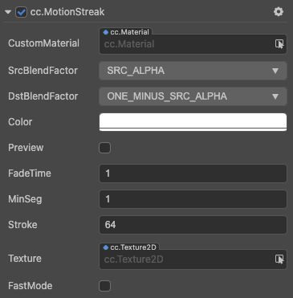
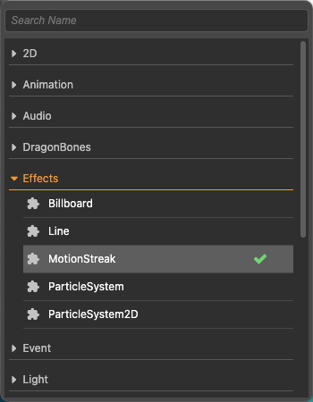

# MotionStreak Component Reference

MotionStreak is used to implement a streak effect on the motion track of a game object.

Click the **Add Component** button at the bottom of the **Inspector** panel and select **MotionStreak** from **Effects** to add the MotionStreak component to the node.

For details on how to use it, please refer to the [MotionStreak](https://github.com/cocos-creator/test-cases-3d/tree/v3.0/assets/cases/ui/24.motion-streak) example.

For script interfaces of MotionStreak, please refer to [MotionStreak API](__APIDOC__/en/classes/particle2d.motionstreak.html).

## MotionStreak Properties

| Property | Description
| :-------------- | :----------- |
| CustomMaterial | Custom Material, please refer to the [Custom Material](./../../ui-system/components/engine/ui-material.md) documentation for usage. |
| Preview | Whether to enable preview. If this option is enabled, the MotionStreak effect can be previewed in the **Scene** panel. |
| FadeTime | The fade time in seconds of the segment. |
| MinSeg | The minimum segment length (the size of the fading segment). |
| Stroke | The width of the MotionStreak. |
| Texture | The texture of the MotionStreak. |
| FastMode | Whether to enable the fast mode. When fast mode is enabled, new vertices will be added faster, but with less precision. |
| Color | The color of the MotionStreak. |
