# Spine Skeletal Component References

The Spine Skeleton components support the data format exported by the official Spine tools, and renders and plays Spine assets.

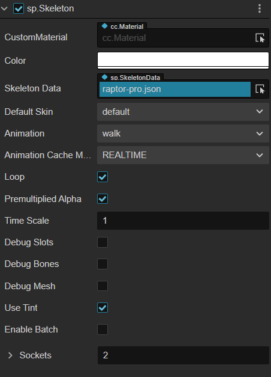

Select the node and choose **Add Component -> Spine -> Skeleton** on the **Inspector** panel to add the Skeleton component to the node.

- For information on using the Spine Skeleton component, please refer to the [Spine Skeleton example case](https://github.com/cocos/cocos-test-projects/tree/v3.6/assets/cases/middleware/spine) for details.
- For Spine Skeleton component related scripting interfaces, please refer to the [Spine Skeleton API](__APIDOC__/en/class/Skeleton) for details.

## Spine Properties

| Property | Description
| :-------------------- | :----------------- |
| CustomMaterial        | Custom materials that can be used to achieve rendering effects such as dissolve, external glow, etc. Please refer to the [Custom Materials](../../ui-system/components/engine/ui-material.md) documentation for details.
| Color                 | Set the skeleton animation color.
| SkeletonData          | Skeleton information data, drag and drop the skeleton assets exported from Spine. into this property
| Default Skin          | Select the default skin.
| Animation             | The name of the currently playing animation.
| Animation Cache Mode  | Rendering mode, the default is **REALTIME** mode. <br>1. **REALTIME** mode, real-time computing, supports all Spine features. <br>2. **SHARED_CACHE** mode, caches, and shares skeletal animations and texture data, equivalent to pre-baked skeletal animations. **SHARED_CACHE** mode has higher performance, but does not support motion fusion, motion overlay, and only supports motion start and end events. As for memory, when creating N (N>=3) animations with the same skeleton and the same action, the memory advantage is obvious. In summary, **SHARED_CACHE** mode is suitable for scene animations, effects, replica monsters, NPCs, etc., and can greatly improve frame rates and reduce memory consumption. <br>3. **PRIVATE_CACHE** mode, similar to **SHARED_CACHE**, but does not share animation and texture data, and will occupy extra memory, there is only a performance advantage, and it may cause stutter if using this mode a lot to play animation. Use **PRIVATE_CACHE** to take advantage of the high performance of the cache mode and to also implement texture replacement (which cannot share the texture data).
| Loop                  | Whether to loop the current animation.
| Premultiplied Alpha   | Whether to enable premultiplied alpha for the image, default is True.<br>This item needs to be disabled when the transparent area of the image appears as a color block, and enabled when the translucent area of the image turns black.
| Time Scale            | The time scale of all animations in the current skeleton.
| Debug Slots           | Whether to show debug information of slots.
| Debug Bones           | Whether to show debug information of skeletons.
| Debug Mesh            | Whether to show debug information of mesh.
| Use Tint              | Whether to turn on the tinting effect, off by default.
| Sockets               | Used to attach certain external nodes to the specified skeleton joints. The value of the property indicates the number of attachment points. For details, please refer to the description below.

> **Notes**:
> 1. The `Anchor` and `Size` properties on the Node component in the **Inspector** panel are invalid when using the Skeleton component.
> 2. The Spine Skeletal component is a UI renderable component, and the `Canvas` node is the rendering root for UI rendering, the node with this component must be a child of the `Canvas` node (or a node with a `RenderRoot2D` component) to be displayed properly in the scene.
> 3. When using the Spine Skeleton component, since it has the `UseTint` property, its custom material needs to have two color information, otherwise the Spine staining effect may be wrong. Please refer to the [builtin-spine.effect](https://github.com/cocos/cocos-engine/blob/v3.0.0/editor/assets/effects/builtin-spine.effect) example to achieve this.

## Spine ReplaceTexture

Here is an example of how Spine replaces the texture.

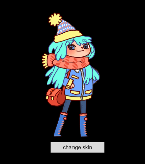

1. First, create a new `Canvas` node in the **Hierarchy** panel, and then create a new empty node and name it to `girl` under the `Canvas` node. Select the `girl` node and add the Skeleton component in the **Inspector** panel, drag and drop the asset into the `SkeletonData` property box of the Skeleton component. The `Animation` property of the Skeleton component can be changed to set the animation that the developer wants to play.

    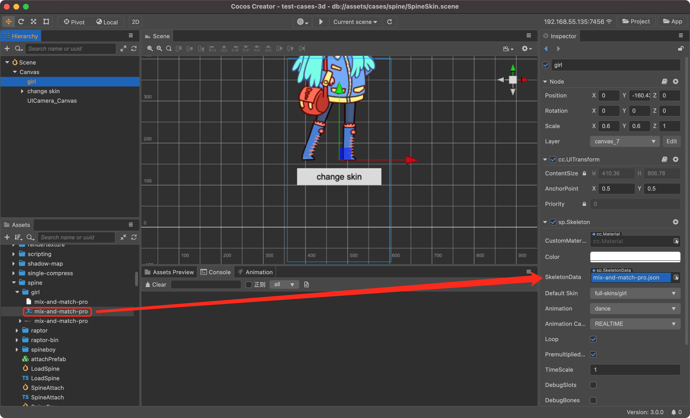

2. Create a new TypeScript script and name it `SpineSkin` in the **Assets** panel to write the component's script. The script code is as follows:

    ```ts
    import { _decorator, Component, sp } from 'cc';
    const { ccclass, property } = _decorator;

    @ccclass('SpineSkin')
    export class SpineSkin extends Component {


        @property({ type:sp.Skeleton })
        spine: sp.Skeleton | null = null;

        skinId: number = 0;

        start () {
            // Your initialization goes here.
        sp.Skeleton }

        change() {
            const skins = ['girl', 'boy', 'girl-blue-cape', 'girl-spring-dress'].map(x=> `full-skins/${x}`);
            this.skinId = (this.skinId + 1) % skins.length;
            this.skin!.setSkin(skins[this.skinId]);
        }

        // update (deltaTime: number) {
        // // Your update function goes here.
        // }
    }
    ```

3. Next, attach the `SpineSkin` script to the `Canvas` node, i.e. drag and drop the script into the **Inspector** panel of the `Canvas` node. Drag and drop the `girl` node in the **Assets** panel into the property boxes corresponding to the `SpineSkin` script component and save the scene.

    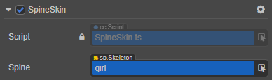

4. Next, use the Button component's click event to trigger the `change` callback in the `SpineSkin` script to replace the texture by clicking the button.

    Create a new Button node under the `Canvas` node in the **Assets** panel and name it `change_skin`. Adjust its position, size, text display, and other properties as needed.

    Set the click event of the `change_skin` node in the **Inspector** panel, drag the `Canvas` node attached with the `SpineSkin` script component into the `cc.Node` property box of the `ClickEvents` property, specify script component as `SpineSkin`, and set the callback to `change`.

    

5. Adjust the scene structure as needed, save the scene and click the **Preview** button at the top of the editor. Click the **change skin** button to see that the character skin has been replaced.

    

    > **Note**: if the scene is not displayed when previewing, check that the `Layer` property of each node is consistent with that of the `Camera` node.
    >
    > 

## Spine Vertex Effect

The vertex effect is only available when Spine's `Animation Cache Mode` is in the **REALTIME** mode. Here is an example of how to set the vertex effect in Spine.

1. First, create a new `Canvas` node in the **Hierarchy** panel, and then create a new empty node under the `Canvas` node. Select the node and add the Skeleton component in the **Inspector** panel, drag and drop the asset to the `SkeletonData` property box of the Skeleton component, and set the Skeleton component properties.

2. Create a new TypeScript script in the **Assets** panel and name it `SpineExample`, write the component script. The script code is as follows:

    ```ts
    import { _decorator, Component, sp } from 'cc';
    const { ccclass, property } = _decorator;

    @ccclass('SpineExample')
    export class SpineExample extends Component {

        @property({ type:sp.Skeleton })
        skeleton: sp.Skeleton | null = null;
    
        private _jitterEffect?:sp.VertexEffectDelegate;

        start () {
            this._jitterEffect = new sp.VertexEffectDelegate();
            // Set the jitter parameters.
            this._jitterEffect.initJitter(20, 20);
            // Call the 'setVertexEffectDelegate' method of the Skeleton component to set the effect.
            this.skeleton!.setVertexEffectDelegate(this._jitterEffect!);
        }

    };
    ```

3. Next, attach the `SpineExample` script to the `Canvas` node, i.e. drag and drop the script into the node's **Inspector** panel. Drag the `Spine` node with the **Skeleton** component attached in the **Hierarchy** panel to the corresponding `Skeleton` property box of the script component, and save the scene.

4. Click the **Preview** button at the top of the editor to see the effect of vertex jitter of the Spine animation. For example, please refer to the [SpineMesh](https://github.com/cocos/cocos-test-projects/tree/v3.6/assets/cases/middleware/spine) example.

## Spine Attachment

When using skeleton animation, nodes are often attached on a certain part of the skeleton animation to achieve the effect of linkage between the nodes and the skeleton animation.

Spine Attachments can be implemented by using both editor and script. Here is an example of how Spine uses an attachment to attach a star to the dragon's tail, and shake it with the dragon's tail.

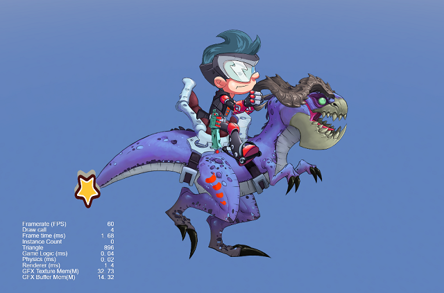

### Implementing via the editor

1. First, create a new `Canvas` node in the **Hierarchy** panel, and then create a new empty node and name it to `Spine` under the `Canvas` node. Select `Spine` and add the **Skeleton** component to the **Inspector** panel. Drag and drop the asset into the `SkeletonData` property box of the **Skeleton** component and set the Skeleton component properties.

2. Second, right-click on the Spine node in the **Hierarchy** panel and select **Create -> Empty Node** to add a child node for it and name it `targetNode`. **Create -> 2D Object -> Sprite** to add a sprite component named `star` under `targetNode`. Drag the star asset to the **SpriteFrame** property of the Sprite component in the **Inspector** panel.

    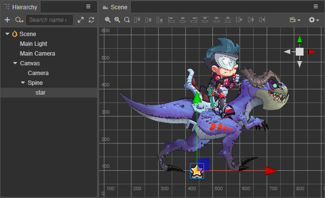

3. Select the Spine node in the **Hierarchy** panel, and set the Skeleton component's `Sockets` property to **1** in the **Inspector** panel (the value of the `Sockets` property represents the number of attachments).

    

4. Next, set the **Path** and **Target** properties of the **Sockets**. The **Path** drop-down box will list all the skeletons, select the target bone you want to attach, here take the dragon's tail as an example, drag the `targetNode` node to the **Target** property box. Notice the star attached on the dragon's tail in the **Scene** panel.

    > **Note**：Do not set the `star` node as **Target** node, because this will make UITransform of `star` invalid. Please create a new empty node as the **Target** node and set components which to be attached as children nodes of **Target ** node.

    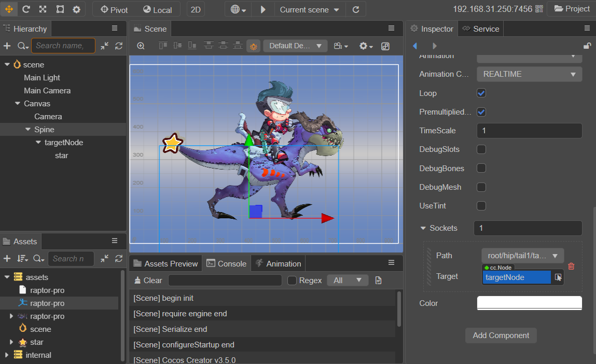

5. Finally, save the scene and click the **Preview** button on top of the editor to see the star hanging on the dragon's tail and swaying along with it. Please refer to the [SpineAttach](https://github.com/cocos/cocos-test-projects/tree/v3.6/assets/cases/middleware/spine) example for details.

### Implementing via code

1. The first two steps are the same as those implemented via the editor.

2. Create a new TypeScript script in the Explorer panel and name it `SpineAttach`. Write the component script. The script code is as follows:

    ```ts
    import { _decorator, Component, sp, Label, Node } from 'cc';
    const { ccclass, property } = _decorator;

    @ccclass('SpineAttach')
    export class SpineAttach extends Component {

        @property({ type: sp.Skeleton })
        skeleton: sp.Skeleton = null!;

        @property({ type: Node })
        attachNode: Node = null!;

        start () {
            var socket = new sp.SpineSocket("root/hip/tail1/tail2/tail3/tail4/tail5/tail6/tail7/tail8/tail9/tail10", this.attachNode); // The first incoming parameter is the target bone of the attachment, and the second incoming parameter is the node of the attachment.
            this.skeleton!.sockets.push(socket);
            this.skeleton!.sockets = this.skeleton!.sockets;
        }

    }
    ```

    If the name of the target bone is unknown, set the `Sockets` property in the Skeleton component to **1** and then look for the name of the desired target bone in the `Path` drop-down box. When the search is complete, restore the `Sockets` property to 0.

3. Next, attach the `SpineAttach` script to the `Canvas` node, i.e. drag and drop the script into the node's **Inspector** panel. Drag and drop the `Spine` node with the Skeleton component attached and the `targetNode` node in the **Hierarchy** panel to the **Skeleton** property box and the **AttachNode** property box of the script component, respectively, and save the scene.

4. Click the **Preview** button at the top of the editor to see the star hanging from the dragon's tail and shaking along with the dragon's tail.

    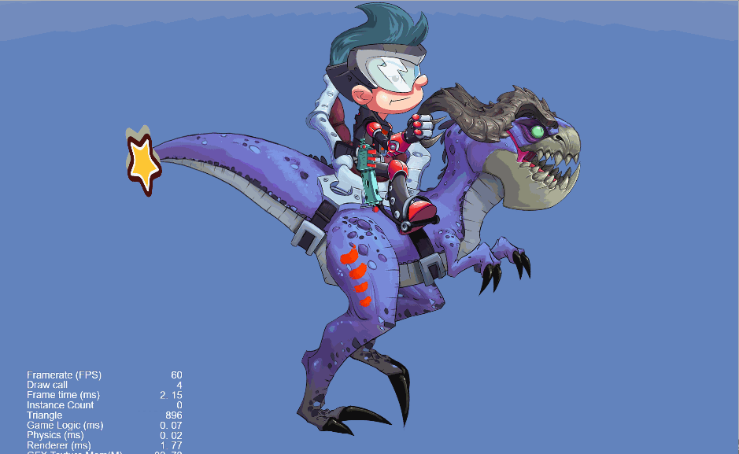

## Spine Collision Detection

The Spine attachment function allows for the detection of a collision of a part of the skeleton animation. The following is an example of how Spine implements collision detection, by determining whether the character's feet are in contact with the ground or not to dynamically change the ground color when the character is running.

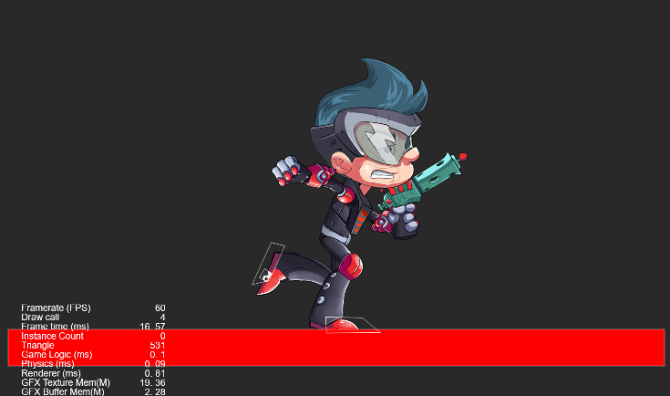

1. First, set the **2D Physics System** to **Builtin 2D Physics System** in the **Project -> Project Settings -> Feature Cropping** of the editor menu bar.

    

2. Create the Spine node and its children (an empty node and named `frontFoot`), as well as the Sprite node as the ground (named `Ground`), and set the position, size, and other properties, as in the first two steps for the Spine attachment.

    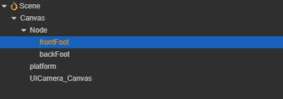

3. Select the `frontFoot` node in the **Hierarchy** panel, click **Add Component -> Physics2D -> Colliders -> Polygon Collider2D** in the **Inspector** panel to add a collision component, and set the collision component parameters.

    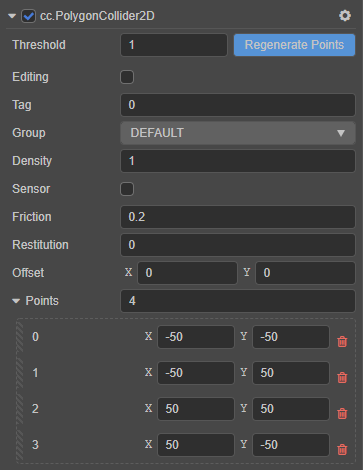

    Referring to steps 3 and 4 of the Spine attachment, attach the `frontFoot` node to the target bone ("foot" for example) of the Sprite node. The `frontFoot` node will then move along with the skeletal animation, and thus the collision component's bounding box will be synchronized with the skeletal animation in real time.

    

4. Select the `Ground` node in the **Hierarchy** panel, click **Add Component -> Physics2D -> Colliders -> BoxCollider2D** in the **Inspector** panel to add a collision component, and set the collision component parameters.

5. Create a new TypeScript script in the **Assets** panel and name it `SpineCollider`. Then attach the script on the `Ground` node. The script code is as follows:

    ```ts
    import { _decorator, Component, Node, PhysicsSystem2D, Contact2DType, Collider2D, Color, Sprite, ParticleSystem2D, EPhysics2DDrawFlags } from 'cc';
    const { ccclass } = _decorator;

    @ccclass('SpineCollider')
    export class SpineCollider extends Component {

        touchingCountMap : Map < Node, number > = new Map;

        private debugDrawFlags : number = 0;

        start () {
            // Your initialization goes here.
            PhysicsSystem2D.instance.on(Contact2DType.BEGIN_CONTACT, this.onBeginContact, this);
            PhysicsSystem2D.instance.on(Contact2DType.END_CONTACT, this.onEndContact, this);
            this.debugDrawFlags = PhysicsSystem2D.instance.debugDrawFlags;
        }

        onEnable () {
            PhysicsSystem2D.instance.debugDrawFlags = this.debugDrawFlags | EPhysics2DDrawFlags.Shape;
        }

        onDisable () {
            PhysicsSystem2D.instance.debugDrawFlags = this.debugDrawFlags;
        }

        addContact (c: Collider2D) {
            let count = this.touchingCountMap.get(c.node) || 0;
            this.touchingCountMap.set(c.node, ++count);

            let sprite = c.getComponent(Sprite);
            if (sprite) {
                sprite.color = Color.RED;
            }
        }

        removeContact (c: Collider2D) {
            let count = this.touchingCountMap.get(c.node) || 0;
            --count;
            if (count <= 0) {
                this.touchingCountMap.delete(c.node);

                let sprite = c.getComponent(Sprite);
                if (sprite) {
                    sprite.color = Color.WHITE;
                }
            } else {
                this.touchingCountMap.set(c.node, count);
            }
        }

        onBeginContact (a: Collider2D, b: Collider2D) {
            this.addContact(a);
            this.addContact(b);
        }

        onEndContact (a: Collider2D, b: Collider2D) {
            this.removeContact(a);
            this.removeContact(b);
        }
    }
    ```

6. Click the **Preview** button at the top of the editor to see the effect. For details, please refer to the [SpineCollider](https://github.com/cocos/cocos-test-projects/tree/v3.6/assets/cases/middleware/spine) example.

    > **Note**: the collision detection based on attachment has a delay of one frame due to the implementation mechanism of the attachment.

    
