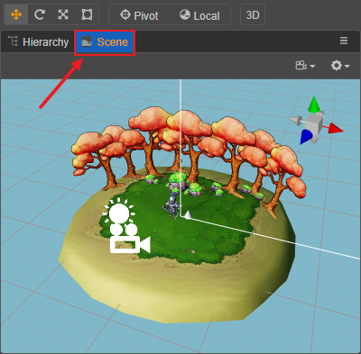

# Editor Layout

Editor layout is the position, size and stacking of each panel in Cocos Creator.

Select the **Cocos Creator/File -> Layout** menu in the main menu, currently only **Default Layout** is supported. Based on the default layout, it is allowed to continue to adjust the position and size of each panel. Changes to the layout are automatically saved in the global directory at:

- **Windows**: `%USERPROFILE%\.CocosCreator\editor\window.json`
- **macOS**: `$HOME/.CocosCreator/editor/window.json`

## Resizing panel

Hover the mouse over the boundary line between the two panels and see the mouse pointer become , then press the mouse, the boundary line will turn yellow, then drag the mouse to change the size of the two adjacent panels.

> **Note**: some panels are set to the minimum size, when dragging to the minimum size limit, shrinking the panel cannot continue.

## Moving panel

A panel can be moved to any position in the editor window by clicking the tab bar of the panel and dragging it. The red box in the following figure indicates the area of the tab bar that can be dragged and dropped, and the arrow indicates the dragging direction:

The blue translucent box during moving the panel indicates the position where the moved panel will be placed after releasing the mouse.

## Stacking Panel

In addition to moving the panel position, it is allowed to move the mouse to the tab bar area of another panel when dragging and dropping the panel tab bar:

Releasing the mouse when the red vertical line appears in the tab bar of the target panel allows stacking two panels together, while only one panel is displayed: 

Stacking panel is useful when the screen resolution is insufficient, or when laying out less-used panels. Panels in the stack can be dragged out at any time to restore displaying at the top level.

Panels also support pop-up standalone panels or close panel operations by clicking the button at the top right of the panel. However, note that the **Scene** panel does not support pop-up/close.

