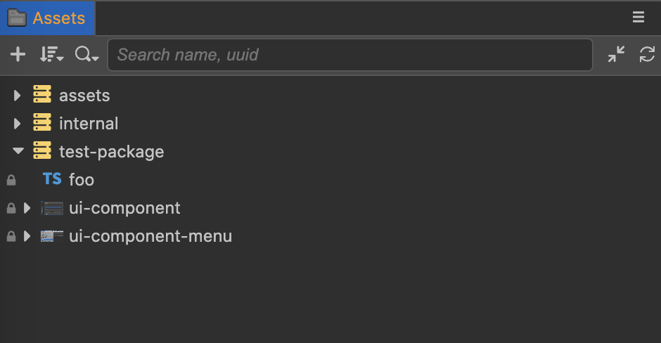

# Custom Asset Database

All asset files in the project are managed through the asset database, where the `assets` directory in the project stores the assets of the current project, and the `editor/assets` in the engine repository stores the built-in assets of the engine (e.g., common images, scripts, etc.).

When we use the assets in the extension, we need to register the asset folder in the extension to the asset database, and publish the assets with the extension when it is released.

Through this article we will learn how to register a asset folder and use the assets in scripts.

## Registration Database Configuration

Asset registration needs to be configured in `contributions` using the `asset-db` field, as follows.

```json5
{
    "name": "test-package",
    "contributions": {
        "asset-db": {
            "mount": {
                "path": "./assets",
                "readonly": true
            }
        }
    }
}
```

In the above example, we have registered the `assets` folder in the root directory of the extension `test-package` to the asset database.

## Script Asset

Create a script `foo.ts` in the `test-package/assets/` directory, with the following content：

```typescript
/// foo.ts
import { _decorator, Component, Node } from 'cc';
const { ccclass, property } = _decorator;
 
@ccclass('Foo')
export class Foo extends Component {
    start () {
        console.log('foo');
    }
}
```

In order to use the `cc` definitions, we need to copy the definition files from `{project directory}\temp\declarations` to the extension root directory.

Since `foo.ts` is only used as a asset and is not part of the extension source code, we need to exclude it by adding `exclude` configuration to `tsconfig.json`, otherwise we will get a compilation error.

```json5
{
    "compilerOptions": { 
        ... 
    },
    "exclude": ["./assets"]
}
```

> **Note**: The script assets in the extension can be written and tested in the Cocos Creator project and then copied to the extension's `assets` directory.

## Other Assets

Assets such as images, text, fonts, etc. can be placed directly in the `assets` directory.

## Using Assets in Extensions

Refresh the extension and you will see a new `test-package` assets package in the **Assets Manager** panel of the Cocos Creator editor, as shown below:s



## Drag-and-drop Assets

To reference an asset within a package as a drag-and-drop component, use it in the same way as the assets in `assets` and `internal`.

## Import Script

You can simply reference a script file from the AssetDatabase as follows:

```typescript
/// bar.ts
import { Foo } from 'db://test-package/foo';
```

You don't need to pay attention to whether a class comes from an extension package, the TypeScript development environment's auto-completion feature will prompt the **import** directory, no need to worry.

> **Note**: The class name in the extension package should be kept globally unique, otherwise it will cause conflicts, try to add a suitable prefix in the actual development (e.g. `test-pacakge` can be shortened to `TP`, and all classes in the package are unified with the `TP` prefix to become `TPFoo`).
