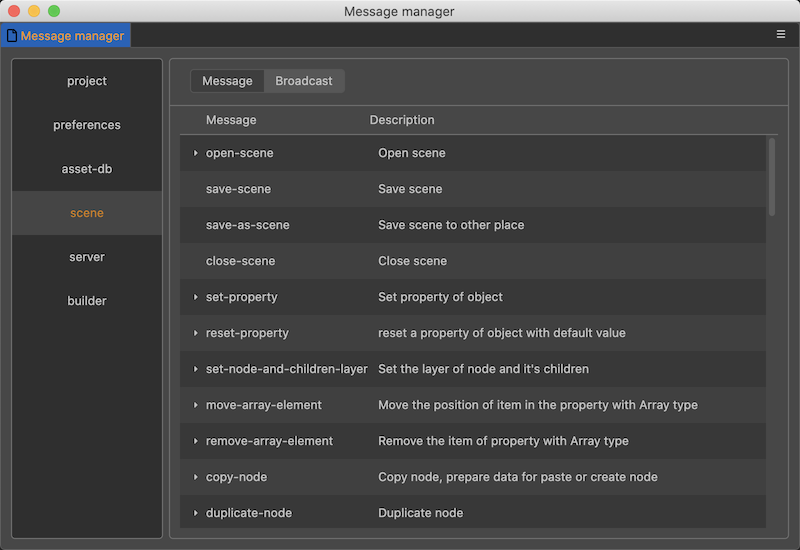

# Customized Messages

In the Cocos Creator editor architecture, all interactions are implemented through message communication, and this article will explain how to customize a message.

## View the Public Message List

Find **Developer** -> **Message Manager** in the top menu bar of the editor to open the message management panel, which shows the public messages of each system of the editor and their descriptions.




## Define a message

Only messages defined in the `contributions.messages` field of the `package.json` file can be used. The messages are defined as follows.

```json
{
    "name": "hello-world",
    "contributions": {
        "messages": {
            "test-messasge": {
                "public": false,
                "description": "",
                "doc": "",
                "methods": []
            }
        }
    }
}
```

`test-messasge` is the name of the message, and we will explain the meaning of each property one by one.

### public

Type `{string}` Optional

Whether to display this message externally, if true, the basic information of this message will be displayed on the message list interface.

### description

Type `{string}` Optional

If public is true, some simple descriptions will be displayed in the message list, supporting `i18n: key` syntax.

### doc

Type `{string}` Optional

If public is true, some documents of this message will be displayed, supporting i18n:key syntax.

This document is written and rendered in markdown format.

### methods

Type `{string[]}` Optional

The method queue triggered by the message.

This is an array of strings. The strings are methods on the extension or panel.

If it is a method on the extension, directly define `methodName`, if you want to trigger a method on the panel, you must fill in `panelName.methodName`. For example, the `ready` method of the scene manager is `scene:ready`.

## Define broadcast message

When developing an extension, you need to send some notifications to other extension after completing an action. If these notifications also need to be displayed on the **Developer -> Message List** panel, you can define the message like this:

```json
{
    "name": "hello-world",
    "contributions": {
        "messages": {
            "hello-world:ready": {
                "public": true,
                "description": "hello-world ready notification"
            }
        }
    }
}
```

For more information, please refer to the document [Message System](./messages.md).
