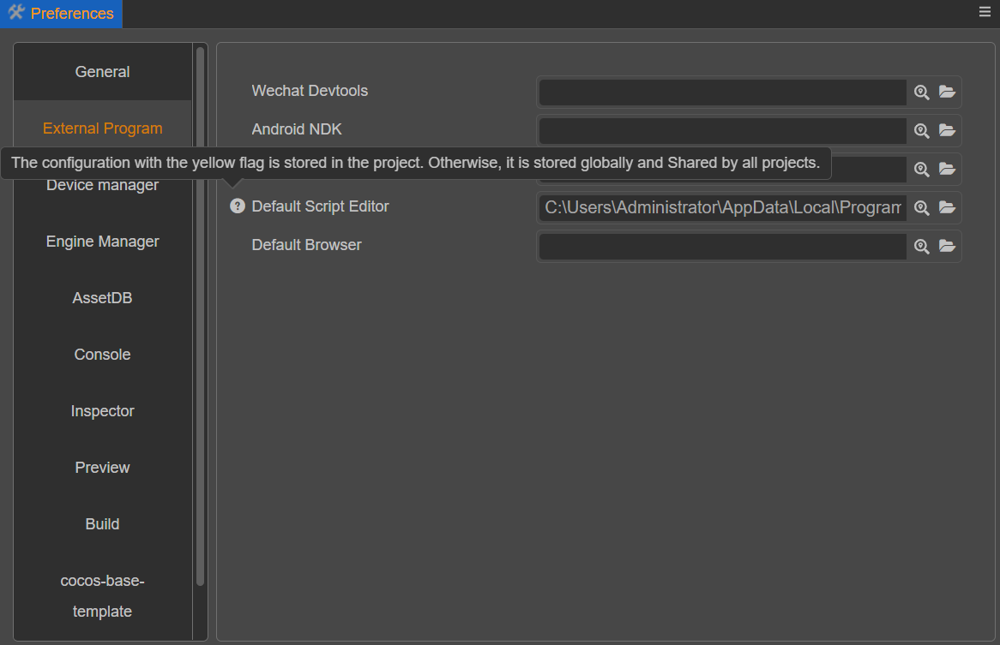

# Extending the Preferences Panel

The editor allows each extension to register its own configuration, and then displays some or all of the editor configuration within the Preferences panel. In this panel, the modifications are editor feature-related configurations.

For project-related configurations, please review the [Project Settings](./contributions-project.md) documentation.

## Description of the Preferences Panel

The Preferences panel can be opened via the top menu **Cocos Creator -> Preferences**.



The Preferences panel is divided into left and right sides.

- The left side shows the names of functional extensions that provide configuration items.
- On the right side is an action panel rendered according to the configuration.

Changes made in the panel are immediately modified to the corresponding configuration items.

Normally, the configuration is stored at the global level. If the configuration needs to be put into a project, then move the mouse over the configuration entry and select **Record to project** on the small icon that appears on the left side. This data will be saved to the project, and changes to it will not affect other projects.

> **Notes**:
> 1. If the auto-rendered configuration is stored in the project, the icon on the left side will turn yellow to indicate it. To reuse the global configuration, click the icon on the left side and select **Restore to Global Configuration**, doing so will discard the project settings.
> 2. Only auto-rendered configurations will automatically add icons. If properties are not defined, implement the icon change function in the panel as needed.

Also, there are some configurations that cannot switch between global and local storage location, such as preview scenes, which must be stored in the project. This part of the configuration should use the custom panel.

For more information about the **Preferences** panel, please refer to the [Preferences](../../editor/preferences/index.md) documentation.

## Registration Methods

Preferences allow to display configurations in two ways.

1. General configuration
2. Lab configuration

General settings are displayed directly as tabs, while lab switches are displayed centrally in a separate tab.

- When the functionality provided by the extension is more stable it is recommended to place the configuration data within the generic functionality.
- When the functionality provided by the extension is in the development stage, it is recommended that the switch configuration data of the functionality be placed in the lab configuration.

First define the configuration in `contributions.profile.editor`. The data to be displayed in the **Preferences** panel can then be defined in `contributions.preferences`.

For details on how to define a `profile`, please review the [Profile](./profile.md) documentation.

## Registering Preferences Data

`package.json`

```JSON5
{
    "name": "hello-world",
    "contributions": {
        "profile": {
            "editor": {
                "foo": {
                    "default": 0,
                    "label": "foo"
                },
                "bar": {
                    "default": false,
                    "label": "bar"
                }
            }
        },
        "preferences": {
            "properties": {
                "foo": {
                    "ui": "ui-num-input"
                }
            },
            "laboratory": ["bar"]
        }    
    }
}
```

Two editor configurations, `foo` and `bar`, have been defined and added the configurations to the `preferences`.
- The `foo` is stored in the general profile.
- The `bar` is stored in the `laboratory` profile.

The defined `profile` data will be automatically registered to `default`. Using `Editor.Profile.getConfig` will get the default values.

The `contributions` of `package.json` need to be defined like the following:

```typescript
interface package
{
    "name": string;
    "contributions": {
        "profile": {
            "editor": {
                [key:string]: ProfileItem;
            };
        };
        "preferences": {
            /**
             * The properties data can be filled in to auto-render the configuration.
             * The key in properties corresponds to the editor configuration key, and the value corresponds to the information needed for auto-rendering.
             * If there is a ui defined in properties then it will be automatically rendered under the tab of the functional extension name.
             **/
            "properties": {
                [key:string]: UIInfo
            };
            /**
             * If the configuration is more complex and auto-rendering can't meet the demand, you can fill in custom data.
             * Fill in the entry for the custom panel there.
             * The panel will appear below the autorender (if properties are defined).
             **/ 
            "custom": string;
            /**
             * The labs are listed as a separate tab within the editor, mainly to provide a switch display for some experimental functions.
             * You can fill in laboratory data to add an editor configuration of type Boolean to the lab switches.
             * Laboratory is an array, the key in the array points to the key in the editor configuration, the corresponding data must be of Boolean type.
             * The key filled in here will be displayed in the Lab tab of Preferences.
             **/
            "laboratory": string[];
        };
        ...
    }
    ...
}
```

```typescript
interface UIInfo {
    // which ui element to use for rendering, e.g.: "ui-num-input"
    ui: string;
    attributes: {
        // The attribute data allowed on the ui element, each ui allows different parameters, see the ui-kit chapter for details
        // Assuming the ui is "ui-num-input"
        // This can be filled with "step": 1
        [key:string]: any;
    };
}
```

For more information on how to customize the panel please review the [Panel Definition](./panel.md) documentation.
