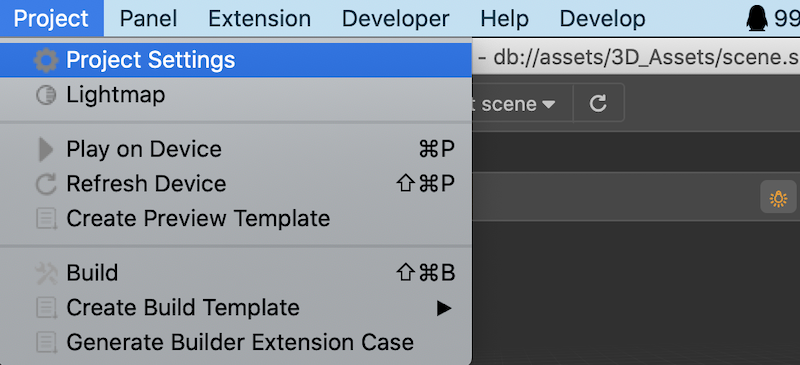
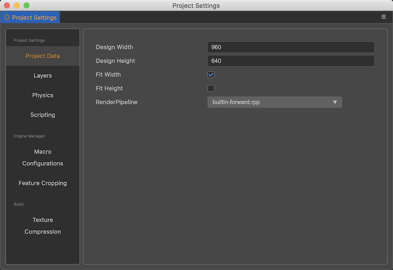
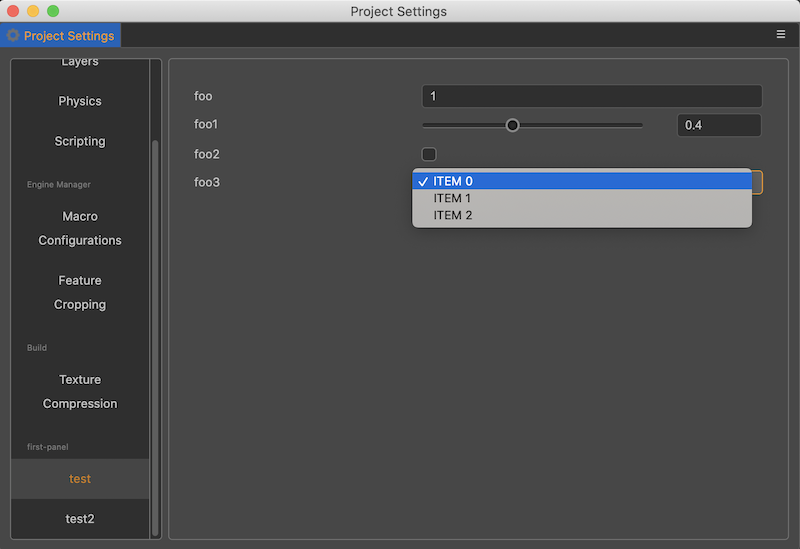

# Extending Project Settings Panel

## Panel Introduction

**Project Settings** holds the configuration related to the project operation, which is stored in the `settings` folder under the project directory and needs to be included in the version management, so that multiple people can share the configuration, otherwise it may lead to inconsistent operation on different machines.

The **Projects** -> **Projects Settings** menu can be found in the top menu bar, as shown below:



Click on it to open the settings panel, as shown in the following figure:s



On the left side of the project settings panel is the function module tab, and on the right side is the configuration modification interface for the corresponding function.

We can add custom configurations to the project by customizing the display data in this panel, and visualize and manage the project configuration with the help of the project settings panel.

If you want to take effect for all projects, you need to customize the editor-related configuration, please refer to the document [Extending the Preferences Panel](./contributions-preferences.md).

The **Custom Item Settings** function allows a we to register multiple tabs, so there will be a small line on the left tab indicating which function the tab belongs to.

## Data Configuration and Display

Custom project settings need to rely on data configuration, you need to define the relevant data fields in `contributions.profile.project` first.

> **Note**: The configuration data in the project settings should be stored in the `profile.project` field.

Once the data fields are defined, you also need to define the data to be displayed and the UI components to be used to display it in the `contributions.project` field. This is shown below.

```json5
// package.json
{
    "name": "project-test",
    "contributions": {
        "profile": {
            "project": {
                "foo": {
                    "default": 1
                },
                "foo1": {
                    "default": 0.4
                },
                "foo2": {
                    "default": false
                },
                "foo3": {
                    "default": 0
                },
                "foo4": {
                    "default": "label"
                }
            }
        },        
        "project": {
            "tab1": {
                "label": "test",
                "content": {
                    "foo": {
                        "ui": "ui-num-input"
                    },
                    "foo1": {
                        "ui": "ui-slider",
                        "attributes": {
                            "min": 0,
                            "max": 1,
                            "step": 0.1
                        }
                    },
                    "foo2": {
                        "ui": "ui-checkbox"
                    },
                    "foo3": {
                        "ui": "ui-select",
                        "items": [
                            {
                                "value": 0,
                                "label": "ITEM 0"
                            },
                            {
                                "value": 1,
                                "label": "ITEM 1"
                            },
                            {
                                "value": 2,
                                "label": "ITEM 2"
                            }
                        ]
                    }
                }
            },
            "tab2": {
                "label": "test2",
                "content": {
                    "foo4": {
                        "ui": "ui-input"
                    }
                }
            }
        }        
    }
}
```

In the above example, 4 data items are defined in the `contributions.profile.project` field: `foo`, `foo1`, `foo2`, `foo3`.

For more information on how to define `profile` related configuration, please refer to [Configuration System](./profile.md).

There are 2 tabs defined in the `contributions.project` field: `test`, `tes2`.

In the `test` tab, each of the 4 data items is configured, see [UI Component Configuration](##UI%20Component%20Configuration) later for the specific configuration properties.

After refreshing the extension in the Extension Manager list, open the **Project Settings Panel** again via the **Project -> Project Settings** menu to see the following screen.



## UI Component Configuration

This example shows the usage of 4 common UI components in customizing the project settings panel, in theory all UI components with `value` attribute can be used in customizing the project settings panel, please refer to the documentation [UI Components](./ui.md).
