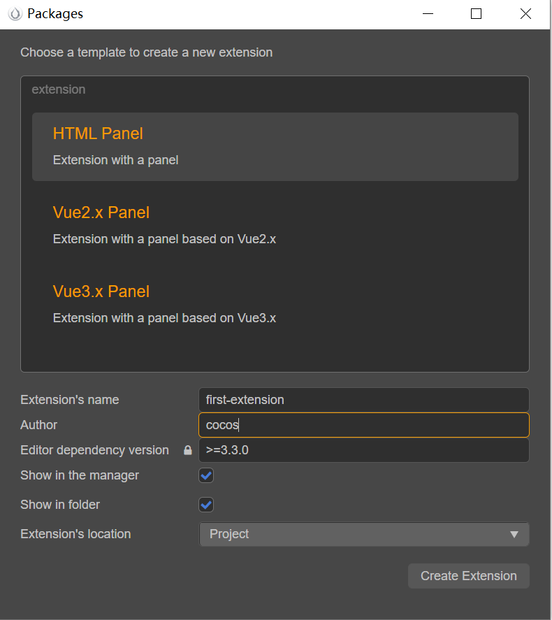

# Generating extensions using templates

This document will demonstrate how to create an extension containing a panel using a template and install and enable this extension.

## Creating an extension using a template and installing it

Creator provides three templates for extension containing panels,Includes **HTML panel**, **vue2.x panel** and **vue3.x panel**.
First, click on **Extension -> Open the Create Extensions panel** in the top menu.



| Option | Description |
| :--- | :----- |
| **Extension's name** | Cannot start with _ or . and cannot contain uppercase letters. Because the extension becomes part of the URL, it cannot contain illegal characters of the URL such as . , ' , . |
| **Author** | Author of extension |
| **Editor dependency version** | The extension runtime created requires a version of Creator, currently requiring a minimum of V3.3.   |
| **show_in_manager** | If this is checked, when the creation of an extension is complete, **Extension Manager** will automatically open and display the created extension. <br>If this is unchecked, then when the extension is created, you can click **Extensions -> Extension Manager** in the menu bar at the top of the editor to see it. |
| **Show in folder** | If this item is checked, the extension will be automatically opened in the system file manager when the extension is created. |
| **location** | The directory where the created extension package is located, you can choose the **Project**/**Global** directory. <br>If you choose the **Global** directory, you are applying the extension package to all Creator projects, the **Global** path is: `%USERPROFILE%\.CocosCreator\extensions`<br>If you choose the **Project** directory, you are applying the build extension package to the specified Creator project, the ** project** path is `$your project address\extensions`.|

After setting the extension information, click the **Create Extension** button in the lower right corner to create the extension.

### Build the example extension

After the extension is created, open the directory where the extension package is located and execute the following command.

```bash
# Install dependent modules
npm install
# Build
npm run build
```

Each extension comes with some definitions of its own, but all depend on the **Node.js** environment and usually use some third-party packages on **Node.js**. So before enabling the extensions you need to run `npm install` in the extensions directory to install the dependent modules in order to compile them properly.

Creator recommends using TypeScript-based workflows, and most of the extension templates provided by default in Creator are based on TypeScript, so that you can write with full code hints. However, TypeScript needs to be compiled with `npm run build` before it can run.
> **Note**: The extension's `tsconfig.json` configuration file has `resolveJsonModule` enabled to get the extension name from the imported extension's `package.json`, so TypeScript needs to be upgraded to **v4.3**, otherwise you will get a compile result path error when importing `json` from outside the root directory. outside the root directory, otherwise the compile result path will be wrong.

### Enabling the example extension

After the extension is created and compiled, go back to the editor, click **Extensions -> Extension Manager** in the top menu bar, find the created extension in the **Projects**/*Global** tab of **Extension Manager**, and then click the Enable button on the right to enable the extension.

## Using the features of this extension

Take an extension created with the **Vue2.x panel** template as an example.

Click **Panel -> Extension Name -> Default Panel** in the top menu bar after enabling the extension to open the default panel of the extension.

Click **Developer -> Extension Name -> Send Message to Panel** in the top menu bar and it will send a message `send-to-panel` to the extension based on the definition of `contributions.menu` in `package.json`. When the extension receives the message, it calls the default `hello` method in the extension's default panel according to the `contributions.messages` definition in `package.json`, and then displays the log message `hello` in the default panel and prints it to the **console**.

The extensions created by each template are not exactly the same, for more information please refer to the `README.md` file in the corresponding extension package directory.
