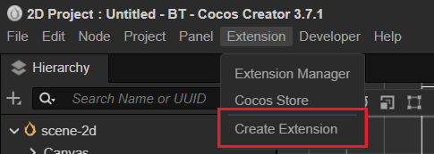
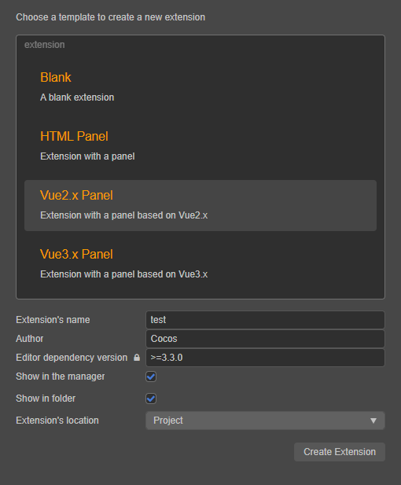

# Extension Templates and Compile Builds

This article will explain in detail how to create an extension with a panel and use it with the extension template provided by Creator.

Select the **Extension -> Create Extension** menu on the main editor menu to open the New Panel.





## Template Types

Cocos Creator provides 4 types of extension templates for quickly creating a new extension project.
- **Blank**: empty extension.
- **HTML Panel**: HTML-based extension template with a popup panel.
- **Vue2.x Panel**: Vue2.x based extension template with a popup panel.
- **Vue3.x Panel**: Vue3.x based extension template with a popup panel.

The extensions created in the above 4 ways differ only in workload and technical selection, and there is no difference in the achievable capabilities of the extensions, so developers can choose according to their needs and technical background.

> **Note**: Please refer to the `README.md` file in the corresponding extension package directory after creation.

## Option Description

| Options | Description |
| :--- | :----- |
| **Extension's name** | The extension name created must not start with `_` or `.`, and cannot contain capital letters. Because extensions become part of the URL, they also cannot contain illegal characters from the URL, `.`, `'` and `,`. |
| **Author** | Author of extension |
| **Editor dependency version** | The Cocos Creator version required by the runtime of the created extension. |
| **Show in the manager** | If this item is checked, **Extension Manager** will automatically open and show the created extensions when the extension creation is finished. <br>If this is unchecked, you can click **Extensions -> Extension Manager** in the menu bar at the top of the editor to view the extensions when they are created.|
| **Show in folder** | If this item is checked, the extension will be automatically opened in the system file manager when the extension is created. |
| **Extension's location** | The directory where the extension package was created, either **Project** or **Global**. |

## Extension's Location

### Project

Apply the extension package to the specified Cocos Creator project, **Project** with the path:

`${your project address}/extensions`

### Global

To apply the extension package to all Cocos Creator projects, the **Global** path is:

- **Windows**: `%USERPROFILE%\.CocosCreator\extensions`

- **MacOS**: `$HOME/.CocosCreator/extensions`

> **Note**: `Editor.App.path` can be used to print the global path.

## Dependency installation and compilation build

Once created, open the directory where the extension package is located and execute the following command:

```bash
## Install the dependency module
npm install
# Build
npm run build
```

The extension depends on **Node.js** third-party libraries, so you need to run `npm install` in the extension directory before enabling the extension to compile properly.

TypeScript can be written with full code hints and is more engineering friendly, so Cocos Creator recommends using a TypeScript-based workflow.

The extension templates provided by default are also based on TypeScript and need to be compiled with `npm run build` to run.

> **Note**: The extension `tsconfig.json` configuration file has `resolveJsonModule` enabled to get the extension name from the imported extension's `package.json`, so TypeScript requires **v4.3** and above, otherwise, importing `json` outside the root directory, otherwise the compilation result will be wrong path.
