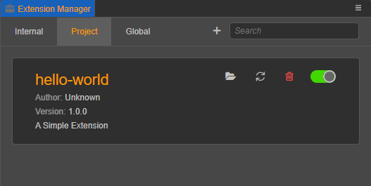

# Change the Name of a Extension

## Change the Display Name

If you want to rename the extension, just change the `name` field in the `package.json` file. The code example is as follows:

```JSON5
// "name": "simple-1649426645745"
"name": "hello-world"
```

Change the `name` field to "hello-world" as above and refresh the extension in the extension manager panel to see the name of the extension changed to **hello-world**.



## Change the Extension Folder Name

If you want to change the folder name along with it, you need to restart Cocos Creator after the folder change in order to make the extension with the modified folder name take effect again.

If you modify the folder name, **i18n** the path to the multilanguage related string needs to be modified as well, as follows.

```json5
// "description": "i18n:simple-1649426645745.description",
"description": "i18n:hello-world.description",
```
