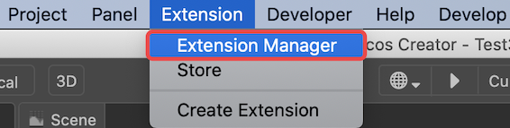
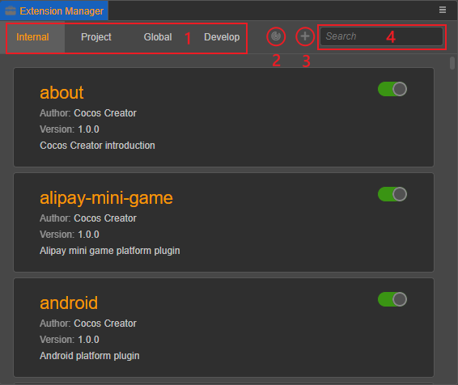
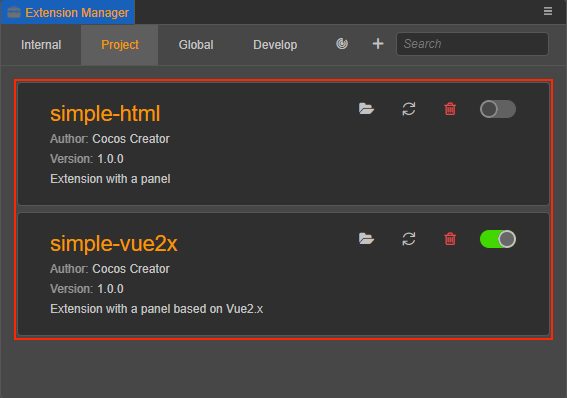
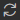
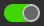
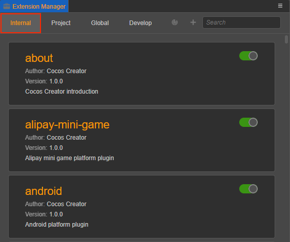
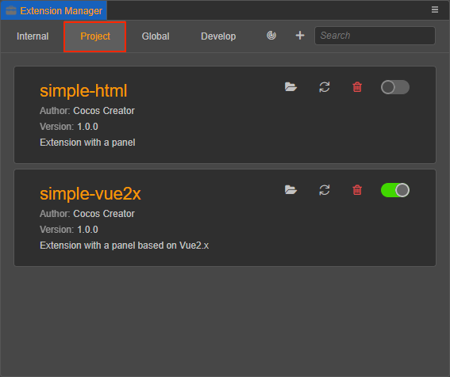
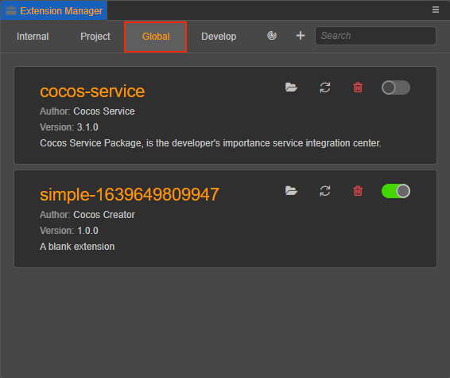

# Extension Manager Panel Description

The **Extension Manager** is used to manage extensions in the editor. Click **Extension -> Extension Manager** in the top menu bar of Cocos Creator to open:

The relevant functions at the top of the Extension Manager are described as follows:

**1**: Extension types, there are 4 types of extensions **Internal**, **Project**, **Global** and **Develop**, please refer to [**Extension Types**](#%E6%89%A9%E5%B1%95%E7% B1%BB%E5%9E%8B) section for details.

**2**: Scan Extension button to scan for extensions under the extensions directory (`extensions`), uninstall non-existent extensions, and install extensions that have not been imported. This button is not available under the **Internal** and **Develop** subpages.

**3**: Import Extension button to import extensions to the extension type pane you are currently in. This button is not available for **Internal** tabs.

**4**: Search field, enter the name of the extension to search for the extension in the list of the extension type you are currently in.

## Extensions list

The **Extension Manager** panel displays the corresponding extensions based on the currently selected extension type, as well as actions such as filtering by the search bar.

In the extension list, the extension-related information is displayed on the left side of the extension, and the descriptions of the buttons on the right side are as follows.

- : opens the extension in the operating system's file manager

- : Refresh button, used to reload the current extension

- : uninstall the extension, when clicked it will remove the current extension from the extension list and delete the extension package

- : enable/disable the extension, the button shows green to enable, shows gray to disable.

## Extension Types

Cocos Creator currently classifies extensions as **Internal**, **Project**, **Global**, and **Develop**, which you can click to switch and display the list of extensions of the current type.

### Internal

The extensions in the Internal tab are all built-in extensions of the editor. The built-in extensions cannot be closed, uninstalled or refreshed, and external extensions cannot be imported as built-in extensions, so the Scan and Import Extension buttons above are grayed out and not available.

### Project

The extensions in the project extensions pane are only available for the current project. The project extensions are located in `${project directory}/extensions`.

| Function | Description |
| :--------------- | :---------- |
| Extensions list | Show extensions installed in the project extensions directory |
| Import Extension button | Import the ZIP package of the extension and extract the ZIP to the project extension's directory |

### Global

The extensions in the Global Extensions pane take effect for all projects that have the extension enabled. The directory where the global extensions are located is:

- **Windows**: `%USERPROFILE%\.CocosCreator\extensions`
- **MacOS**: `$HOME/.CocosCreator/extensions`

| Function | Description |
| :--------- | :----------- |
| Extensions list | Show the extensions installed in the global extensions directory |
| Import Extension button | Import the ZIP package of the extension and extract the ZIP to the directory of the global extensions |

### Develop

The extensions imported in the **Develop** tab can be considered as **Temporary Import** extensions, which are generally used when developing and testing extensions.

| Function | Description |
| :------ | :-------- |
| Extensions list | Show temporarily installed extensions |
| Scan Extension button | This button is disabled |
| Import Extension button | Click this button to **temporarily import** the specified extensions into the **Develop** extension list, but will not copy the corresponding extension packages to the current project. Note that temporarily imported extensions will need to be re-imported the next time the project is opened. |

> **Note**: If you click the Uninstall button in the **Develop** extension list, only the reference will be removed from the extension list, and the extension folder will not be deleted.
