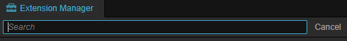
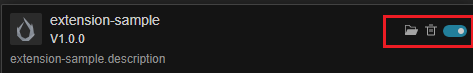

# Extension Manager Panel

The **Extension Manager** is used to manage extensions within the editor. Click **Extension -> Extension Manager** in the main menu bar of Cocos Creator to open.

The Extension Manager panel is as follows.

Its relevant functions are described as follows.

1. Extension type, divided into **Cocos Official** and **Builtin**, selected by drop-down menu. 
2. Installed, click it to show the currently installed extensions.
3. From left to right, **Search Extensions**, **Import Extension** and **Refresh Extension List**
    - **Search Extensions**: When clicked, you can find the extensions within the current project by keywords in the input box shown below.
        
    - **Import Extension**: Click to import a new extension via zip file
    - **Refresh Exntesion List**: Refresh the current status of all extensions
4. Extension list.

    

    For each extension, the extension name, icon, version number and description are displayed on the left side.
    The buttons on the right side are.
      - **Open extension directory**
      - **Delete** the extension
      - **Enable/Disable** the extension
    The built-in and official extensions cannot be deleted or disabled, some of the buttons need to be visible by moving the mouse over the entry.
5. Details of extensions
