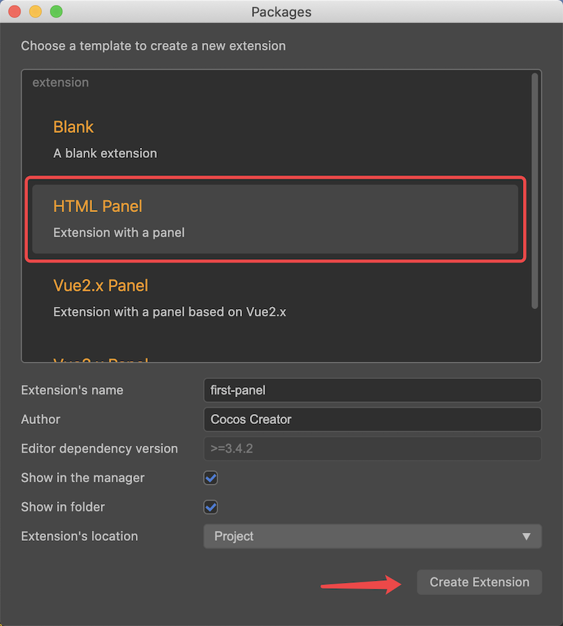
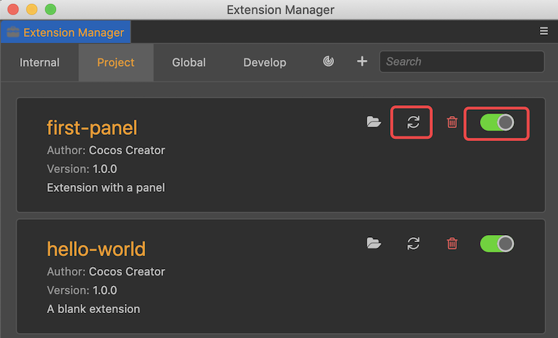
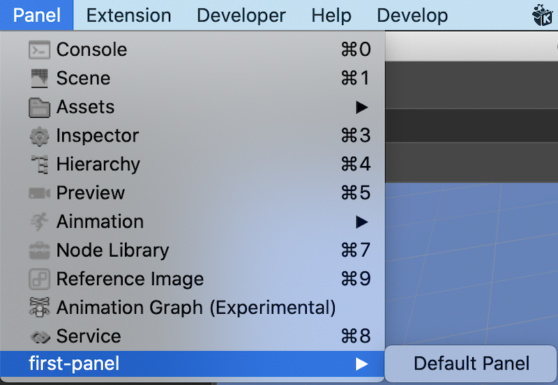
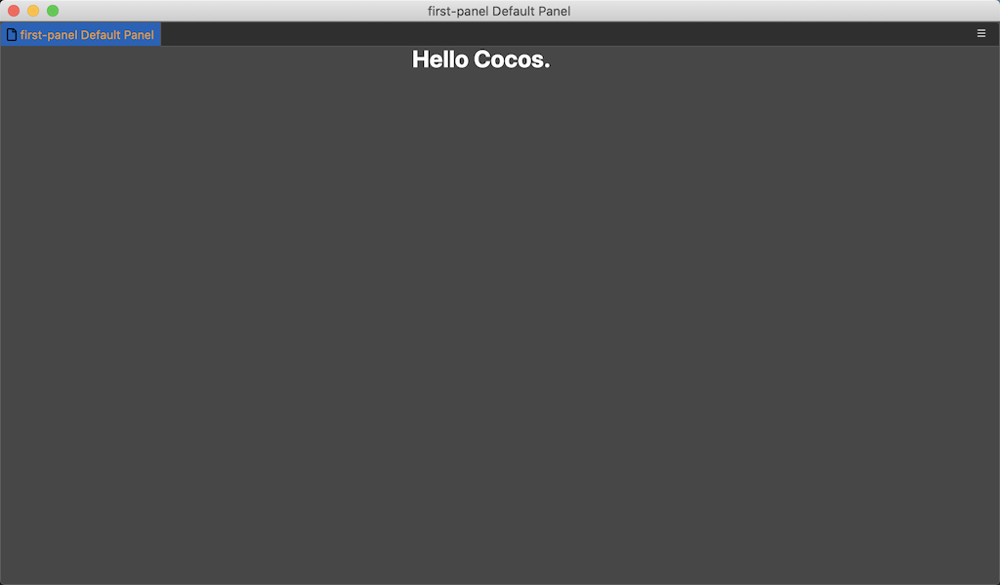
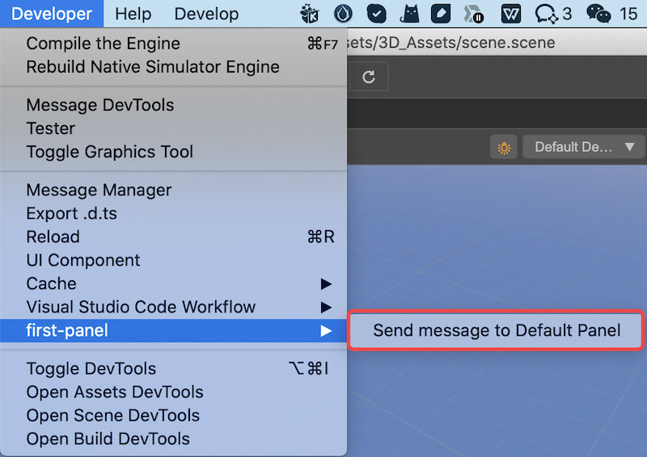
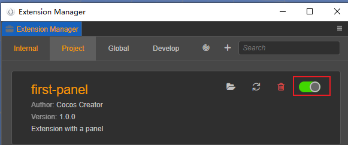
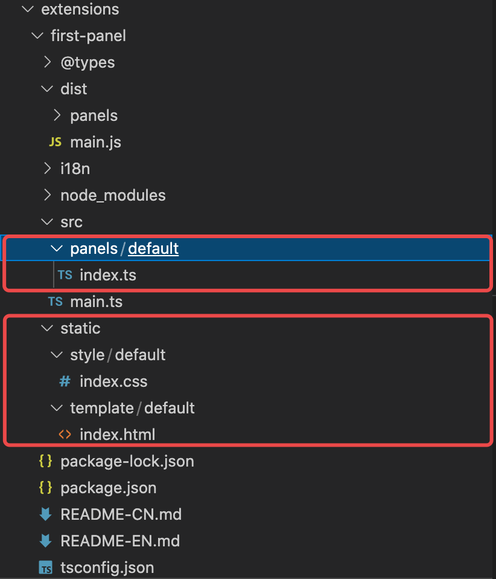

# Getting Started Example - Panel

In the document [Getting Started Example - Menus](./first.md) explains how to create a minimal extension, next we look at how to create a panel and communicate with it.

## Creating via templates

The quickest way to create a panel in Cocos Creator is through the **Extension template with a panel**, as shown in the following image:



After clicking the **Create** button, you can find the extensions/first-panel extension in the project root directory.

### Compile, install

In the command line tool, locate the extensions/first-panel directory and execute the following statement:

```bash
npm install
npm run build
```

After the command is executed, go back to the **Extension Manager**, find the first-panel extension, enable it and refresh it, as shown in the following image:



### View Panel

After enabling and refreshing the plugin, you can find the menu items in the **Panel** menu as shown in the following figure.



Click on the **Default panel** menu item to bring up the panel shown below.



This example also defines another menu item for communication in the **Developer** menu, as shown in the following image.



After clicking the **Send message to Default Panel** button shown in the red box in the above image, you can see that the content displayed on the panel will change.

> **Note**: If this menu is not displayed, please open the **Extension Manager** panel and make sure the plugin is enabled.
>
> 

## Panel explanation

Next, we explain the panel directory structure, definition and communication mechanism one by one.

### Panel directory structure

In the project directory, find `./extensions/first-panel` folder, which is the directory where the entire plugin can be viewed.



As shown above, there are more `static` and `panels` directories than hello-world.

`static` - used to store panel layout files, such as css\html, etc.

`panels` - used to store panel-related source code, each panel has an `index.ts` entry source file.

`index.ts`, `style`, `template` Please refer to the documentation [Writing Panels](./panel-boot.md)

### Description file package.json

Before we understand the panel, let's look at the panel-related definitions in `package.json`, as follows:

```json
{
    "package_version": 2,
    "version": "1.0.0",
    "name": "first-panel",
    "description": "i18n:first-panel.description",
    "main": "./dist/main.js",
    "dependencies": {
        "fs-extra": "^10.0.0"
    },
    "devDependencies": {
        "@types/node": "^16.0.1",
        "@types/fs-extra": "^9.0.5",
        "typescript": "^4.3.4"
    },
    "panels": {
        "default": {
            "title": "first-panel Default Panel",
            "type": "dockable",
            "main": "dist/panels/default",
            "size": {
                "min-width": 400,
                "min-height": 300,
                "width": 1024,
                "height": 600
            }
        }
    },
    "contributions": {
        "menu": [
            {
                "path": "i18n:menu.panel/first-panel",
                "label": "i18n:first-panel.open_panel",
                "message": "open-panel"
            },
            {
                "path": "i18n:menu.develop/first-panel",
                "label": "i18n:first-panel.send_to_panel",
                "message": "send-to-panel"
            }
        ],
        "messages": {
            "open-panel": {
                "methods": [
                    "openPanel"
                ]
            },
            "send-to-panel": {
                "methods": [
                    "default.hello"
                ]
            }
        }
    },
    "author": "Cocos Creator",
    "editor": ">=3.4.2",
    "scripts": {
        "build": "tsc -b",
        "watch": "tsc -w"
    }
}
```

`panels`: {} - The panels defined in this extension
- default: String - defines a panel named default
    - title: String - the title of the panel
    - type: String - the type of the panel
    - main: String - the panel source directory
    - size: {} - size information
        - min-width: Number - the minimum width
        - min-height: Number - the minimum height
        - width: Number - the default width of the panel
        - height: Number - the default height of the panel

## Read more

`panel` For a detailed explanation of panels, please refer to the documentation [Panel System](./panel.md).

`i18n` for multi-language configuration, please refer to the documentation [Multi-language system (i18n)](./i18n.md).

`messages` For the complete message definition mechanism, please refer to the documentation [custom messages](./contributions-messages.md).
