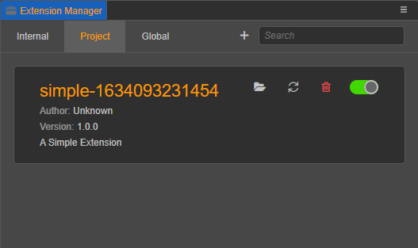
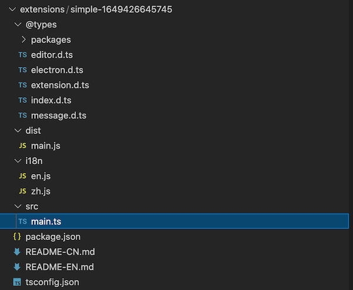
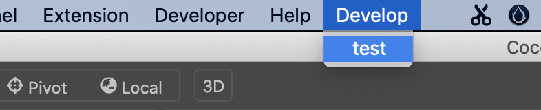

# Getting Started Example - Menu

This article will demonstrate how to create a Cocos Creator extension, and it will cover the following points.
- Creating an extension
- Adding a menu
- Menu Messages

## Create and Install Extensions

Find the **Extension -> Create** menu in the editor's menu bar, as shown below:


After clicking **Create**, the creation panel will pop up as shown below:


Cocos Creator provides 4 extension templates as shown above for quickly creating a new extension project.

To demonstrate the template creation process more simply, let's select the **Blank** template and click the **Create Extension** button at the bottom right of the panel to build an extension package.

For more template creation related content, please refer to the document [Extension Templates and Compile Builds - Template Types](./create-extension.md).

## Extension Manager

After the extension is successfully created, click **Extensions-> Extension Manager -> Project/Global** in the top menu bar, you can see the extension you just created. The newly created extension is not enabled by default, click the Enable button to enable this extension.



For more information about extension management, please refer to the documentation [Extension Manager - Extension List](./extension-manager.md).

## Extended Directory

Click the  button to open the directory where the extensions are located. Take the **Blank** template as an example, the directory structure is as follows:



The function of each subfile (folder) is as follows.
- `@types` - TypeScript definition file.
- `dist` - TypeScript-generated javascript code.
- `i18n` - Multilanguage configuration.
- `src` - TypeScript source code.
- `package.json` - The extension description file.
- `README-CN/EN.md` - Chinese/English description file.
- `tsconfig.json` - TypeScript configuration file.

## Extension Definition File `package.json`

Each extension needs a `package.json` file to describe the purpose of the extension.

Only after the complete definition of the description file `package.json`, the editor will be able to know the specific functionality, loading entry and other information defined in the extension.

> **Note**: Although many of the fields in `package.json` are defined similarly to `package.json` of the `node.js` npm module, the npm module downloaded from the npm community cannot be used directly as a Cocos Creator extension. You can call the npm module from within the Cocos Creator extension to make the extension capable of doing so.

Open the `package.json` file and you will see the following:

```json
{
    "package_version": 2,
    "version": "1.0.0",
    "name": "simple-1649426645745",
    "description": "i18n:simple-1649426645745.description",
    "main": "./dist/main.js",
    "devDependencies": {
        "@types/node": "^16.0.1",
        "typescript": "^4.3.4"
    },
    "author": "Cocos Creator",
    "editor": ">=3.4.2",
    "scripts": {
        "build": "tsc -b",
        "watch": "tsc -w"
    }
}

```

The meaning of each field is as follows.
- `package_version`: Number - the value of the version number.
- `version`: String - The version number string, it is recommended to use [semver](http://semver.org/) format to manage your package version.
- `name`: String - defines the name of the package, the package name is globally unique. Please refer to [option description] for naming rules (. /create-extension.md).
- `description`: Stirng - Extension description, used to briefly introduce the key features, usage and other information of the extension, supports **i18n** multi-language settings.
- `main`: String - The entry program file.
- `devDependencies`: {} - Extension dependencies. In this example, the extension depends on NodeJS version 16.0.1 and TypeScript version 4.3.4.
- `author`: String - Author information.
- `editor`: String - the supported Cocos Creator editor version.
- `scripts`: {} - Script compilation related commands.

## Define Menus and Messages

Replace `package.json` with the following:

```json
{
    "package_version": 2,
    "version": "1.0.0",
    "name": "simple-1649426645745",
    "description": "i18n:simple-1649426645745.description",
    "main": "./dist/main.js",
    "devDependencies": {
        "@types/node": "^16.0.1",
        "typescript": "^4.3.4"
    },
    "author": "Cocos Creator",
    "editor": ">=3.4.2",
    "scripts": {
        "build": "tsc -b",
        "watch": "tsc -w"
    },
    //------------------------------
    "contributions": {
        "menu": [{
            "path": "Develop",
            "label": "test",
            "message": "log"
        }],
        "messages": {
            "log": {
                "methods": ["log"]
            }
        }
    }
}
```

The meaning of the new fields is as follows.
- `contributions`: Object (optional) - configuration related to the extension of the editor's existing functionality
    - `menu`: [], register the menu and bind the message. For details, please refer to [Customize Main Menu](./contributions-menu.md).
    - `messages`:[] - Register editor messages, which can be bound to one or more methods defined within the extension. See [custom messages] for more definition data (./contributions-messages.md).

For more definitions of the `package.json` format, please refer to [Extension Package Definitions](./define.md).

## Installing Dependencies and Compiling

After the extension is created, open the directory where the extension package is located and execute the following command.

```bash
# install dependencies
npm install
# build
npm run build
```

For more information on building extensions, see the documentation [Extension templates and building](./create-extension.md).

## Run Extensions

Go back to the editor and click **Extension -> Extension Manager -> Project/Global** in the top menu bar and find the extension you created earlier. Click on the  button on the right side of the extension to make the above changes take effect.

If the extension has taken effect, a **Develop** menu will appear in the top menu bar area of Cocos Creator with a **test** menu item, as shown below.



If you click on the **test** menu item, you will see that there is no response, because we have not yet written the code for the menu information.

Next, we will see how to make the menu communicate with the extension.

## Entry Program `main.ts`

Each extension has a unique entry program `main.ts`, which is generated by default as follows:

```typescript
/**
 * @en Registration method for the main process of Extension
 * @zh 为扩展的主进程的注册方法
 */
export const methods: { [key: string]: (...any: any) => any } = { };

/**
 * @en Hooks triggered after extension loading is complete
 * @zh 扩展加载完成后触发的钩子
 */
export const load = function() { };

/**
 * @en Hooks triggered after extension uninstallation is complete
 * @zh 扩展卸载完成后触发的钩子
 */
export const unload = function() { };
```

The methods defined in `export const methods` will be used as interfaces for operations that will be called across extensions via the [message system](./messages.md) to be called across extensions or to communicate with panels.

The entry program is the main process of the extension and will be loaded during the startup of Cocos Creator.

## Menu Message Handling

We modify the entry program slightly by adding a handler function that receives ``log`` messages, as follows.

```typescript
export const methods: { [key: string]: (.. . any: any) => any } = { 
    log(){console.log('Hello World')},
};
```

Execute the `npm run build` command to compile the extension.

Click on the  button on the right side of the extension to make the above changes take effect.

Click the `Develop/test` menu item again and you will see that "Hello World" is printed out in the Cocos Creator **console**.
