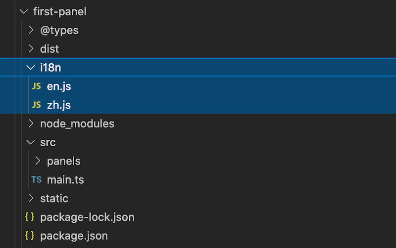

# Multilingual System (i18n)

## What is i18n

**i18n** (derived from the first and last characters i and n of the English word internationalization, with 18 being the number of characters in between) is short for "internationalization".

In the field of information, i18n refers to the ability to adapt products (publications, software, hardware, etc.) to the needs of different languages and regions without much change.

In the field of application development, i18n refers to the ability to display localized content for different languages and regions without modifying the internal code.

The built-in multilingual scheme (i18n) in the Cocos Creator extension system allows extensions to configure **key-value mapping** for multiple languages and use strings from different languages in the extension according to the editor's current language settings.

## i18n Folder

To enable the multilingual feature (hereinafter referred to as i18n), you need to create a new folder named i18n in the extended directory and add a corresponding `JavaScript` file for each language as key-value mapping data.

The data file name should be consistent with the language code, e.g. `en.js` corresponds to English mapping data, `zh.js` corresponds to Chinese mapping data. As shown in the following figure.



The mapping takes the key of the `JavaScript` object as the key value and is exported with the module information as follows:

- `en.js`

  ```javascript
  "use strict";
  module.exports = {
      open_panel:"Default Panel",
      send_to_panel:"Send message to Default Panel",
      description:"Extension with a panel"
  };
  ```

- `zh.js`

  ```javascript
  module.exports = {
      open_panel:"默认面板",
      send_to_panel:"发送消息给面板",
      description:"含有一个面板的扩展"
  };
  ```

Take `open_panel` as an example, suppose the registered extension name is `first-panel`, then the corresponding text translation key is `first-panel.open_panel`.

## Using in Scripts

In TypeScript or JavaScript scripts, the translated text for the current language can be obtained through the ``Editor.I18n.t`'' interface.

```typescript
let str = Editor.I18n.t('first-panel.open_panel');
```

## Use in HTML Templates

You can use the ui-label element for translation in HTML templates if you need to translate.

```html
<ui-label value="i18n:first-panel.open_panel"></ui-label>
```

> **Note**: `ui-label` is a normal in-line element, similar to span.

### Use in json Files

For example, when registering a menu path in the `package.json` of an extension package, the path can be translated into multiple languages using the form `i18n:${key}`, as long as the field supports i18n formatted paths.

Example 1: Extension description

```json5
// "package_version": 2,
// "version": "1.0.0",
// "name": "first-panel",
"description": "i18n:first-panel.description",
// "main": "./dist/main.js",
```

Example 2: Panel Title

```json5
"panels": {
    "default": {
        "title": "first-panel Default Panel",
        // "type": "dockable",
        // "main": "dist/panels/default",
        // "size": {...}
    }
},
```

Example 3: Menu path and display content

```json
"menu":[
  {
    "path": "i18n:menu.panel/first-panel",
    "label": "i18n:first-panel.open_panel",
    "message": "open-panel"
  },
  {
    "path": "i18n:menu.develop/first-panel",
    "label": "i18n:first-panel.send_to_panel",
    "message": "send-to-panel"
  }
]
```
