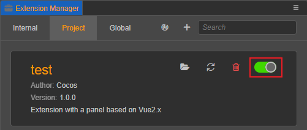
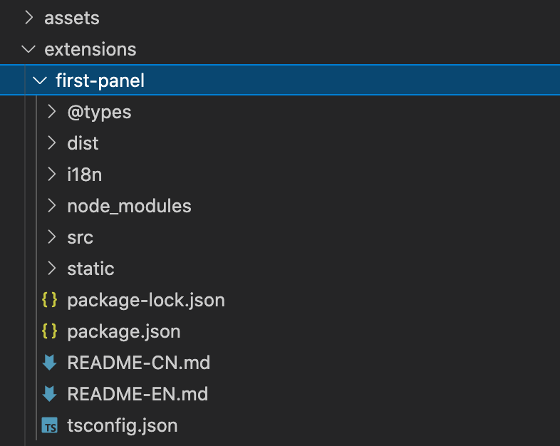
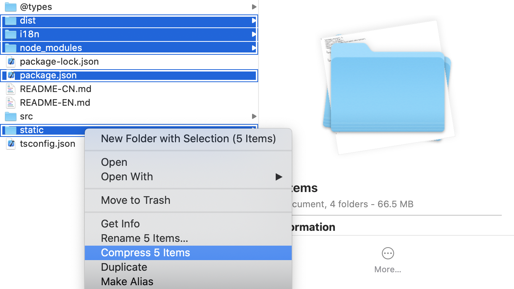

# Install and Share

## Install Location

Cocos Creator will search and load extensions under **Global** and **Project** paths during project startup.

### Global

If you need to apply an extension to all Cocos Creator projects, you can choose to place the extension package in the **Global** extension package path at

- **Windows**: `%USERPROFILE%\.CocosCreator\extensions`
- **macOS**: `$HOME/.CocosCreator/extensions`

### Project

If you only wish to apply the extension to the specified project, you can choose to place the extension package in the **Project** extension package path at.

- `${your project address}/extensions`

## Installing extensions

Extensions can be obtained in three ways.
- Other developers packaged and shared, see [Packaged Extensions](#Package%20extensions) below.

- Download from **Dashboard -> Store**.

  

- Downloaded from the [Cocos Store](http://store.cocos.com) page.

After getting the extension zip file, click **Extension -> Extension Manager** in the top menu bar of the editor.

Clicking on it opens the **Extension Manager** panel as shown below.

In the **Extension Manager**, select the **Projects**/**Global** (1 above) tab and click the **+** (3 above) button.

In the file selection box that pops up, select the extension zip you want to import and click the **Open** button to import it.

The imported extension zip will be extracted and placed in the specified [installation location](#Install%20Location).

Finally, find the extension in the **Project**/**Global** tab of the corresponding **Extension Manager** and click the **Enable** button on the right side, the extension you just imported will run normally. As shown in the figure below.

## Uninstall installed extensions

Find the extension you want to delete in **Extension Manager** and click the **Delete button**  to do so, and the folder where the extension is located will also be deleted. If you only need to disable it, you can just select "Close".

## Reload extensions

If the content of the extension has been modified, it will not be updated automatically, so you need to reload the extension once manually inside the editor.

Find the corresponding extension in the **Extension Manager** and click the **Reload button** , then the extension will be re-run with the latest code and files in the editor.

## Package extensions

After writing an extension, if you want to share it with other users, you need to package the extension as a zip archive.

Let's take the `first-panel` extension as an example, its directory structure is as follows.

Go to the extension root directory, select the appropriate files and zip all files as follows (screenshot for macOS, same for all other platforms)

The files (folders) selected in the above diagram are mandatory, none of them are required, and they serve the following purposes.
- `dist` - Generated javascript code.
- `i18n` - Multilanguage configuration.
- `node_modules` - dependent Node.js modules.
- `package.json` - Extension description file.
- `static` - Static resource files.

Name the zip package `first-panel.zip` (same name as the extensions folder is recommended) and share it with others or upload it to the Cocos Store to finish sharing.

> **Note**: You have to do the file selection operation in the directory of the extension, otherwise it may lead to incorrect directory structure.

If you want to upload the extension to the [Cocos Store](https://store.cocos.com), please refer to the document [Submitting Resources to Cocos Store](./store/upload-store.md).
